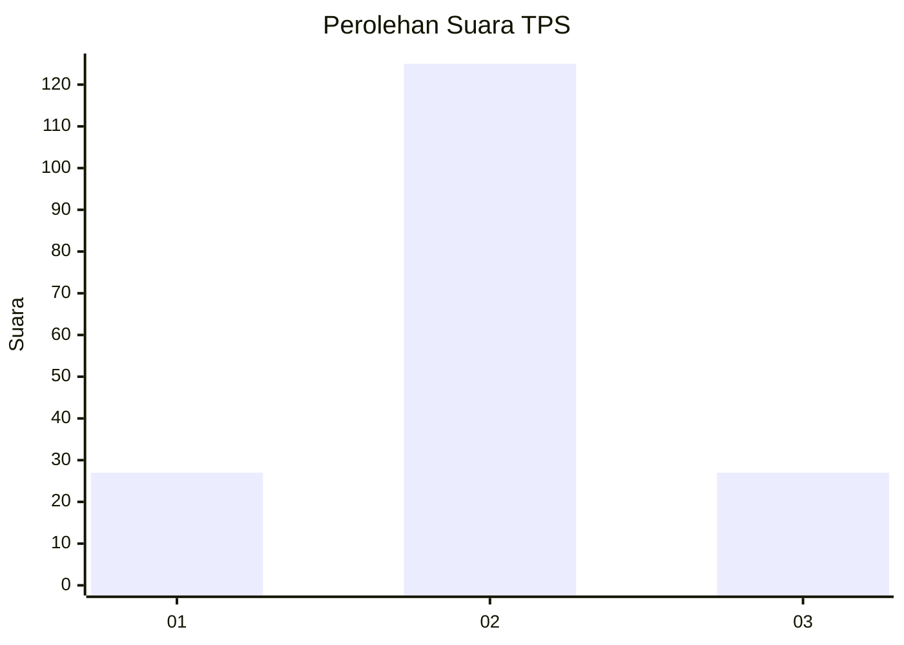

# Hasil

## Grafik

## Tabel

| No. | Nama Paslon    | Suara | Suara (raw) | Persentase |
|:--- |:-------------- | -----:| -----------:| ----------:|
| 1   | ANIES MUHAIMIN | 27    | [27][p-1]   | 15,08      |
| 2   | PRABOWO GIBRAN | 125   | [125][p-2]  | 69,83      |
| 3   | GANJAR MAHFUD  | 27    | [27][p-3]   | 15,08      |

[p-1]: https://github.com/gigit-pemilu/pemilu-2024-51-bali/blob/main/pilpres/hitung-suara/sub/51-bali/sub/71-kota-denpasar/sub/03-denpasar-barat/sub/2001-padangsambian-kelod/sub/013-tps/sub/paslon-1.txt
[p-2]: https://github.com/gigit-pemilu/pemilu-2024-51-bali/blob/main/pilpres/hitung-suara/sub/51-bali/sub/71-kota-denpasar/sub/03-denpasar-barat/sub/2001-padangsambian-kelod/sub/013-tps/sub/paslon-2.txt
[p-3]: https://github.com/gigit-pemilu/pemilu-2024-51-bali/blob/main/pilpres/hitung-suara/sub/51-bali/sub/71-kota-denpasar/sub/03-denpasar-barat/sub/2001-padangsambian-kelod/sub/013-tps/sub/paslon-3.txt

## Foto C Plano

https://sirekap-obj-formc.kpu.go.id/e18c/pemilu/ppwp/51/71/03/20/01/5171032001013-20240214-220430--b2877c47-f01c-4fcd-a179-f5a6a38e790c.jpg

https://sirekap-obj-formc.kpu.go.id/e18c/pemilu/ppwp/51/71/03/20/01/5171032001013-20240214-220436--f2b511d4-47f8-4462-8c30-fb4a401a6cc9.jpg

https://sirekap-obj-formc.kpu.go.id/e18c/pemilu/ppwp/51/71/03/20/01/5171032001013-20240214-220443--8df0f5b0-4b06-4bf7-aa88-8028715d6bd0.jpg

## Metadata

| Key        | Value               |
| ---------- | ------------------- |
| Time Stamp | 2024-02-15 20:00:44 |

## DATA PEMILIH TETAP

Jumlah pemilih dalam DPT: **230**.
 * L: **110**.
 * P: **120**.

## DATA PENGGUNA HAK PILIH

Jumlah pengguna hak pilih dalam DPT: **177**.
 * L: **85**.
 * P: **92**.

Jumlah pengguna hak pilih dalam DPTb: **0**.
 * L: **0**.
 * P: **0**.

Jumlah pengguna hak pilih dalam DPK: **3**.
 * L: **1**.
 * P: **2**.

Jumlah pengguna hak pilih: **180**.
 * L: **86**.
 * P: **94**.

## JUMLAH SUARA SAH DAN TIDAK SAH

JUMLAH SELURUH SUARA SAH: **179**.

JUMLAH SUARA TIDAK SAH: **1**.

JUMLAH SELURUH SUARA SAH DAN SUARA TIDAK SAH: **180**.

