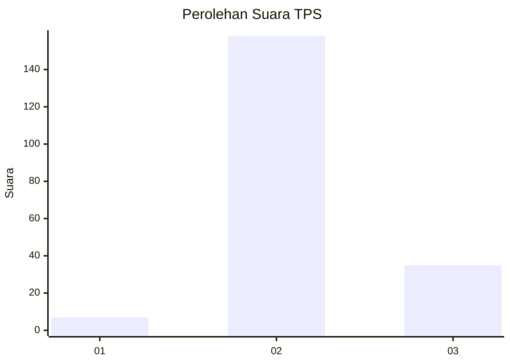

# Hasil

## Grafik

## Tabel

| No. | Nama Paslon    | Suara | Suara (raw) | Persentase |
|:--- |:-------------- | -----:| -----------:| ----------:|
| 1   | ANIES MUHAIMIN | 7     | [7][p-1]    | 3,50       |
| 2   | PRABOWO GIBRAN | 158   | [158][p-2]  | 79,00      |
| 3   | GANJAR MAHFUD  | 35    | [35][p-3]   | 17,50      |

[p-1]: https://github.com/gigit-pemilu/pemilu-2024-51-bali/blob/main/pilpres/hitung-suara/sub/51-bali/sub/71-kota-denpasar/sub/03-denpasar-barat/sub/2001-padangsambian-kelod/sub/039-tps/sub/paslon-1.txt
[p-2]: https://github.com/gigit-pemilu/pemilu-2024-51-bali/blob/main/pilpres/hitung-suara/sub/51-bali/sub/71-kota-denpasar/sub/03-denpasar-barat/sub/2001-padangsambian-kelod/sub/039-tps/sub/paslon-2.txt
[p-3]: https://github.com/gigit-pemilu/pemilu-2024-51-bali/blob/main/pilpres/hitung-suara/sub/51-bali/sub/71-kota-denpasar/sub/03-denpasar-barat/sub/2001-padangsambian-kelod/sub/039-tps/sub/paslon-3.txt

## Foto C Plano

https://sirekap-obj-formc.kpu.go.id/df9f/pemilu/ppwp/51/71/03/20/01/5171032001039-20240214-195652--5da6375d-d966-4bbd-a06b-9002b1132d1e.jpg

https://sirekap-obj-formc.kpu.go.id/df9f/pemilu/ppwp/51/71/03/20/01/5171032001039-20240214-195704--6ef36a73-888b-44cf-a621-ec773c3fb7c4.jpg

https://sirekap-obj-formc.kpu.go.id/df9f/pemilu/ppwp/51/71/03/20/01/5171032001039-20240214-195739--2888f0fa-a9b1-4790-b93b-7fdbfb34847e.jpg

## Metadata

| Key        | Value               |
| ---------- | ------------------- |
| Time Stamp | 2024-02-24 22:31:28 |

