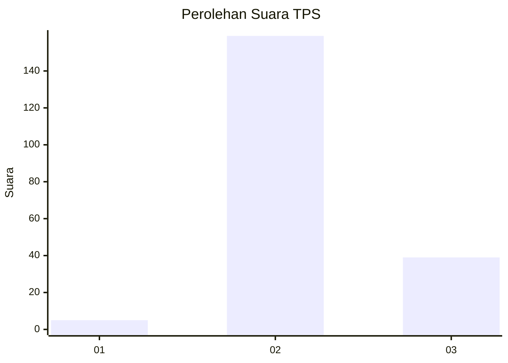
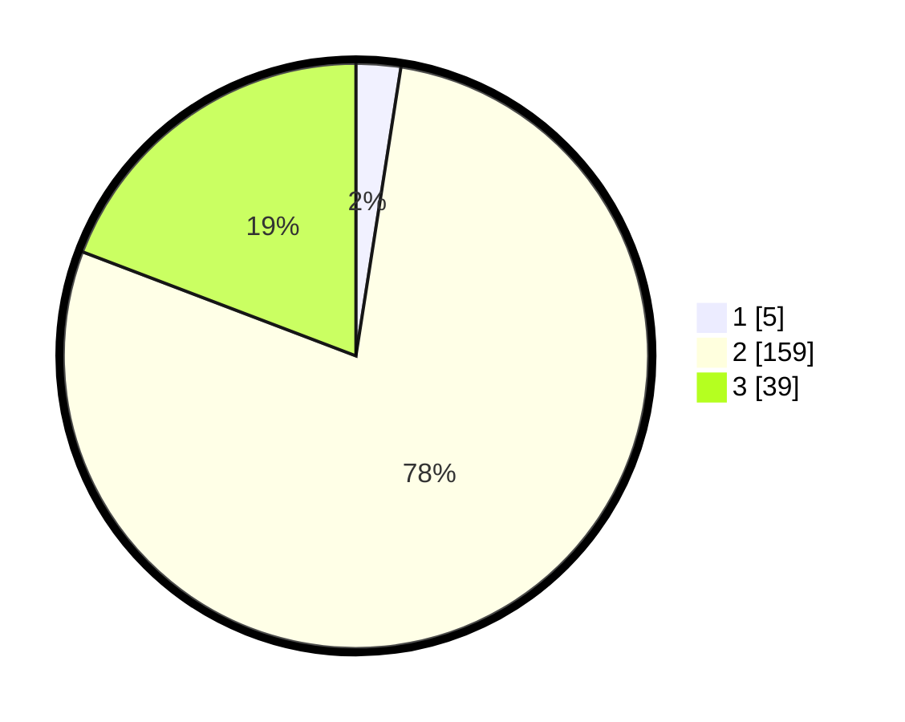

# Hasil

## Grafik

## Tabel

| No. | Nama Paslon    | Suara | Suara (raw) | Persentase |
|:--- |:-------------- | -----:| -----------:| ----------:|
| 1   | ANIES MUHAIMIN | 5     | [5][p-1]    | 2,46       |
| 2   | PRABOWO GIBRAN | 159   | [159][p-2]  | 78,33      |
| 3   | GANJAR MAHFUD  | 39    | [39][p-3]   | 19,21      |

[p-1]: https://github.com/gigit-pemilu/pemilu-2024-51-bali/blob/main/pilpres/hitung-suara/sub/51-bali/sub/71-kota-denpasar/sub/03-denpasar-barat/sub/2001-padangsambian-kelod/sub/040-tps/sub/paslon-1.txt
[p-2]: https://github.com/gigit-pemilu/pemilu-2024-51-bali/blob/main/pilpres/hitung-suara/sub/51-bali/sub/71-kota-denpasar/sub/03-denpasar-barat/sub/2001-padangsambian-kelod/sub/040-tps/sub/paslon-2.txt
[p-3]: https://github.com/gigit-pemilu/pemilu-2024-51-bali/blob/main/pilpres/hitung-suara/sub/51-bali/sub/71-kota-denpasar/sub/03-denpasar-barat/sub/2001-padangsambian-kelod/sub/040-tps/sub/paslon-3.txt

## Foto C Plano

https://sirekap-obj-formc.kpu.go.id/6a4c/pemilu/ppwp/51/71/03/20/01/5171032001040-20240214-211252--16a8eb36-1c2a-45f9-8309-7a538b92c020.jpg

https://sirekap-obj-formc.kpu.go.id/6a4c/pemilu/ppwp/51/71/03/20/01/5171032001040-20240214-211317--30f2466e-51de-4d11-b2e9-d53a91737474.jpg

https://sirekap-obj-formc.kpu.go.id/6a4c/pemilu/ppwp/51/71/03/20/01/5171032001040-20240214-211337--a3ea105d-1d23-40cb-8175-d2570fafef38.jpg

## Metadata

| Key        | Value               |
| ---------- | ------------------- |
| Time Stamp | 2024-02-24 22:31:28 |

