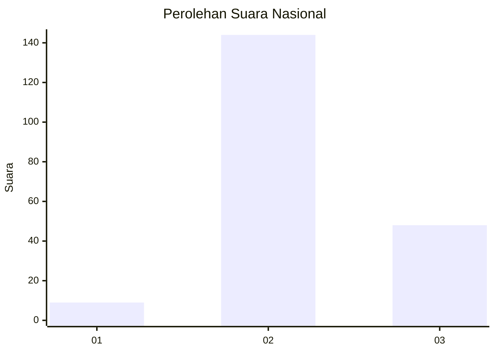
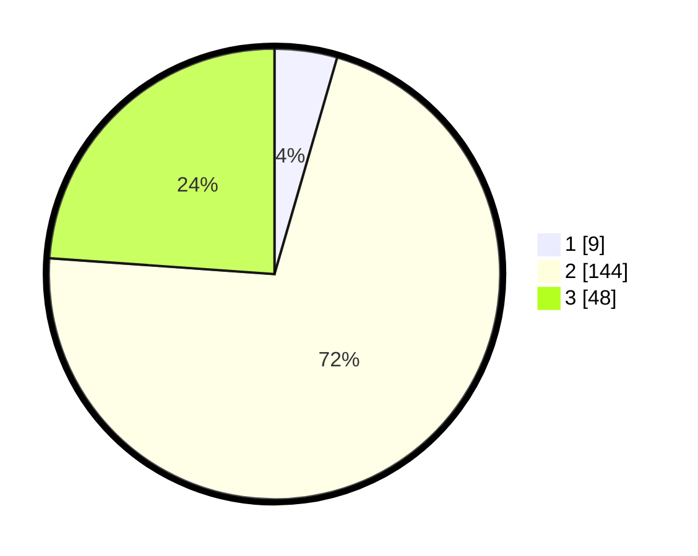

# Hasil

## Grafik

## Tabel

| No. | Nama Paslon    | Suara | Suara (raw) | Persentase |
|:--- |:-------------- | -----:| -----------:| ----------:|
| 1   | ANIES MUHAIMIN | 9     | [9][p-1]    | 4,48       |
| 2   | PRABOWO GIBRAN | 144   | [144][p-2]  | 71,64      |
| 3   | GANJAR MAHFUD  | 48    | [48][p-3]   | 23,88      |

[p-1]: https://github.com/gigit-pemilu/pemilu-2024/blob/main/pilpres/hitung-suara/sub/51-bali/sub/71-kota-denpasar/sub/03-denpasar-barat/sub/2001-padangsambian-kelod/sub/042-tps/sub/paslon-1.txt
[p-2]: https://github.com/gigit-pemilu/pemilu-2024/blob/main/pilpres/hitung-suara/sub/51-bali/sub/71-kota-denpasar/sub/03-denpasar-barat/sub/2001-padangsambian-kelod/sub/042-tps/sub/paslon-2.txt
[p-3]: https://github.com/gigit-pemilu/pemilu-2024/blob/main/pilpres/hitung-suara/sub/51-bali/sub/71-kota-denpasar/sub/03-denpasar-barat/sub/2001-padangsambian-kelod/sub/042-tps/sub/paslon-3.txt

## Foto C Plano

https://sirekap-obj-formc.kpu.go.id/5386/pemilu/ppwp/51/71/03/20/01/5171032001042-20240214-204327--c9b1284a-e250-41bf-a936-51779944a308.jpg

https://sirekap-obj-formc.kpu.go.id/5386/pemilu/ppwp/51/71/03/20/01/5171032001042-20240214-203021--84c9c57b-a3d1-4ccf-a9da-f50dc3b522d8.jpg

https://sirekap-obj-formc.kpu.go.id/5386/pemilu/ppwp/51/71/03/20/01/5171032001042-20240214-230227--c3957b63-58c3-46df-b05b-73cc9d63f30d.jpg

## Metadata

| Key        | Value               |
| ---------- | ------------------- |
| Time Stamp | 2024-02-24 22:31:28 |

