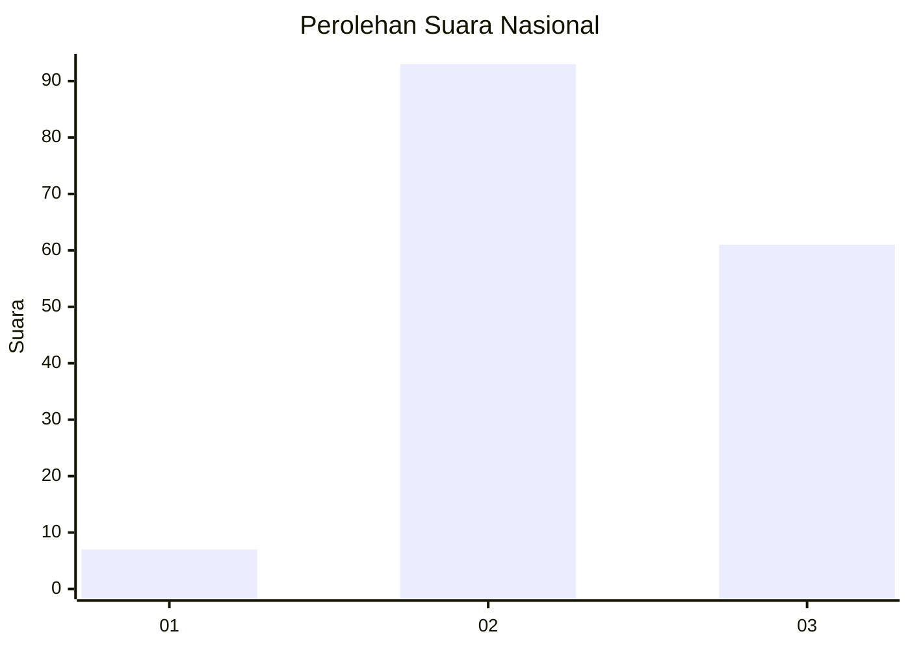
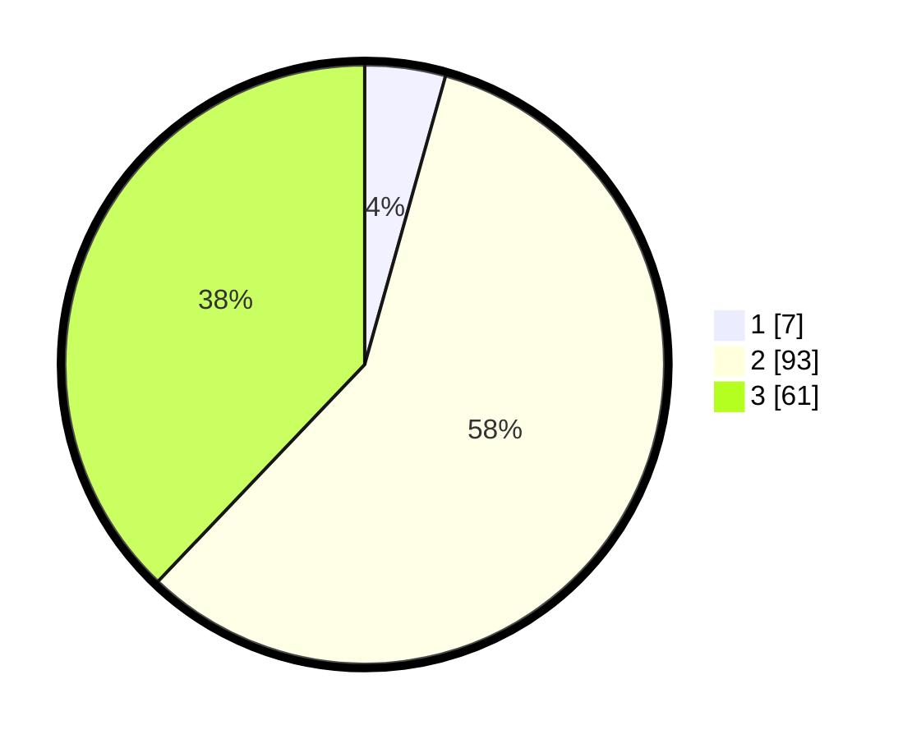

# Hasil

## Grafik

## Tabel

| No. | Nama Paslon    | Suara | Suara (raw) | Persentase |
|:--- |:-------------- | -----:| -----------:| ----------:|
| 1   | ANIES MUHAIMIN | 7     | [7][p-1]    | 4,35       |
| 2   | PRABOWO GIBRAN | 93    | [93][p-2]   | 57,76      |
| 3   | GANJAR MAHFUD  | 61    | [61][p-3]   | 37,89      |

[p-1]: https://github.com/gigit-pemilu/pemilu-2024/blob/main/pilpres/hitung-suara/sub/51-bali/sub/71-kota-denpasar/sub/03-denpasar-barat/sub/2002-pemecutan-kelod/sub/007-tps/sub/paslon-1.txt
[p-2]: https://github.com/gigit-pemilu/pemilu-2024/blob/main/pilpres/hitung-suara/sub/51-bali/sub/71-kota-denpasar/sub/03-denpasar-barat/sub/2002-pemecutan-kelod/sub/007-tps/sub/paslon-2.txt
[p-3]: https://github.com/gigit-pemilu/pemilu-2024/blob/main/pilpres/hitung-suara/sub/51-bali/sub/71-kota-denpasar/sub/03-denpasar-barat/sub/2002-pemecutan-kelod/sub/007-tps/sub/paslon-3.txt

## Foto C Plano

https://sirekap-obj-formc.kpu.go.id/eece/pemilu/ppwp/51/71/03/20/02/5171032002007-20240216-210448--a64c4284-64d6-41d0-a907-dc94f4a23f83.jpg

https://sirekap-obj-formc.kpu.go.id/eece/pemilu/ppwp/51/71/03/20/02/5171032002007-20240216-210456--8a97b536-8686-449d-b4ee-497f013fb50b.jpg

https://sirekap-obj-formc.kpu.go.id/eece/pemilu/ppwp/51/71/03/20/02/5171032002007-20240216-210505--35751670-3394-4920-a368-02ac0723e145.jpg

## Metadata

| Key        | Value               |
| ---------- | ------------------- |
| Time Stamp | 2024-02-24 22:31:28 |

