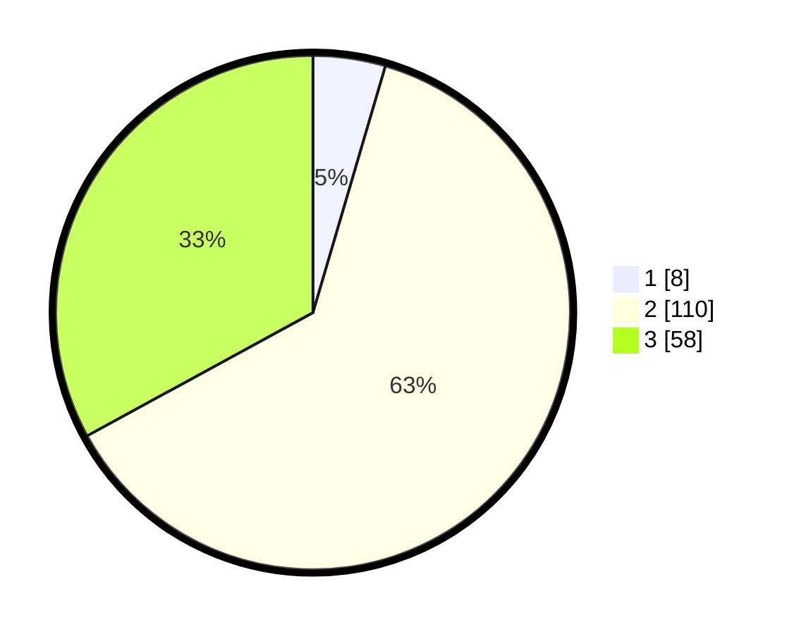

# Hasil

## Grafik

## Tabel

| No. | Nama Paslon    | Suara | Suara (raw) | Persentase |
|:--- |:-------------- | -----:| -----------:| ----------:|
| 1   | ANIES MUHAIMIN | 8     | [8][p-1]    | 4,55       |
| 2   | PRABOWO GIBRAN | 110   | [110][p-2]  | 62,50      |
| 3   | GANJAR MAHFUD  | 58    | [58][p-3]   | 32,95      |

[p-1]: https://github.com/gigit-pemilu/pemilu-2024-51-bali/blob/main/pilpres/hitung-suara/sub/51-bali/sub/71-kota-denpasar/sub/03-denpasar-barat/sub/2002-pemecutan-kelod/sub/008-tps/sub/paslon-1.txt
[p-2]: https://github.com/gigit-pemilu/pemilu-2024-51-bali/blob/main/pilpres/hitung-suara/sub/51-bali/sub/71-kota-denpasar/sub/03-denpasar-barat/sub/2002-pemecutan-kelod/sub/008-tps/sub/paslon-2.txt
[p-3]: https://github.com/gigit-pemilu/pemilu-2024-51-bali/blob/main/pilpres/hitung-suara/sub/51-bali/sub/71-kota-denpasar/sub/03-denpasar-barat/sub/2002-pemecutan-kelod/sub/008-tps/sub/paslon-3.txt

## Foto C Plano

https://sirekap-obj-formc.kpu.go.id/0a58/pemilu/ppwp/51/71/03/20/02/5171032002008-20240214-155822--d969fce9-3825-4ef3-903f-027933a8229e.jpg

https://sirekap-obj-formc.kpu.go.id/0a58/pemilu/ppwp/51/71/03/20/02/5171032002008-20240214-155826--1d4155df-b8c6-4674-8998-f39637407ec1.jpg

https://sirekap-obj-formc.kpu.go.id/0a58/pemilu/ppwp/51/71/03/20/02/5171032002008-20240214-155829--555d2358-6cd5-4feb-aa53-8755cb9c8c9a.jpg

## Metadata

| Key        | Value               |
| ---------- | ------------------- |
| Time Stamp | 2024-02-24 22:31:28 |

