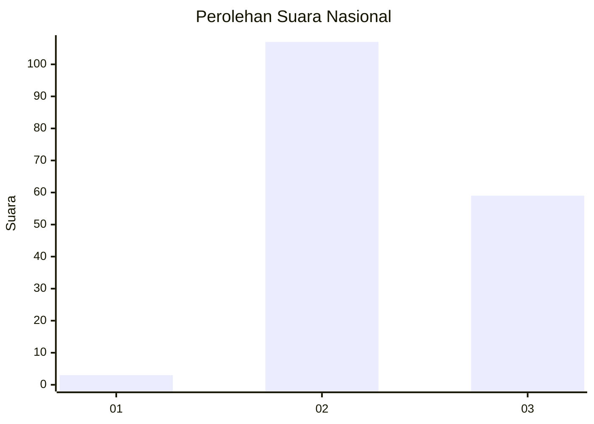
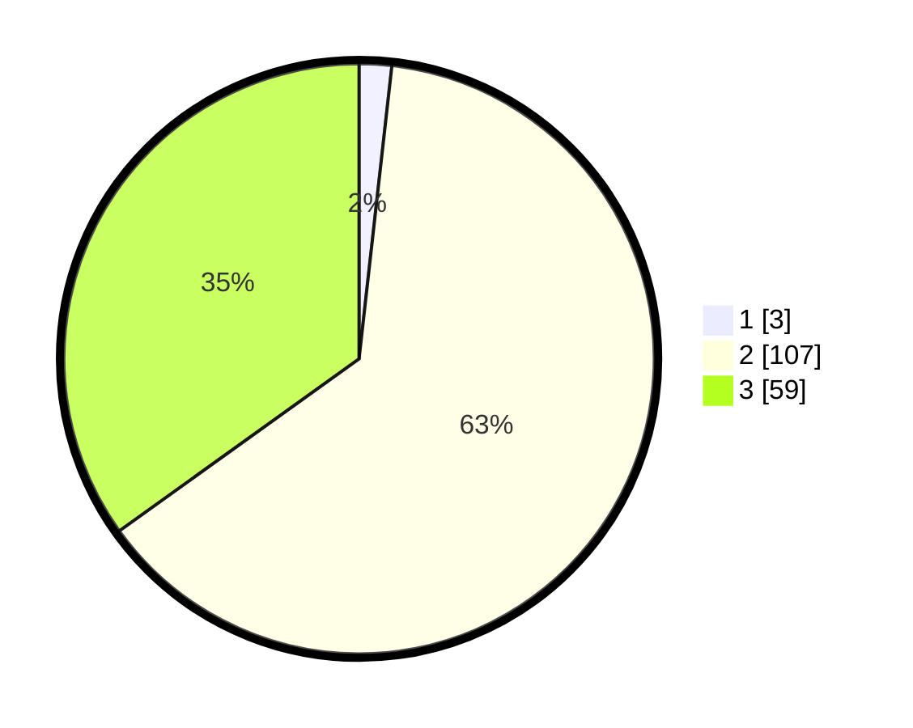

# Hasil

## Grafik

## Tabel

| No. | Nama Paslon    | Suara | Suara (raw) | Persentase |
|:--- |:-------------- | -----:| -----------:| ----------:|
| 1   | ANIES MUHAIMIN | 3     | [3][p-1]    | 1,78       |
| 2   | PRABOWO GIBRAN | 107   | [107][p-2]  | 63,31      |
| 3   | GANJAR MAHFUD  | 59    | [59][p-3]   | 34,91      |

[p-1]: https://github.com/gigit-pemilu/pemilu-2024/blob/main/pilpres/hitung-suara/sub/51-bali/sub/71-kota-denpasar/sub/03-denpasar-barat/sub/2002-pemecutan-kelod/sub/012-tps/sub/paslon-1.txt
[p-2]: https://github.com/gigit-pemilu/pemilu-2024/blob/main/pilpres/hitung-suara/sub/51-bali/sub/71-kota-denpasar/sub/03-denpasar-barat/sub/2002-pemecutan-kelod/sub/012-tps/sub/paslon-2.txt
[p-3]: https://github.com/gigit-pemilu/pemilu-2024/blob/main/pilpres/hitung-suara/sub/51-bali/sub/71-kota-denpasar/sub/03-denpasar-barat/sub/2002-pemecutan-kelod/sub/012-tps/sub/paslon-3.txt

## Foto C Plano

https://sirekap-obj-formc.kpu.go.id/4b2b/pemilu/ppwp/51/71/03/20/02/5171032002012-20240214-155309--d9f62dbe-4427-444b-acb2-4ee4e5e02595.jpg

https://sirekap-obj-formc.kpu.go.id/4b2b/pemilu/ppwp/51/71/03/20/02/5171032002012-20240214-155315--25e069bb-8997-4262-a059-b5c630057bce.jpg

https://sirekap-obj-formc.kpu.go.id/4b2b/pemilu/ppwp/51/71/03/20/02/5171032002012-20240214-155402--df8c2940-3faa-4a3c-9bf0-5588af8c7f2c.jpg

## Metadata

| Key        | Value               |
| ---------- | ------------------- |
| Time Stamp | 2024-02-14 21:46:01 |

## DATA PEMILIH TETAP

Jumlah pemilih dalam DPT: **200**.
 * L: **107**.
 * P: **93**.

## DATA PENGGUNA HAK PILIH

Jumlah pengguna hak pilih dalam DPT: **169**.
 * L: **89**.
 * P: **80**.

Jumlah pengguna hak pilih dalam DPTb: **4**.
 * L: **2**.
 * P: **2**.

Jumlah pengguna hak pilih dalam DPK: **1**.
 * L: **0**.
 * P: **1**.

Jumlah pengguna hak pilih: **174**.
 * L: **91**.
 * P: **83**.

## JUMLAH SUARA SAH DAN TIDAK SAH

JUMLAH SELURUH SUARA SAH: **169**.

JUMLAH SUARA TIDAK SAH: **5**.

JUMLAH SELURUH SUARA SAH DAN SUARA TIDAK SAH: **174**.

