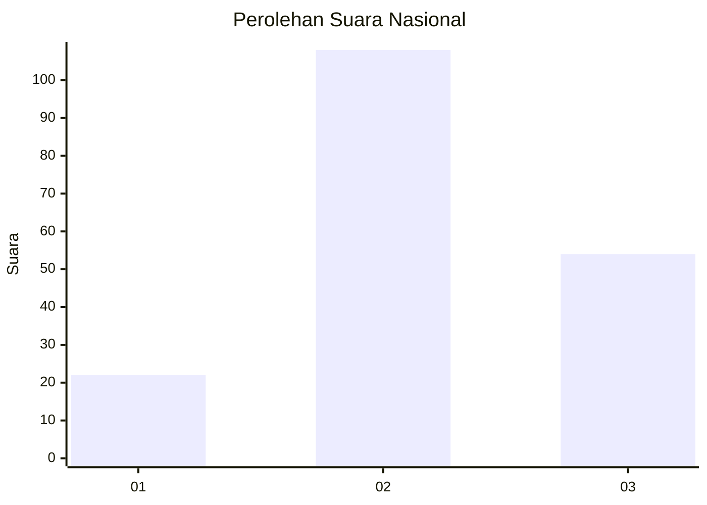
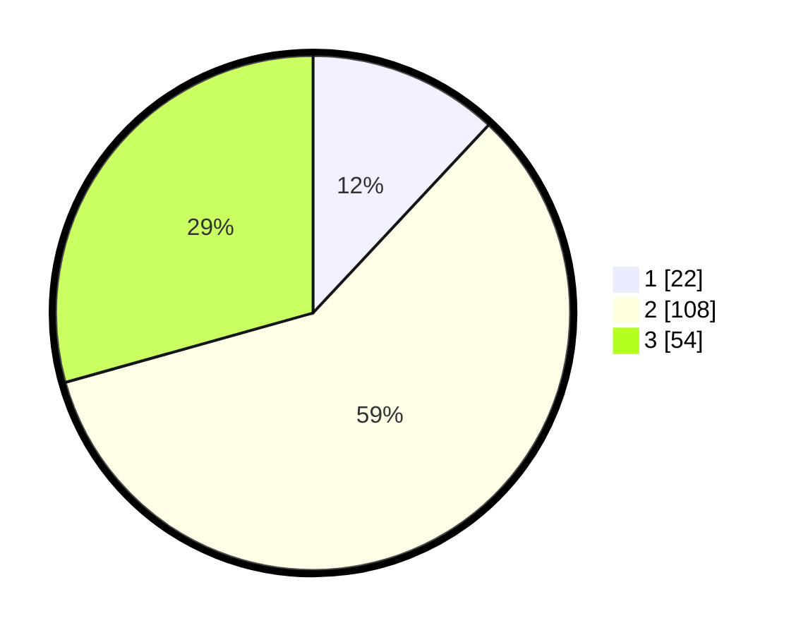

# Hasil

## Grafik

## Tabel

| No. | Nama Paslon    | Suara | Suara (raw) | Persentase |
|:--- |:-------------- | -----:| -----------:| ----------:|
| 1   | ANIES MUHAIMIN | 22    | [22][p-1]   | 11,96      |
| 2   | PRABOWO GIBRAN | 108   | [108][p-2]  | 58,70      |
| 3   | GANJAR MAHFUD  | 54    | [54][p-3]   | 29,35      |

[p-1]: https://github.com/gigit-pemilu/pemilu-2024/blob/main/pilpres/hitung-suara/sub/51-bali/sub/71-kota-denpasar/sub/03-denpasar-barat/sub/2002-pemecutan-kelod/sub/026-tps/sub/paslon-1.txt
[p-2]: https://github.com/gigit-pemilu/pemilu-2024/blob/main/pilpres/hitung-suara/sub/51-bali/sub/71-kota-denpasar/sub/03-denpasar-barat/sub/2002-pemecutan-kelod/sub/026-tps/sub/paslon-2.txt
[p-3]: https://github.com/gigit-pemilu/pemilu-2024/blob/main/pilpres/hitung-suara/sub/51-bali/sub/71-kota-denpasar/sub/03-denpasar-barat/sub/2002-pemecutan-kelod/sub/026-tps/sub/paslon-3.txt

## Foto C Plano

https://sirekap-obj-formc.kpu.go.id/0495/pemilu/ppwp/51/71/03/20/02/5171032002026-20240214-195339--5a854266-9f9c-4940-a2f2-80e08df50f15.jpg

https://sirekap-obj-formc.kpu.go.id/0495/pemilu/ppwp/51/71/03/20/02/5171032002026-20240219-145608--14a65977-8fae-4277-85f2-2913538df5ff.jpg

https://sirekap-obj-formc.kpu.go.id/0495/pemilu/ppwp/51/71/03/20/02/5171032002026-20240219-145916--bb2724f3-6147-4c4a-a40c-ccef695be53b.jpg

## Metadata

| Key        | Value               |
| ---------- | ------------------- |
| Time Stamp | 2024-02-24 22:31:28 |

