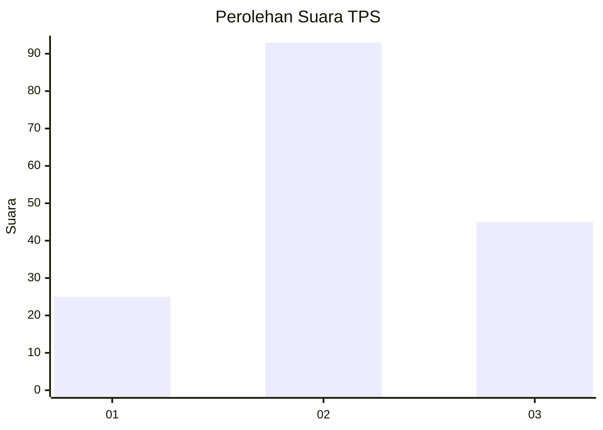
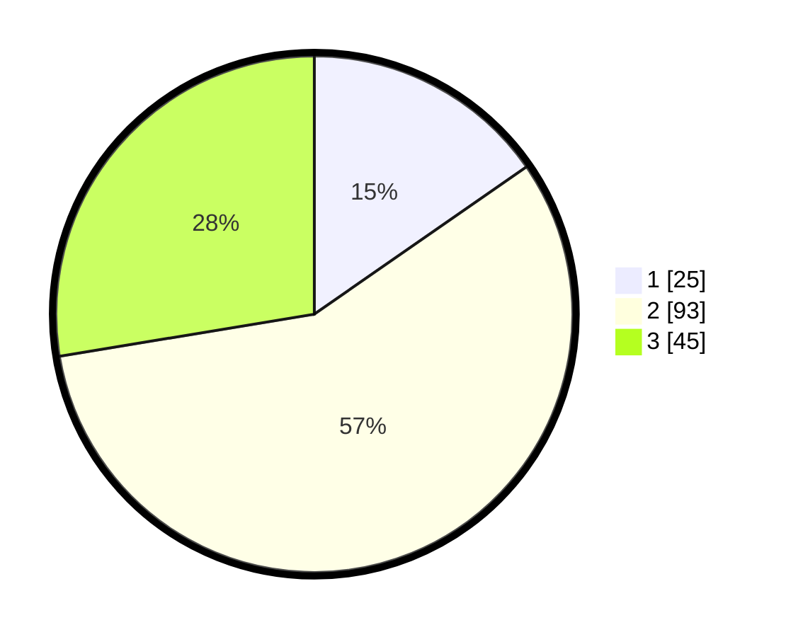

# Hasil

## Grafik

## Tabel

| No. | Nama Paslon    | Suara | Suara (raw) | Persentase |
|:--- |:-------------- | -----:| -----------:| ----------:|
| 1   | ANIES MUHAIMIN | 25    | [25][p-1]   | 15,34      |
| 2   | PRABOWO GIBRAN | 93    | [93][p-2]   | 57,06      |
| 3   | GANJAR MAHFUD  | 45    | [45][p-3]   | 27,61      |

[p-1]: https://github.com/gigit-pemilu/pemilu-2024-51-bali/blob/main/pilpres/hitung-suara/sub/51-bali/sub/71-kota-denpasar/sub/03-denpasar-barat/sub/2002-pemecutan-kelod/sub/028-tps/sub/paslon-1.txt
[p-2]: https://github.com/gigit-pemilu/pemilu-2024-51-bali/blob/main/pilpres/hitung-suara/sub/51-bali/sub/71-kota-denpasar/sub/03-denpasar-barat/sub/2002-pemecutan-kelod/sub/028-tps/sub/paslon-2.txt
[p-3]: https://github.com/gigit-pemilu/pemilu-2024-51-bali/blob/main/pilpres/hitung-suara/sub/51-bali/sub/71-kota-denpasar/sub/03-denpasar-barat/sub/2002-pemecutan-kelod/sub/028-tps/sub/paslon-3.txt

## Foto C Plano

https://sirekap-obj-formc.kpu.go.id/3efd/pemilu/ppwp/51/71/03/20/02/5171032002028-20240214-214900--99e6a85d-8cf0-473c-adb8-5cafe147b95b.jpg

https://sirekap-obj-formc.kpu.go.id/3efd/pemilu/ppwp/51/71/03/20/02/5171032002028-20240214-215019--7e4f078a-de0b-4049-a09f-359ed183fdc5.jpg

https://sirekap-obj-formc.kpu.go.id/3efd/pemilu/ppwp/51/71/03/20/02/5171032002028-20240214-215101--81cb9823-3955-4640-a3eb-7b9f04f22eac.jpg

## Metadata

| Key        | Value               |
| ---------- | ------------------- |
| Time Stamp | 2024-02-25 18:00:00 |

