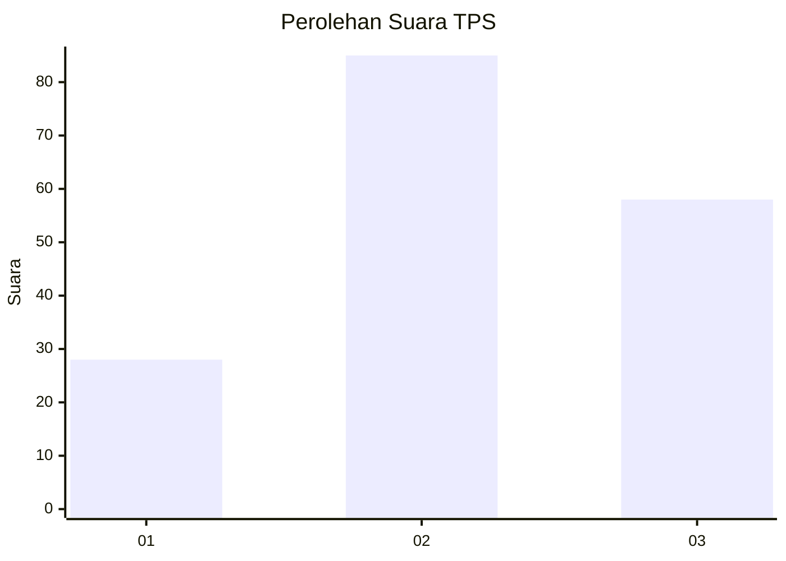
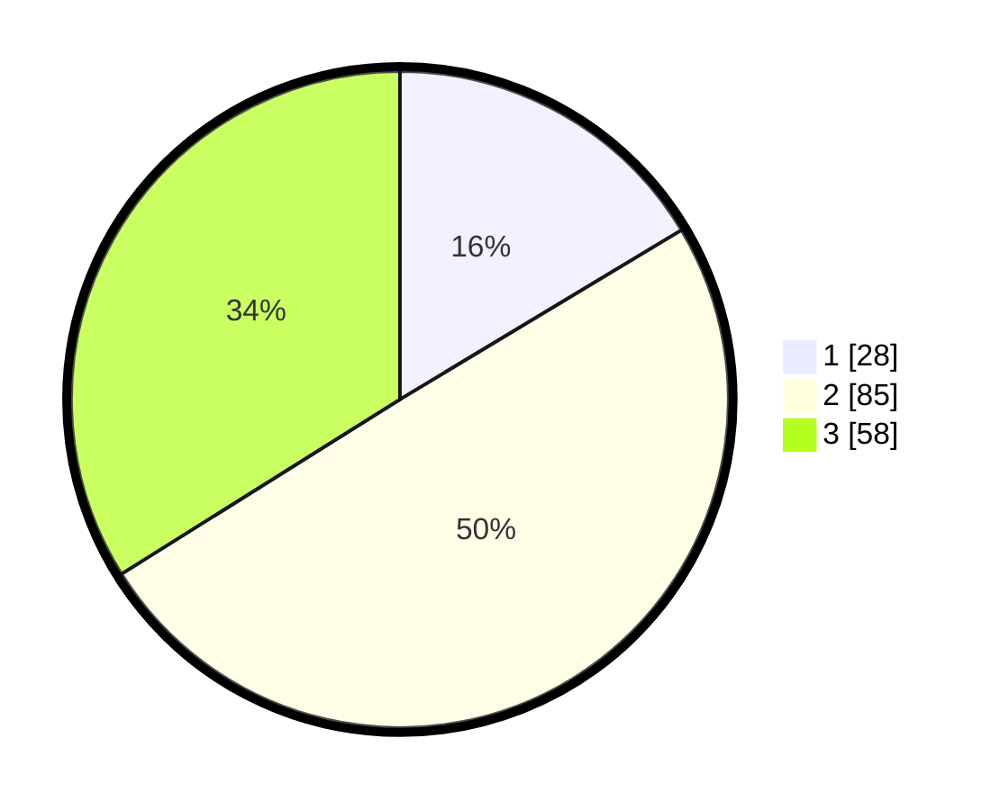

# Hasil

## Grafik

## Tabel

| No. | Nama Paslon    | Suara | Suara (raw) | Persentase |
|:--- |:-------------- | -----:| -----------:| ----------:|
| 1   | ANIES MUHAIMIN | 28    | [28][p-1]   | 16,37      |
| 2   | PRABOWO GIBRAN | 85    | [85][p-2]   | 49,71      |
| 3   | GANJAR MAHFUD  | 58    | [58][p-3]   | 33,92      |

[p-1]: https://github.com/gigit-pemilu/pemilu-2024-51-bali/blob/main/pilpres/hitung-suara/sub/51-bali/sub/71-kota-denpasar/sub/03-denpasar-barat/sub/2002-pemecutan-kelod/sub/029-tps/sub/paslon-1.txt
[p-2]: https://github.com/gigit-pemilu/pemilu-2024-51-bali/blob/main/pilpres/hitung-suara/sub/51-bali/sub/71-kota-denpasar/sub/03-denpasar-barat/sub/2002-pemecutan-kelod/sub/029-tps/sub/paslon-2.txt
[p-3]: https://github.com/gigit-pemilu/pemilu-2024-51-bali/blob/main/pilpres/hitung-suara/sub/51-bali/sub/71-kota-denpasar/sub/03-denpasar-barat/sub/2002-pemecutan-kelod/sub/029-tps/sub/paslon-3.txt

## Foto C Plano

https://sirekap-obj-formc.kpu.go.id/a18c/pemilu/ppwp/51/71/03/20/02/5171032002029-20240214-211252--26c8743b-fc03-4ce2-88e5-728b8ed5026a.jpg

https://sirekap-obj-formc.kpu.go.id/a18c/pemilu/ppwp/51/71/03/20/02/5171032002029-20240214-225505--2efbf5a0-dbb4-4f3a-beaa-848f6d8912cd.jpg

https://sirekap-obj-formc.kpu.go.id/a18c/pemilu/ppwp/51/71/03/20/02/5171032002029-20240214-211308--a8302d6b-4a5f-45e9-b838-01ca6a7a9c03.jpg

## Metadata

| Key        | Value               |
| ---------- | ------------------- |
| Time Stamp | 2024-02-24 22:31:28 |

