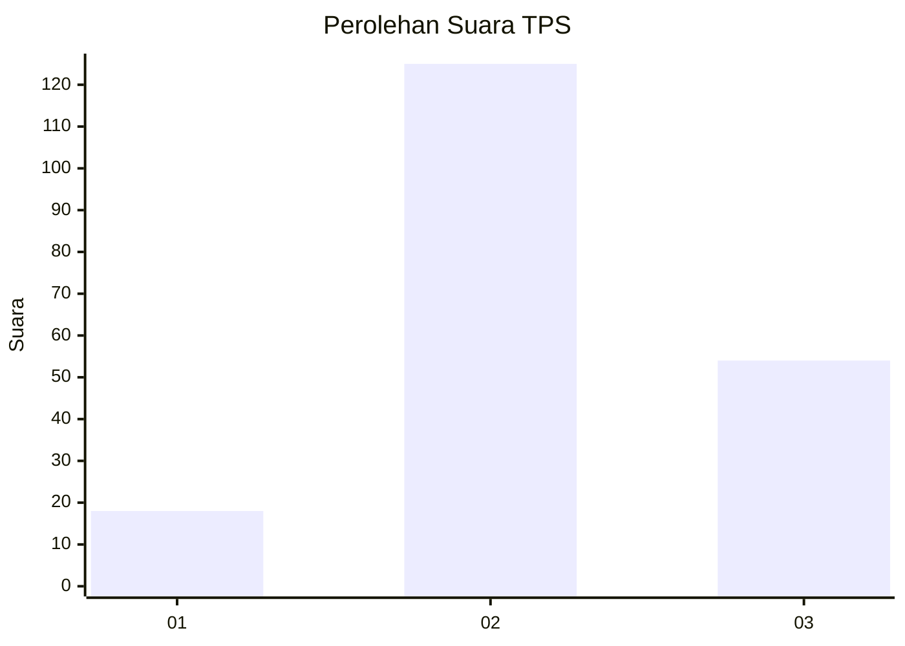
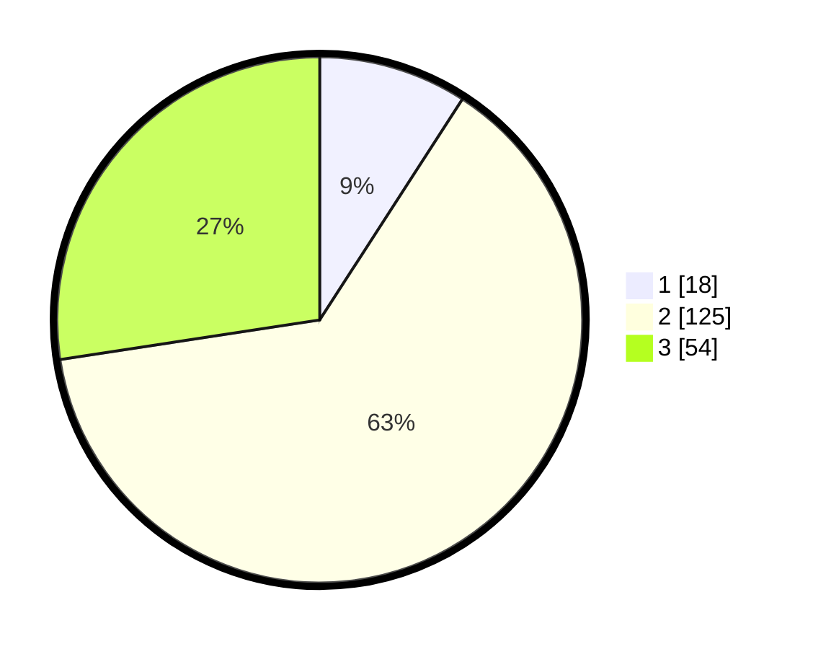

# Hasil

## Grafik

## Tabel

| No. | Nama Paslon    | Suara | Suara (raw) | Persentase |
|:--- |:-------------- | -----:| -----------:| ----------:|
| 1   | ANIES MUHAIMIN | 18    | [18][p-1]   | 9,14       |
| 2   | PRABOWO GIBRAN | 125   | [125][p-2]  | 63,45      |
| 3   | GANJAR MAHFUD  | 54    | [54][p-3]   | 27,41      |

[p-1]: https://github.com/gigit-pemilu/pemilu-2024-51-bali/blob/main/pilpres/hitung-suara/sub/51-bali/sub/71-kota-denpasar/sub/03-denpasar-barat/sub/2002-pemecutan-kelod/sub/037-tps/sub/paslon-1.txt
[p-2]: https://github.com/gigit-pemilu/pemilu-2024-51-bali/blob/main/pilpres/hitung-suara/sub/51-bali/sub/71-kota-denpasar/sub/03-denpasar-barat/sub/2002-pemecutan-kelod/sub/037-tps/sub/paslon-2.txt
[p-3]: https://github.com/gigit-pemilu/pemilu-2024-51-bali/blob/main/pilpres/hitung-suara/sub/51-bali/sub/71-kota-denpasar/sub/03-denpasar-barat/sub/2002-pemecutan-kelod/sub/037-tps/sub/paslon-3.txt

## Foto C Plano

https://sirekap-obj-formc.kpu.go.id/2fe4/pemilu/ppwp/51/71/03/20/02/5171032002037-20240215-084806--31895338-2d5f-4170-ac61-e95e57220de3.jpg

https://sirekap-obj-formc.kpu.go.id/2fe4/pemilu/ppwp/51/71/03/20/02/5171032002037-20240214-141245--01e510f1-359b-464a-a0de-68dc6e07838c.jpg

https://sirekap-obj-formc.kpu.go.id/2fe4/pemilu/ppwp/51/71/03/20/02/5171032002037-20240214-141105--4b974f22-f3d1-41db-b1e4-6db00ef70b93.jpg

## Metadata

| Key        | Value               |
| ---------- | ------------------- |
| Time Stamp | 2024-02-24 22:31:28 |

