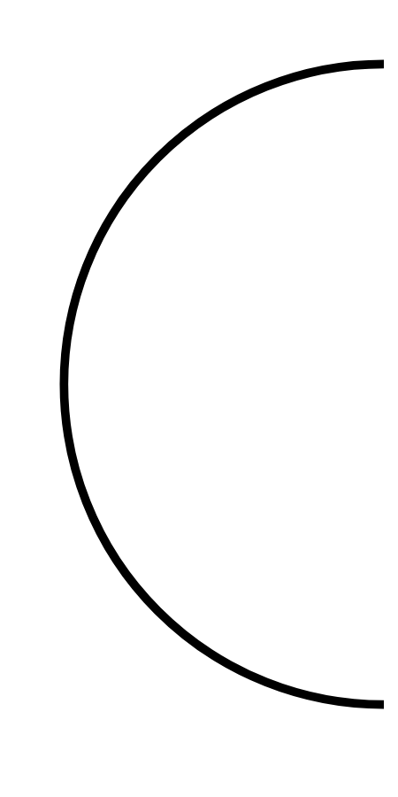

# Hasil

## Grafik

```mermaid
xychart-beta
    title "Perolehan Suara Nasional"
    x-axis []
    y-axis "Suara" 0 --> 0
    bar []
```



## Tabel

| No. | Nama Paslon | Suara | Suara (raw) | Persentase |
|:--- |:----------- | -----:| -----------:| ----------:|


[p-1]: https://github.com/gigit-pemilu/pemilu-2024/blob/main/pilpres/hitung-suara/sub/51-bali/sub/71-kota-denpasar/sub/03-denpasar-barat/sub/2002-pemecutan-kelod/sub/038-tps/sub/paslon-1.txt
[p-2]: https://github.com/gigit-pemilu/pemilu-2024/blob/main/pilpres/hitung-suara/sub/51-bali/sub/71-kota-denpasar/sub/03-denpasar-barat/sub/2002-pemecutan-kelod/sub/038-tps/sub/paslon-2.txt
[p-3]: https://github.com/gigit-pemilu/pemilu-2024/blob/main/pilpres/hitung-suara/sub/51-bali/sub/71-kota-denpasar/sub/03-denpasar-barat/sub/2002-pemecutan-kelod/sub/038-tps/sub/paslon-3.txt

## Foto C Plano

https://sirekap-obj-formc.kpu.go.id/f33c/pemilu/ppwp/51/71/03/20/02/5171032002038-20240214-141106--cfb991e4-2936-4abc-9287-b17204be9b09.jpg

https://sirekap-obj-formc.kpu.go.id/f33c/pemilu/ppwp/51/71/03/20/02/5171032002038-20240219-151154--ee5486f6-6acd-4bb1-a4f9-51a393d5833f.jpg

https://sirekap-obj-formc.kpu.go.id/f33c/pemilu/ppwp/51/71/03/20/02/5171032002038-20240220-123640--1f19b4f4-3250-4494-ba6e-3e5a71cd985c.jpg


## Metadata

| Key        | Value               |
| ---------- | ------------------- |
| Time Stamp | 2024-02-20 13:00:00 |


## DATA PEMILIH TETAP

Jumlah pemilih dalam DPT: **273**.
 * L: **138**.
 * P: **135**.

## DATA PENGGUNA HAK PILIH

Jumlah pengguna hak pilih dalam DPT: **198**.
 * L: **98**.
 * P: **100**.

Jumlah pengguna hak pilih dalam DPTb: **1**.
 * L: **1**.
 * P: **0**.

Jumlah pengguna hak pilih dalam DPK: **0**.
 * L: **0**.
 * P: **0**.

Jumlah pengguna hak pilih: **199**.
 * L: **99**.
 * P: **100**.

## JUMLAH SUARA SAH DAN TIDAK SAH

JUMLAH SELURUH SUARA SAH: **195**.

JUMLAH SUARA TIDAK SAH: **4**.

JUMLAH SELURUH SUARA SAH DAN SUARA TIDAK SAH: **199**.


