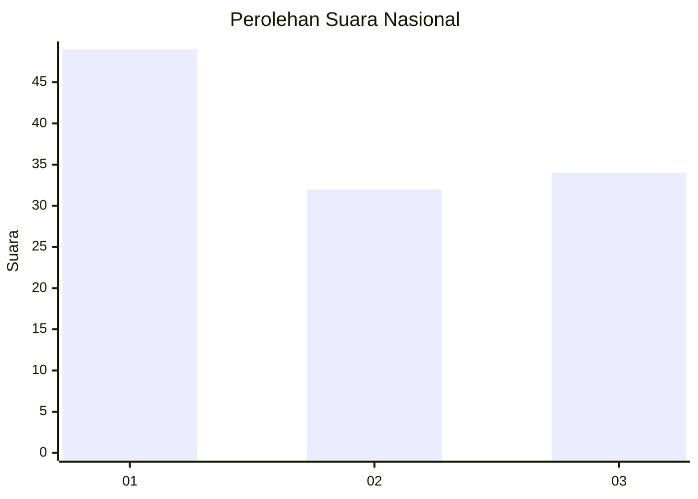
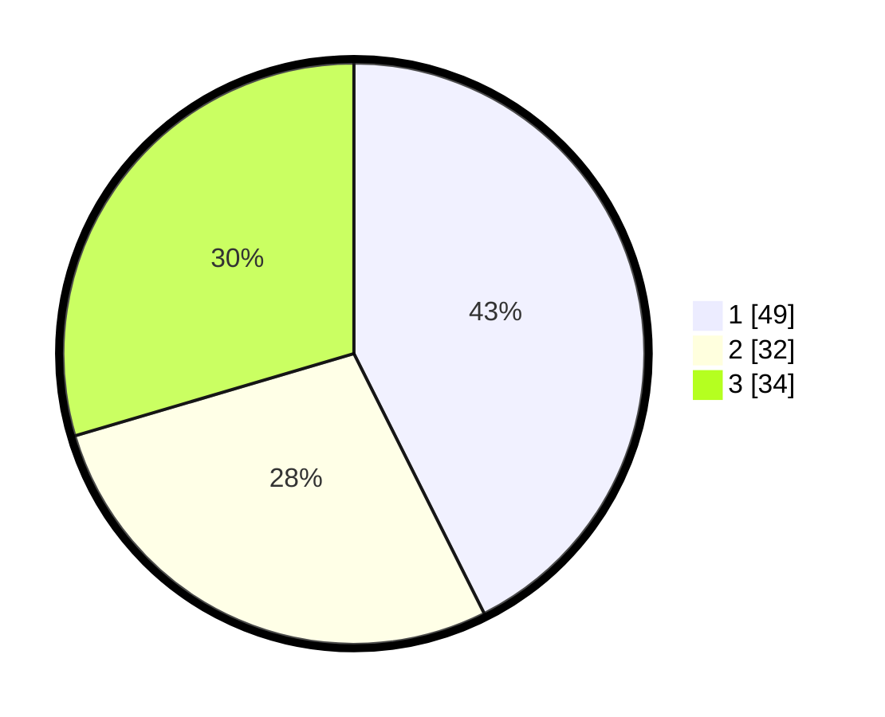

# Hasil

## Grafik

## Tabel

| No. | Nama Paslon    | Suara | Suara (raw) | Persentase |
|:--- |:-------------- | -----:| -----------:| ----------:|
| 1   | ANIES MUHAIMIN | 49    | [49][p-1]   | 42,61      |
| 2   | PRABOWO GIBRAN | 32    | [32][p-2]   | 27,83      |
| 3   | GANJAR MAHFUD  | 34    | [34][p-3]   | 29,57      |

[p-1]: https://github.com/gigit-pemilu/pemilu-2024/blob/main/pilpres/hitung-suara/sub/51-bali/sub/71-kota-denpasar/sub/03-denpasar-barat/sub/2002-pemecutan-kelod/sub/042-tps/sub/paslon-1.txt
[p-2]: https://github.com/gigit-pemilu/pemilu-2024/blob/main/pilpres/hitung-suara/sub/51-bali/sub/71-kota-denpasar/sub/03-denpasar-barat/sub/2002-pemecutan-kelod/sub/042-tps/sub/paslon-2.txt
[p-3]: https://github.com/gigit-pemilu/pemilu-2024/blob/main/pilpres/hitung-suara/sub/51-bali/sub/71-kota-denpasar/sub/03-denpasar-barat/sub/2002-pemecutan-kelod/sub/042-tps/sub/paslon-3.txt

## Foto C Plano

https://sirekap-obj-formc.kpu.go.id/4e36/pemilu/ppwp/51/71/03/20/02/5171032002042-20240220-070657--e2e00f4e-abfa-4e32-b08a-d3ca558b7059.jpg

https://sirekap-obj-formc.kpu.go.id/4e36/pemilu/ppwp/51/71/03/20/02/5171032002042-20240220-071126--806c4dae-e766-471d-97f4-d31a854af77f.jpg

https://sirekap-obj-formc.kpu.go.id/4e36/pemilu/ppwp/51/71/03/20/02/5171032002042-20240220-070541--694f1989-1c11-4714-bf7c-6529ea9e9c05.jpg

## Metadata

| Key        | Value               |
| ---------- | ------------------- |
| Time Stamp | 2024-02-20 08:00:00 |

