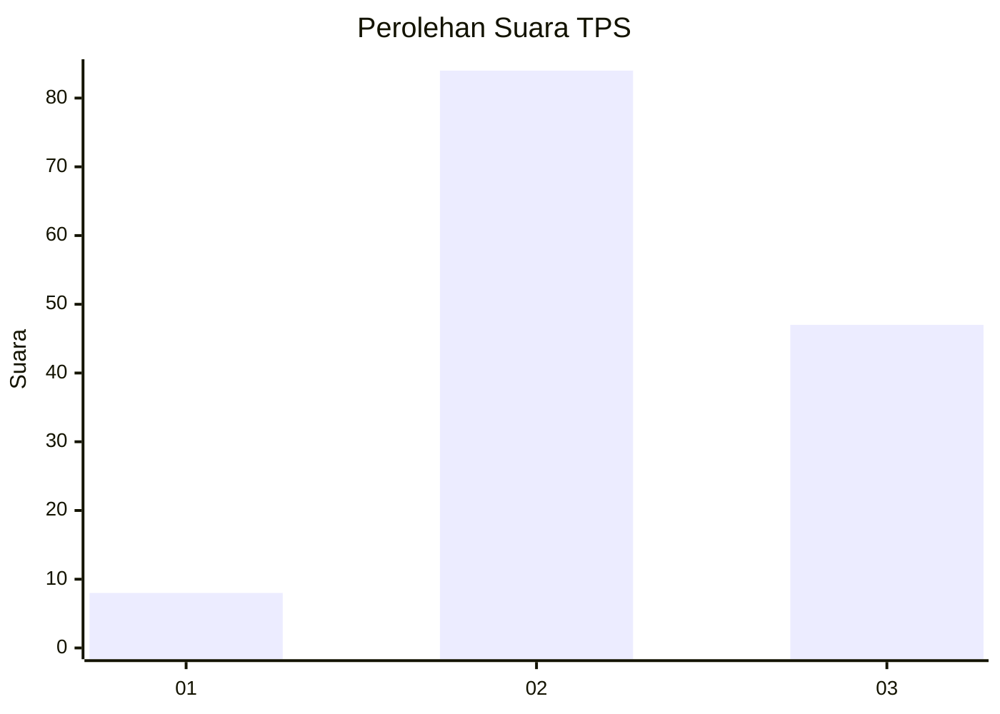
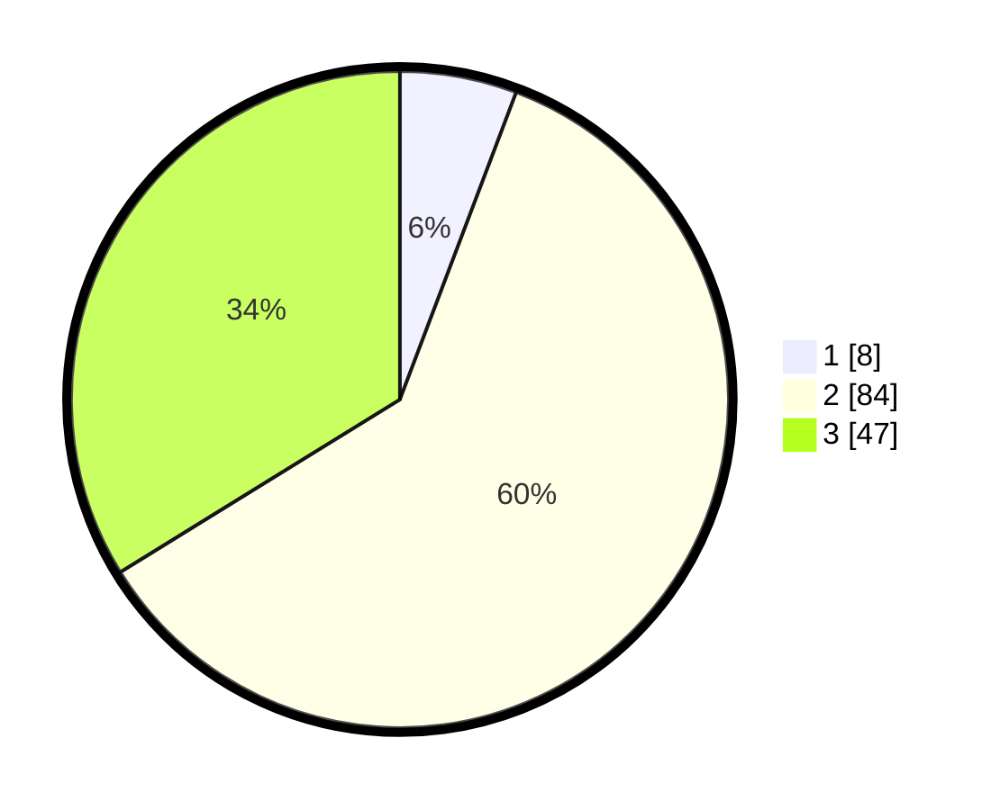

# Hasil

## Grafik

## Tabel

| No. | Nama Paslon    | Suara | Suara (raw) | Persentase |
|:--- |:-------------- | -----:| -----------:| ----------:|
| 1   | ANIES MUHAIMIN | 8     | [8][p-1]    | 5,76       |
| 2   | PRABOWO GIBRAN | 84    | [84][p-2]   | 60,43      |
| 3   | GANJAR MAHFUD  | 47    | [47][p-3]   | 33,81      |

[p-1]: https://github.com/gigit-pemilu/pemilu-2024-51-bali/blob/main/pilpres/hitung-suara/sub/51-bali/sub/71-kota-denpasar/sub/03-denpasar-barat/sub/2002-pemecutan-kelod/sub/045-tps/sub/paslon-1.txt
[p-2]: https://github.com/gigit-pemilu/pemilu-2024-51-bali/blob/main/pilpres/hitung-suara/sub/51-bali/sub/71-kota-denpasar/sub/03-denpasar-barat/sub/2002-pemecutan-kelod/sub/045-tps/sub/paslon-2.txt
[p-3]: https://github.com/gigit-pemilu/pemilu-2024-51-bali/blob/main/pilpres/hitung-suara/sub/51-bali/sub/71-kota-denpasar/sub/03-denpasar-barat/sub/2002-pemecutan-kelod/sub/045-tps/sub/paslon-3.txt

## Foto C Plano

https://sirekap-obj-formc.kpu.go.id/954d/pemilu/ppwp/51/71/03/20/02/5171032002045-20240215-084807--aca1b02e-e623-46e4-b99b-5000a2ce27c8.jpg

https://sirekap-obj-formc.kpu.go.id/954d/pemilu/ppwp/51/71/03/20/02/5171032002045-20240215-084832--e80d7cc8-8312-4612-8b37-ccc4fd167d2f.jpg

https://sirekap-obj-formc.kpu.go.id/954d/pemilu/ppwp/51/71/03/20/02/5171032002045-20240215-084901--335146ba-8060-4190-924f-4d260f1f7b35.jpg

## Metadata

| Key        | Value               |
| ---------- | ------------------- |
| Time Stamp | 2024-02-19 18:00:00 |

## DATA PEMILIH TETAP

Jumlah pemilih dalam DPT: **215**.
 * L: **110**.
 * P: **105**.

## DATA PENGGUNA HAK PILIH

Jumlah pengguna hak pilih dalam DPT: **139**.
 * L: **74**.
 * P: **65**.

Jumlah pengguna hak pilih dalam DPTb: **3**.
 * L: **0**.
 * P: **3**.

Jumlah pengguna hak pilih dalam DPK: **2**.
 * L: **0**.
 * P: **2**.

Jumlah pengguna hak pilih: **144**.
 * L: **74**.
 * P: **70**.

## JUMLAH SUARA SAH DAN TIDAK SAH

JUMLAH SELURUH SUARA SAH: **139**.

JUMLAH SUARA TIDAK SAH: **5**.

JUMLAH SELURUH SUARA SAH DAN SUARA TIDAK SAH: **144**.

