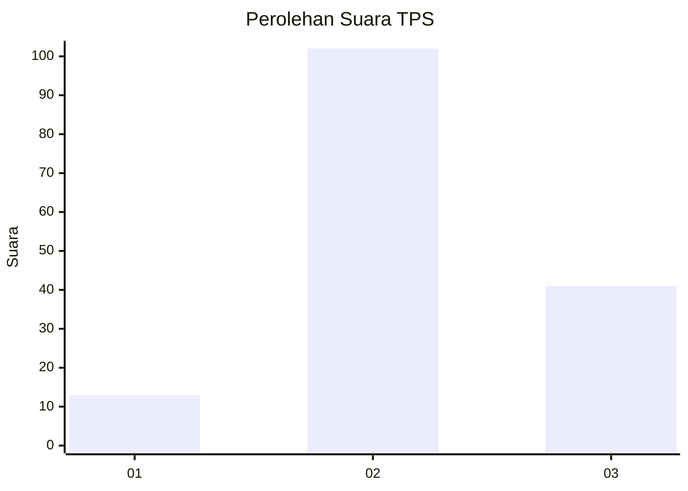
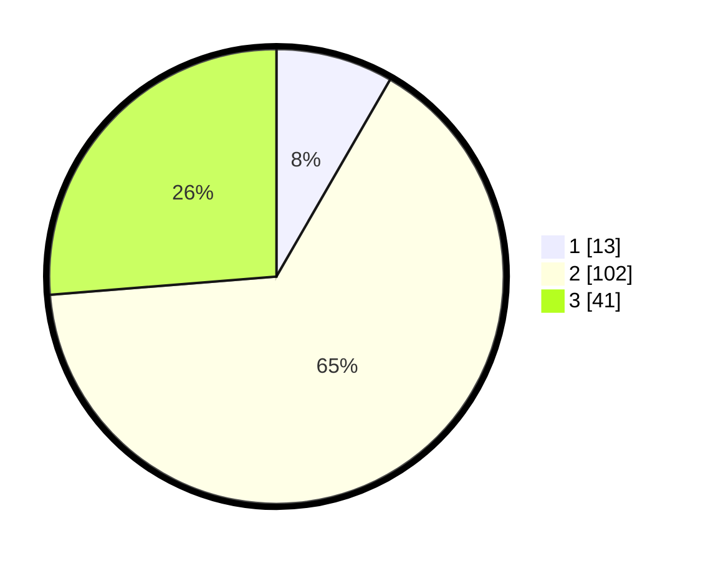

# Hasil

## Grafik

## Tabel

| No. | Nama Paslon    | Suara | Suara (raw) | Persentase |
|:--- |:-------------- | -----:| -----------:| ----------:|
| 1   | ANIES MUHAIMIN | 13    | [13][p-1]   | 8,33       |
| 2   | PRABOWO GIBRAN | 102   | [102][p-2]  | 65,38      |
| 3   | GANJAR MAHFUD  | 41    | [41][p-3]   | 26,28      |

[p-1]: https://github.com/gigit-pemilu/pemilu-2024-51-bali/blob/main/pilpres/hitung-suara/sub/51-bali/sub/71-kota-denpasar/sub/03-denpasar-barat/sub/2002-pemecutan-kelod/sub/047-tps/sub/paslon-1.txt
[p-2]: https://github.com/gigit-pemilu/pemilu-2024-51-bali/blob/main/pilpres/hitung-suara/sub/51-bali/sub/71-kota-denpasar/sub/03-denpasar-barat/sub/2002-pemecutan-kelod/sub/047-tps/sub/paslon-2.txt
[p-3]: https://github.com/gigit-pemilu/pemilu-2024-51-bali/blob/main/pilpres/hitung-suara/sub/51-bali/sub/71-kota-denpasar/sub/03-denpasar-barat/sub/2002-pemecutan-kelod/sub/047-tps/sub/paslon-3.txt

## Foto C Plano

https://sirekap-obj-formc.kpu.go.id/7933/pemilu/ppwp/51/71/03/20/02/5171032002047-20240215-084911--75578c3f-cb37-4f08-8e3b-ad4b377b68d5.jpg

https://sirekap-obj-formc.kpu.go.id/7933/pemilu/ppwp/51/71/03/20/02/5171032002047-20240215-084933--f0db8193-0378-440d-8361-ab1a7d7d5f69.jpg

https://sirekap-obj-formc.kpu.go.id/7933/pemilu/ppwp/51/71/03/20/02/5171032002047-20240215-084943--ca885ebe-fd6c-4edd-a94d-95d1c18461c5.jpg

## Metadata

| Key        | Value               |
| ---------- | ------------------- |
| Time Stamp | 2024-02-24 22:31:28 |

