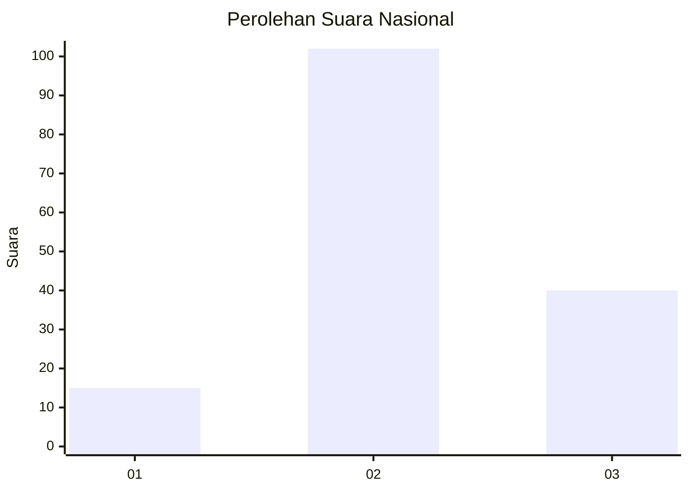
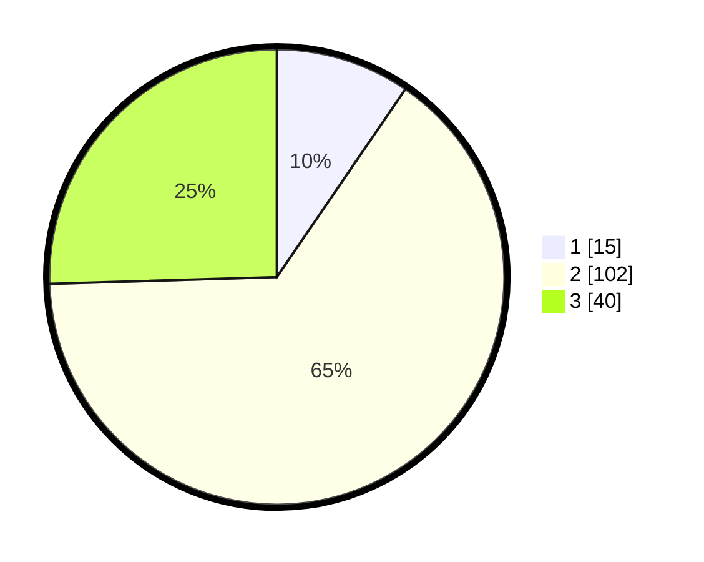

# Hasil

## Grafik

## Tabel

| No. | Nama Paslon    | Suara | Suara (raw) | Persentase |
|:--- |:-------------- | -----:| -----------:| ----------:|
| 1   | ANIES MUHAIMIN | 15    | [15][p-1]   | 9,55       |
| 2   | PRABOWO GIBRAN | 102   | [102][p-2]  | 64,97      |
| 3   | GANJAR MAHFUD  | 40    | [40][p-3]   | 25,48      |

[p-1]: https://github.com/gigit-pemilu/pemilu-2024/blob/main/pilpres/hitung-suara/sub/51-bali/sub/71-kota-denpasar/sub/03-denpasar-barat/sub/2002-pemecutan-kelod/sub/049-tps/sub/paslon-1.txt
[p-2]: https://github.com/gigit-pemilu/pemilu-2024/blob/main/pilpres/hitung-suara/sub/51-bali/sub/71-kota-denpasar/sub/03-denpasar-barat/sub/2002-pemecutan-kelod/sub/049-tps/sub/paslon-2.txt
[p-3]: https://github.com/gigit-pemilu/pemilu-2024/blob/main/pilpres/hitung-suara/sub/51-bali/sub/71-kota-denpasar/sub/03-denpasar-barat/sub/2002-pemecutan-kelod/sub/049-tps/sub/paslon-3.txt

## Foto C Plano

https://sirekap-obj-formc.kpu.go.id/e48b/pemilu/ppwp/51/71/03/20/02/5171032002049-20240214-213332--4cf789fb-5883-4cdd-90ba-76e95a01b770.jpg

https://sirekap-obj-formc.kpu.go.id/e48b/pemilu/ppwp/51/71/03/20/02/5171032002049-20240214-213422--c82307bf-b873-4fad-9a4e-b948b23d4524.jpg

https://sirekap-obj-formc.kpu.go.id/e48b/pemilu/ppwp/51/71/03/20/02/5171032002049-20240214-213504--982c53e7-6d75-415a-a3df-c61d610c0f39.jpg

## Metadata

| Key        | Value               |
| ---------- | ------------------- |
| Time Stamp | 2024-02-24 22:31:28 |

