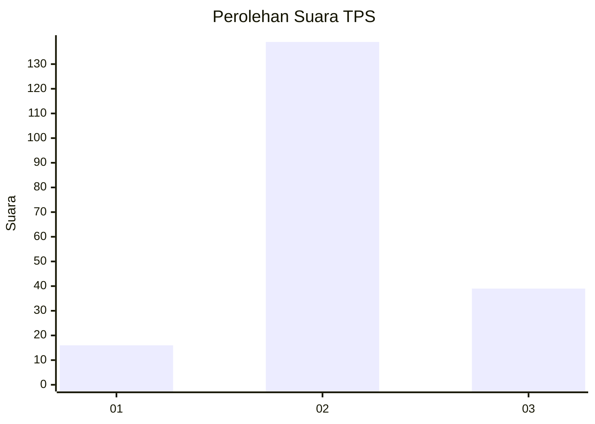
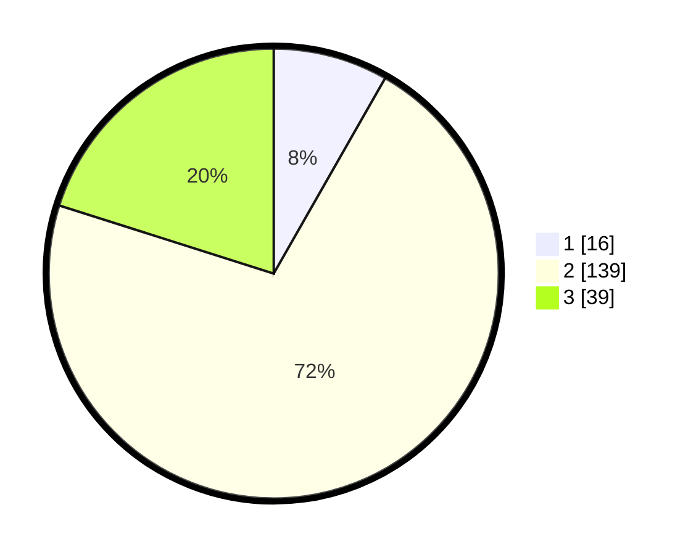

# Hasil

## Grafik

## Tabel

| No. | Nama Paslon    | Suara | Suara (raw) | Persentase |
|:--- |:-------------- | -----:| -----------:| ----------:|
| 1   | ANIES MUHAIMIN | 16    | [16][p-1]   | 8,25       |
| 2   | PRABOWO GIBRAN | 139   | [139][p-2]  | 71,65      |
| 3   | GANJAR MAHFUD  | 39    | [39][p-3]   | 20,10      |

[p-1]: https://github.com/gigit-pemilu/pemilu-2024-51-bali/blob/main/pilpres/hitung-suara/sub/51-bali/sub/71-kota-denpasar/sub/03-denpasar-barat/sub/2002-pemecutan-kelod/sub/053-tps/sub/paslon-1.txt
[p-2]: https://github.com/gigit-pemilu/pemilu-2024-51-bali/blob/main/pilpres/hitung-suara/sub/51-bali/sub/71-kota-denpasar/sub/03-denpasar-barat/sub/2002-pemecutan-kelod/sub/053-tps/sub/paslon-2.txt
[p-3]: https://github.com/gigit-pemilu/pemilu-2024-51-bali/blob/main/pilpres/hitung-suara/sub/51-bali/sub/71-kota-denpasar/sub/03-denpasar-barat/sub/2002-pemecutan-kelod/sub/053-tps/sub/paslon-3.txt

## Foto C Plano

https://sirekap-obj-formc.kpu.go.id/940d/pemilu/ppwp/51/71/03/20/02/5171032002053-20240214-202722--eb94a013-3268-48e7-b5b5-b32eed22619f.jpg

https://sirekap-obj-formc.kpu.go.id/940d/pemilu/ppwp/51/71/03/20/02/5171032002053-20240214-202802--97f17a2e-f2b7-40b3-8f27-20164aaf2b06.jpg

https://sirekap-obj-formc.kpu.go.id/940d/pemilu/ppwp/51/71/03/20/02/5171032002053-20240214-202809--188d96fd-2287-4a2b-b223-baa5660d0700.jpg

## Metadata

| Key        | Value               |
| ---------- | ------------------- |
| Time Stamp | 2024-02-15 00:41:44 |

## DATA PEMILIH TETAP

Jumlah pemilih dalam DPT: **249**.
 * L: **116**.
 * P: **133**.

## DATA PENGGUNA HAK PILIH

Jumlah pengguna hak pilih dalam DPT: **182**.
 * L: **84**.
 * P: **98**.

Jumlah pengguna hak pilih dalam DPTb: **8**.
 * L: **3**.
 * P: **5**.

Jumlah pengguna hak pilih dalam DPK: **4**.
 * L: **2**.
 * P: **2**.

Jumlah pengguna hak pilih: **194**.
 * L: **89**.
 * P: **105**.

## JUMLAH SUARA SAH DAN TIDAK SAH

JUMLAH SELURUH SUARA SAH: **194**.

JUMLAH SUARA TIDAK SAH: **0**.

JUMLAH SELURUH SUARA SAH DAN SUARA TIDAK SAH: **194**.

