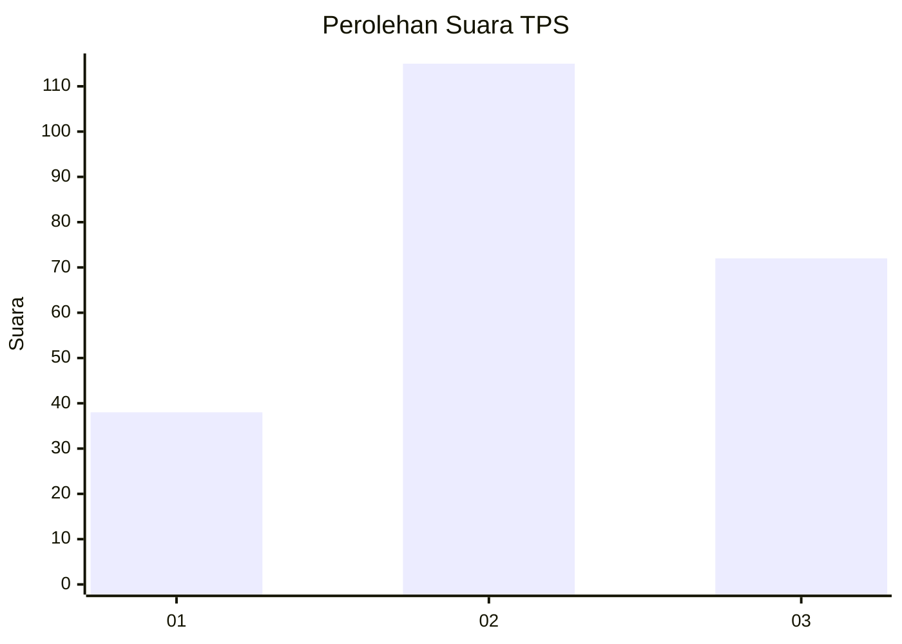
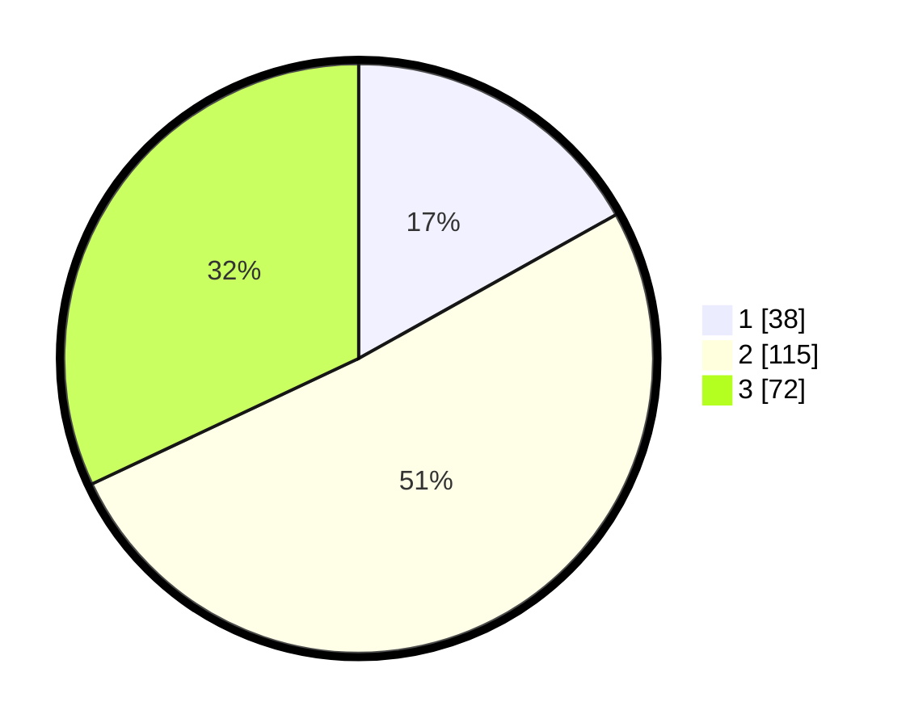

# Hasil

## Grafik

## Tabel

| No. | Nama Paslon    | Suara | Suara (raw) | Persentase |
|:--- |:-------------- | -----:| -----------:| ----------:|
| 1   | ANIES MUHAIMIN | 38    | [38][p-1]   | 16,89      |
| 2   | PRABOWO GIBRAN | 115   | [115][p-2]  | 51,11      |
| 3   | GANJAR MAHFUD  | 72    | [72][p-3]   | 32,00      |

[p-1]: https://github.com/gigit-pemilu/pemilu-2024-51-bali/blob/main/pilpres/hitung-suara/sub/51-bali/sub/71-kota-denpasar/sub/03-denpasar-barat/sub/2002-pemecutan-kelod/sub/055-tps/sub/paslon-1.txt
[p-2]: https://github.com/gigit-pemilu/pemilu-2024-51-bali/blob/main/pilpres/hitung-suara/sub/51-bali/sub/71-kota-denpasar/sub/03-denpasar-barat/sub/2002-pemecutan-kelod/sub/055-tps/sub/paslon-2.txt
[p-3]: https://github.com/gigit-pemilu/pemilu-2024-51-bali/blob/main/pilpres/hitung-suara/sub/51-bali/sub/71-kota-denpasar/sub/03-denpasar-barat/sub/2002-pemecutan-kelod/sub/055-tps/sub/paslon-3.txt

## Foto C Plano

https://sirekap-obj-formc.kpu.go.id/87ab/pemilu/ppwp/51/71/03/20/02/5171032002055-20240214-202432--e53e8e8b-b7fa-47b1-a910-edc2c4b35e82.jpg

https://sirekap-obj-formc.kpu.go.id/87ab/pemilu/ppwp/51/71/03/20/02/5171032002055-20240214-202558--790c8612-85a8-4b83-b5b6-c0657046ec31.jpg

https://sirekap-obj-formc.kpu.go.id/87ab/pemilu/ppwp/51/71/03/20/02/5171032002055-20240214-202702--0b14d43e-577f-463f-8a3d-d982be83ea8d.jpg

## Metadata

| Key        | Value               |
| ---------- | ------------------- |
| Time Stamp | 2024-02-24 22:31:28 |

