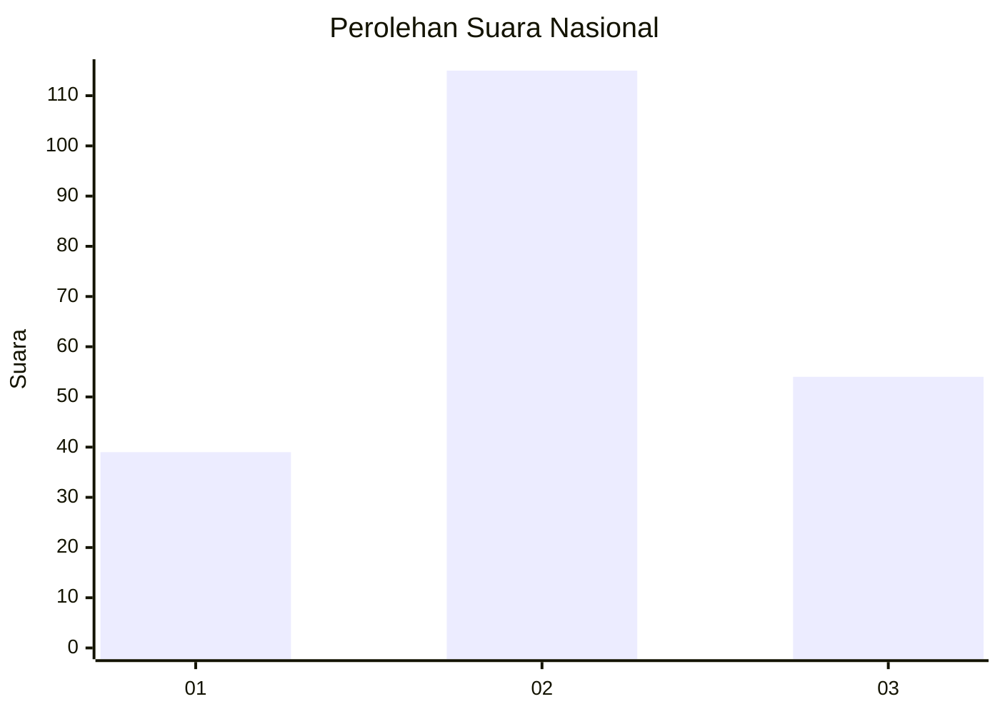
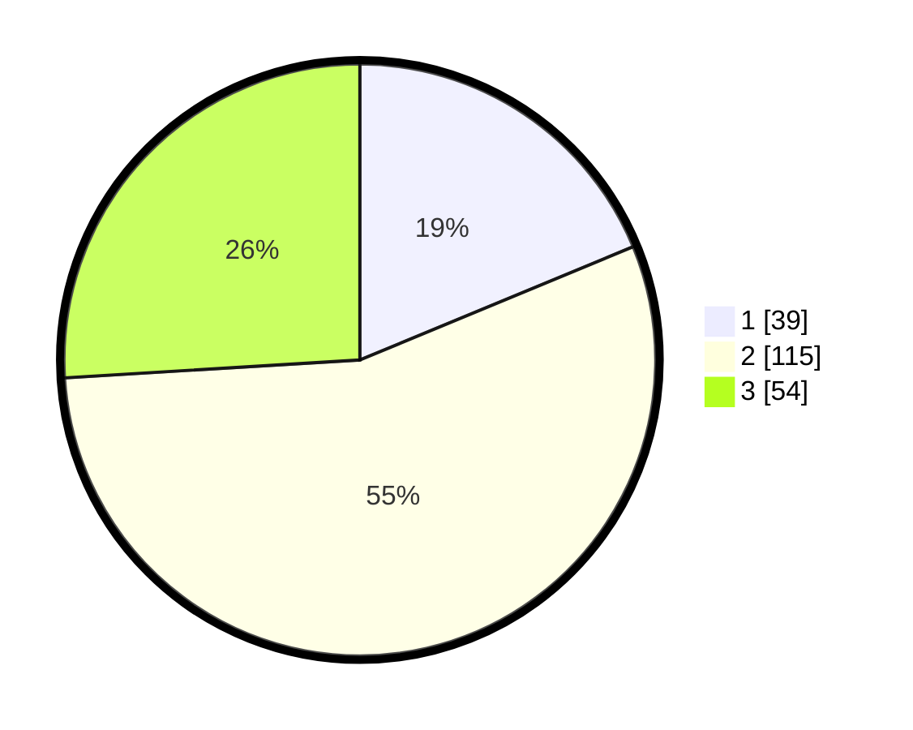

# Hasil

## Grafik

## Tabel

| No. | Nama Paslon    | Suara | Suara (raw) | Persentase |
|:--- |:-------------- | -----:| -----------:| ----------:|
| 1   | ANIES MUHAIMIN | 39    | [39][p-1]   | 18,75      |
| 2   | PRABOWO GIBRAN | 115   | [115][p-2]  | 55,29      |
| 3   | GANJAR MAHFUD  | 54    | [54][p-3]   | 25,96      |

[p-1]: https://github.com/gigit-pemilu/pemilu-2024/blob/main/pilpres/hitung-suara/sub/51-bali/sub/71-kota-denpasar/sub/03-denpasar-barat/sub/2002-pemecutan-kelod/sub/056-tps/sub/paslon-1.txt
[p-2]: https://github.com/gigit-pemilu/pemilu-2024/blob/main/pilpres/hitung-suara/sub/51-bali/sub/71-kota-denpasar/sub/03-denpasar-barat/sub/2002-pemecutan-kelod/sub/056-tps/sub/paslon-2.txt
[p-3]: https://github.com/gigit-pemilu/pemilu-2024/blob/main/pilpres/hitung-suara/sub/51-bali/sub/71-kota-denpasar/sub/03-denpasar-barat/sub/2002-pemecutan-kelod/sub/056-tps/sub/paslon-3.txt

## Foto C Plano

https://sirekap-obj-formc.kpu.go.id/2e64/pemilu/ppwp/51/71/03/20/02/5171032002056-20240214-195404--499ce125-d02c-494c-b327-7dcf64ce69d2.jpg

https://sirekap-obj-formc.kpu.go.id/2e64/pemilu/ppwp/51/71/03/20/02/5171032002056-20240214-195421--8f73c52c-9ae5-4e36-8145-aa170ee85a49.jpg

https://sirekap-obj-formc.kpu.go.id/2e64/pemilu/ppwp/51/71/03/20/02/5171032002056-20240214-195424--36cfb413-b912-461a-b707-e92eef868ba4.jpg

## Metadata

| Key        | Value               |
| ---------- | ------------------- |
| Time Stamp | 2024-02-24 22:31:28 |

