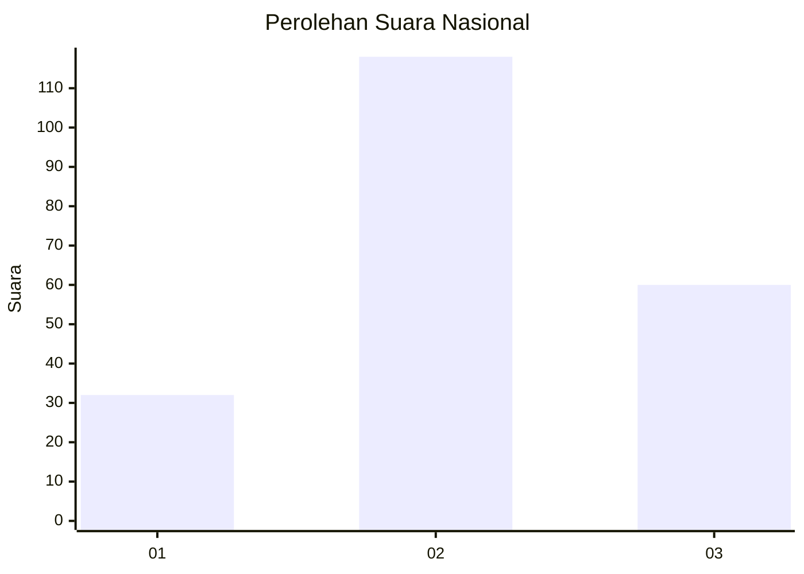
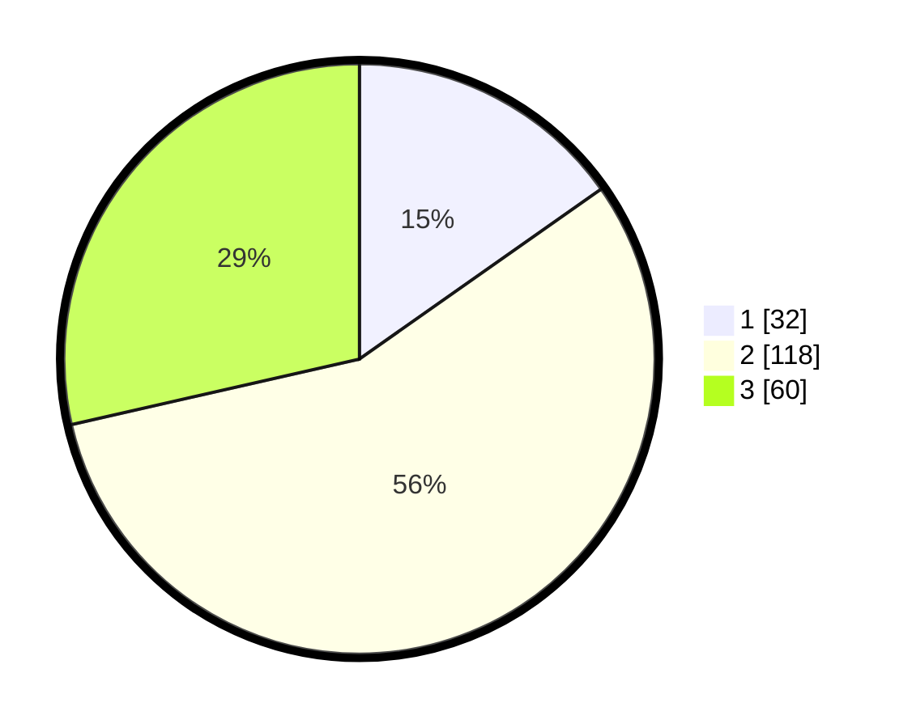

# Hasil

## Grafik

## Tabel

| No. | Nama Paslon    | Suara | Suara (raw) | Persentase |
|:--- |:-------------- | -----:| -----------:| ----------:|
| 1   | ANIES MUHAIMIN | 32    | [32][p-1]   | 15,24      |
| 2   | PRABOWO GIBRAN | 118   | [118][p-2]  | 56,19      |
| 3   | GANJAR MAHFUD  | 60    | [60][p-3]   | 28,57      |

[p-1]: https://github.com/gigit-pemilu/pemilu-2024/blob/main/pilpres/hitung-suara/sub/51-bali/sub/71-kota-denpasar/sub/03-denpasar-barat/sub/2002-pemecutan-kelod/sub/061-tps/sub/paslon-1.txt
[p-2]: https://github.com/gigit-pemilu/pemilu-2024/blob/main/pilpres/hitung-suara/sub/51-bali/sub/71-kota-denpasar/sub/03-denpasar-barat/sub/2002-pemecutan-kelod/sub/061-tps/sub/paslon-2.txt
[p-3]: https://github.com/gigit-pemilu/pemilu-2024/blob/main/pilpres/hitung-suara/sub/51-bali/sub/71-kota-denpasar/sub/03-denpasar-barat/sub/2002-pemecutan-kelod/sub/061-tps/sub/paslon-3.txt

## Foto C Plano

https://sirekap-obj-formc.kpu.go.id/e7e7/pemilu/ppwp/51/71/03/20/02/5171032002061-20240214-141219--16d8651b-6c3c-4a56-b022-781ecab1db70.jpg

https://sirekap-obj-formc.kpu.go.id/e7e7/pemilu/ppwp/51/71/03/20/02/5171032002061-20240214-141259--131f4214-b861-4417-bc40-ed67a1216f1e.jpg

https://sirekap-obj-formc.kpu.go.id/e7e7/pemilu/ppwp/51/71/03/20/02/5171032002061-20240214-141340--934ea46f-f7e1-426b-a40f-5987b7592bde.jpg

## Metadata

| Key        | Value               |
| ---------- | ------------------- |
| Time Stamp | 2024-02-24 22:31:28 |

