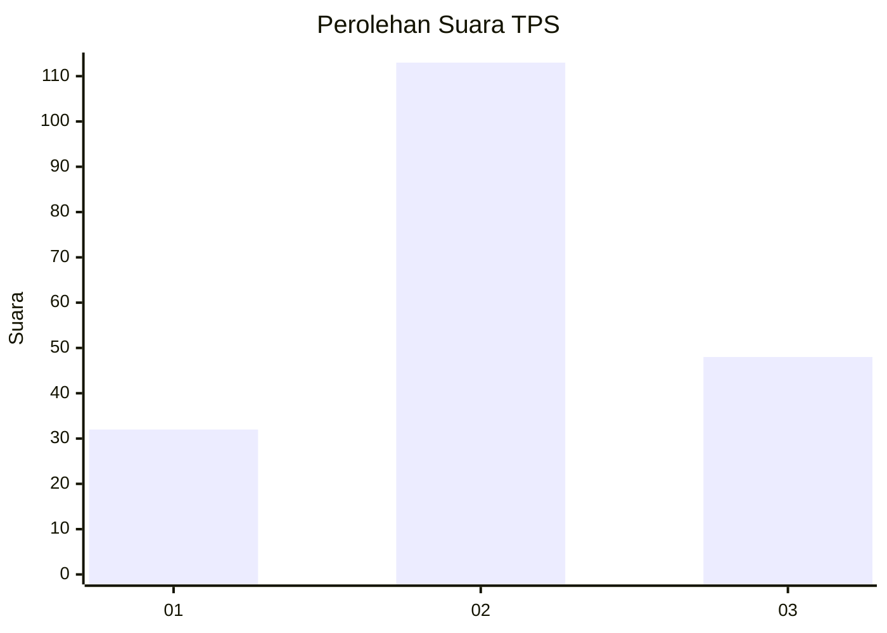
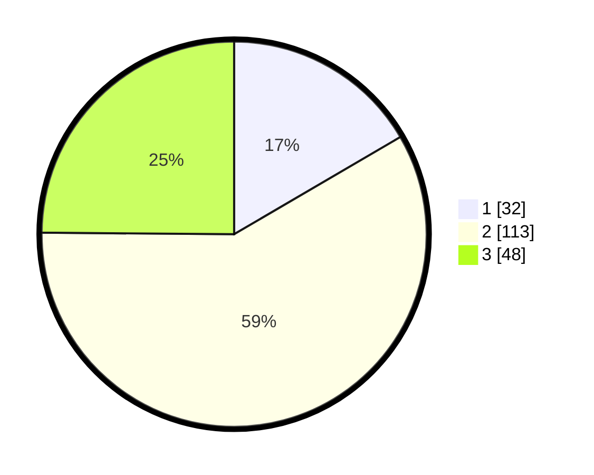

# Hasil

## Grafik

## Tabel

| No. | Nama Paslon    | Suara | Suara (raw) | Persentase |
|:--- |:-------------- | -----:| -----------:| ----------:|
| 1   | ANIES MUHAIMIN | 32    | [32][p-1]   | 16,58      |
| 2   | PRABOWO GIBRAN | 113   | [113][p-2]  | 58,55      |
| 3   | GANJAR MAHFUD  | 48    | [48][p-3]   | 24,87      |

[p-1]: https://github.com/gigit-pemilu/pemilu-2024-51-bali/blob/main/pilpres/hitung-suara/sub/51-bali/sub/71-kota-denpasar/sub/03-denpasar-barat/sub/2002-pemecutan-kelod/sub/063-tps/sub/paslon-1.txt
[p-2]: https://github.com/gigit-pemilu/pemilu-2024-51-bali/blob/main/pilpres/hitung-suara/sub/51-bali/sub/71-kota-denpasar/sub/03-denpasar-barat/sub/2002-pemecutan-kelod/sub/063-tps/sub/paslon-2.txt
[p-3]: https://github.com/gigit-pemilu/pemilu-2024-51-bali/blob/main/pilpres/hitung-suara/sub/51-bali/sub/71-kota-denpasar/sub/03-denpasar-barat/sub/2002-pemecutan-kelod/sub/063-tps/sub/paslon-3.txt

## Foto C Plano

https://sirekap-obj-formc.kpu.go.id/85f0/pemilu/ppwp/51/71/03/20/02/5171032002063-20240214-141202--d5e4b221-b0d8-4af4-8894-8fdb3ec5339d.jpg

https://sirekap-obj-formc.kpu.go.id/85f0/pemilu/ppwp/51/71/03/20/02/5171032002063-20240214-141401--d84f63c8-5315-4ff4-ad23-1fa16b73b7f5.jpg

https://sirekap-obj-formc.kpu.go.id/85f0/pemilu/ppwp/51/71/03/20/02/5171032002063-20240214-141532--513195ad-abcf-4f6a-ae19-b0222ca142f6.jpg

## Metadata

| Key        | Value               |
| ---------- | ------------------- |
| Time Stamp | 2024-02-25 11:00:00 |

