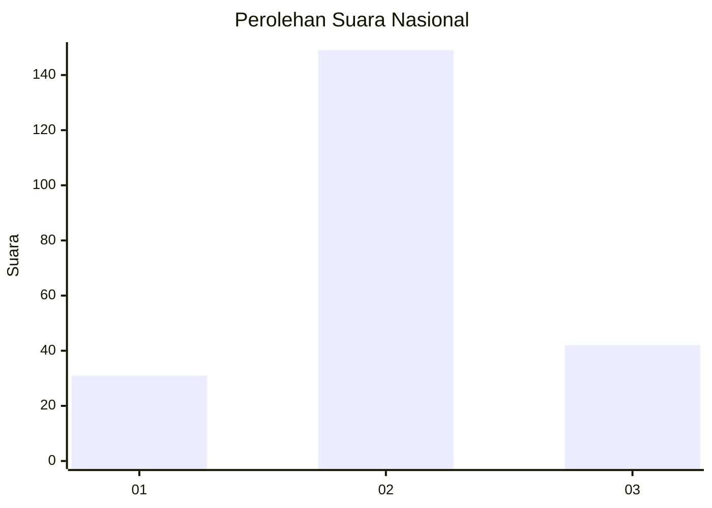
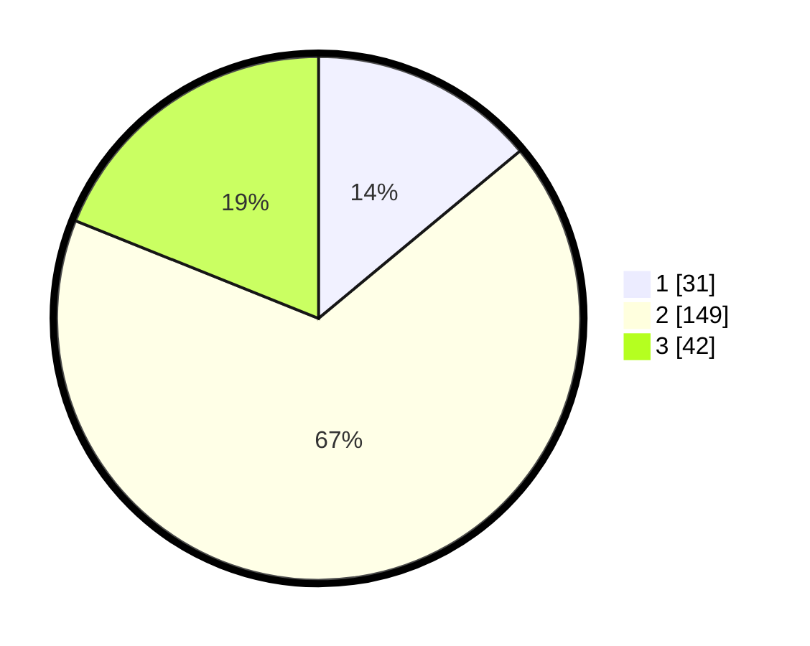

# Hasil

## Grafik

## Tabel

| No. | Nama Paslon    | Suara | Suara (raw) | Persentase |
|:--- |:-------------- | -----:| -----------:| ----------:|
| 1   | ANIES MUHAIMIN | 31    | [31][p-1]   | 13,96      |
| 2   | PRABOWO GIBRAN | 149   | [149][p-2]  | 67,12      |
| 3   | GANJAR MAHFUD  | 42    | [42][p-3]   | 18,92      |

[p-1]: https://github.com/gigit-pemilu/pemilu-2024/blob/main/pilpres/hitung-suara/sub/51-bali/sub/71-kota-denpasar/sub/03-denpasar-barat/sub/2002-pemecutan-kelod/sub/064-tps/sub/paslon-1.txt
[p-2]: https://github.com/gigit-pemilu/pemilu-2024/blob/main/pilpres/hitung-suara/sub/51-bali/sub/71-kota-denpasar/sub/03-denpasar-barat/sub/2002-pemecutan-kelod/sub/064-tps/sub/paslon-2.txt
[p-3]: https://github.com/gigit-pemilu/pemilu-2024/blob/main/pilpres/hitung-suara/sub/51-bali/sub/71-kota-denpasar/sub/03-denpasar-barat/sub/2002-pemecutan-kelod/sub/064-tps/sub/paslon-3.txt

## Foto C Plano

https://sirekap-obj-formc.kpu.go.id/5d88/pemilu/ppwp/51/71/03/20/02/5171032002064-20240214-201444--f81d854f-6299-4c11-bb66-de86bdf1183c.jpg

https://sirekap-obj-formc.kpu.go.id/5d88/pemilu/ppwp/51/71/03/20/02/5171032002064-20240214-201453--410c4367-a1a3-428b-a1cf-a9121cdea0f2.jpg

https://sirekap-obj-formc.kpu.go.id/5d88/pemilu/ppwp/51/71/03/20/02/5171032002064-20240214-201815--7ed9cc06-8d74-4349-a91d-e05e67f308bf.jpg

## Metadata

| Key        | Value               |
| ---------- | ------------------- |
| Time Stamp | 2024-02-25 01:00:00 |

