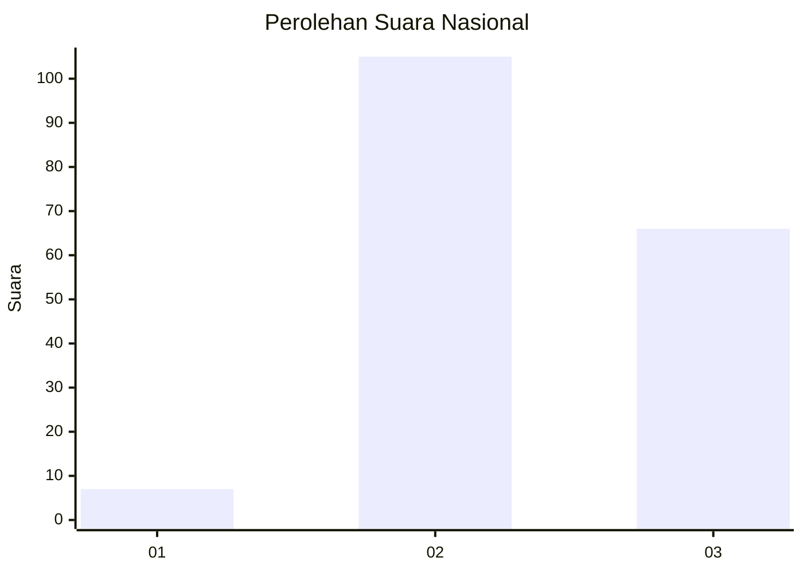
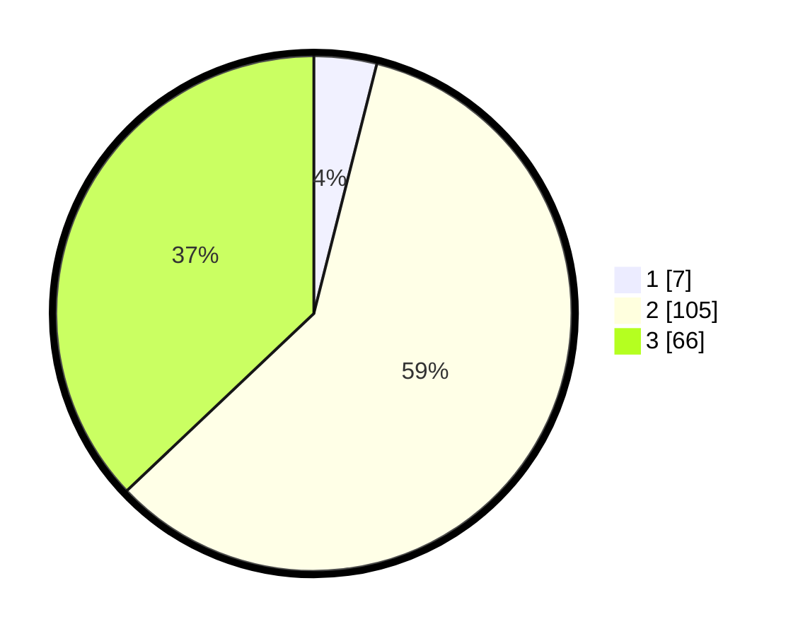

# Hasil

## Grafik

## Tabel

| No. | Nama Paslon    | Suara | Suara (raw) | Persentase |
|:--- |:-------------- | -----:| -----------:| ----------:|
| 1   | ANIES MUHAIMIN | 7     | [7][p-1]    | 3,93       |
| 2   | PRABOWO GIBRAN | 105   | [105][p-2]  | 58,99      |
| 3   | GANJAR MAHFUD  | 66    | [66][p-3]   | 37,08      |

[p-1]: https://github.com/gigit-pemilu/pemilu-2024/blob/main/pilpres/hitung-suara/sub/51-bali/sub/71-kota-denpasar/sub/03-denpasar-barat/sub/2002-pemecutan-kelod/sub/074-tps/sub/paslon-1.txt
[p-2]: https://github.com/gigit-pemilu/pemilu-2024/blob/main/pilpres/hitung-suara/sub/51-bali/sub/71-kota-denpasar/sub/03-denpasar-barat/sub/2002-pemecutan-kelod/sub/074-tps/sub/paslon-2.txt
[p-3]: https://github.com/gigit-pemilu/pemilu-2024/blob/main/pilpres/hitung-suara/sub/51-bali/sub/71-kota-denpasar/sub/03-denpasar-barat/sub/2002-pemecutan-kelod/sub/074-tps/sub/paslon-3.txt

## Foto C Plano

https://sirekap-obj-formc.kpu.go.id/25c4/pemilu/ppwp/51/71/03/20/02/5171032002074-20240214-215206--e84beaf4-5991-4532-8757-76fceb98a992.jpg

https://sirekap-obj-formc.kpu.go.id/25c4/pemilu/ppwp/51/71/03/20/02/5171032002074-20240214-215834--75683f15-1ebb-44b4-b3ad-93635a3cdf13.jpg

https://sirekap-obj-formc.kpu.go.id/25c4/pemilu/ppwp/51/71/03/20/02/5171032002074-20240214-215342--9ddac70a-6b2c-4a19-b519-2723f414f178.jpg

## Metadata

| Key        | Value               |
| ---------- | ------------------- |
| Time Stamp | 2024-02-24 22:31:28 |

