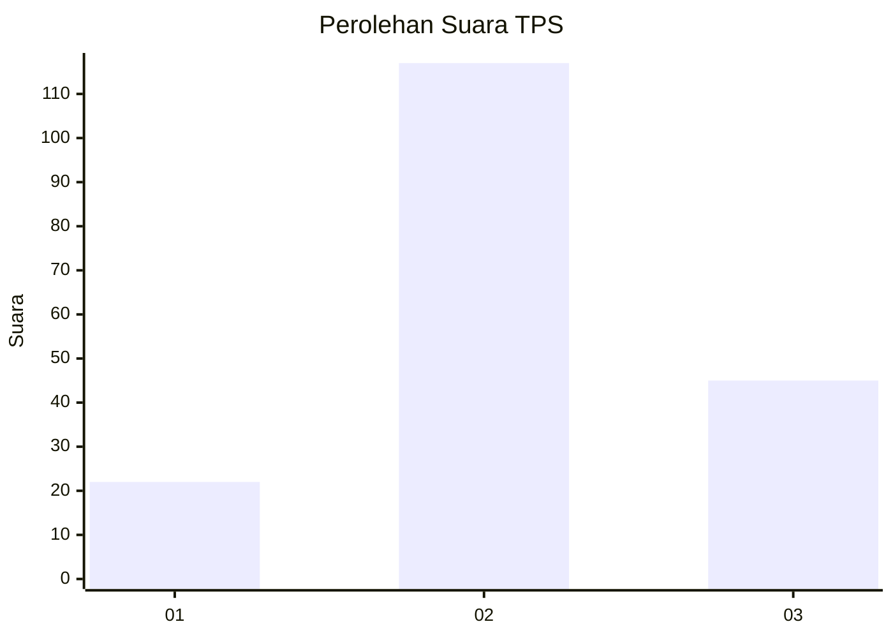
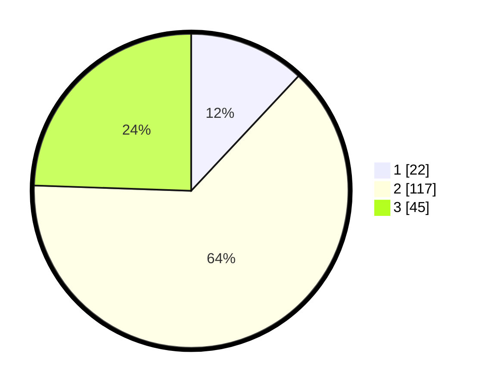

# Hasil

## Grafik

## Tabel

| No. | Nama Paslon    | Suara | Suara (raw) | Persentase |
|:--- |:-------------- | -----:| -----------:| ----------:|
| 1   | ANIES MUHAIMIN | 22    | [22][p-1]   | 11,96      |
| 2   | PRABOWO GIBRAN | 117   | [117][p-2]  | 63,59      |
| 3   | GANJAR MAHFUD  | 45    | [45][p-3]   | 24,46      |

[p-1]: https://github.com/gigit-pemilu/pemilu-2024-51-bali/blob/main/pilpres/hitung-suara/sub/51-bali/sub/71-kota-denpasar/sub/03-denpasar-barat/sub/2002-pemecutan-kelod/sub/075-tps/sub/paslon-1.txt
[p-2]: https://github.com/gigit-pemilu/pemilu-2024-51-bali/blob/main/pilpres/hitung-suara/sub/51-bali/sub/71-kota-denpasar/sub/03-denpasar-barat/sub/2002-pemecutan-kelod/sub/075-tps/sub/paslon-2.txt
[p-3]: https://github.com/gigit-pemilu/pemilu-2024-51-bali/blob/main/pilpres/hitung-suara/sub/51-bali/sub/71-kota-denpasar/sub/03-denpasar-barat/sub/2002-pemecutan-kelod/sub/075-tps/sub/paslon-3.txt

## Foto C Plano

https://sirekap-obj-formc.kpu.go.id/18d3/pemilu/ppwp/51/71/03/20/02/5171032002075-20240214-193909--2f6967d9-83fe-42c8-8db6-9c5c96a23efc.jpg

https://sirekap-obj-formc.kpu.go.id/18d3/pemilu/ppwp/51/71/03/20/02/5171032002075-20240214-192925--01eadf0a-e2a4-4293-9bd5-bfc7f6e94388.jpg

https://sirekap-obj-formc.kpu.go.id/18d3/pemilu/ppwp/51/71/03/20/02/5171032002075-20240215-070622--41a6c193-5cef-4b26-aab3-a2ca28651b99.jpg

## Metadata

| Key        | Value               |
| ---------- | ------------------- |
| Time Stamp | 2024-02-15 09:00:24 |

