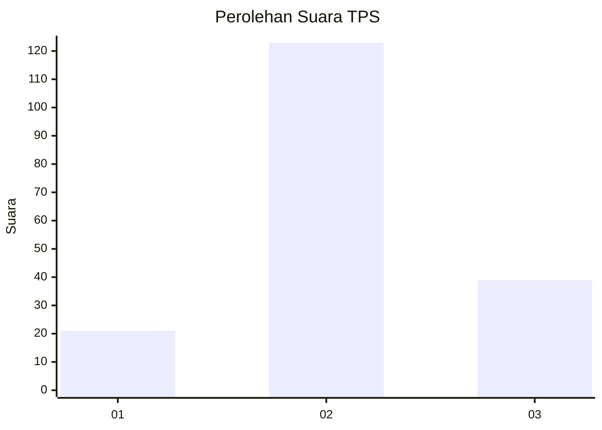
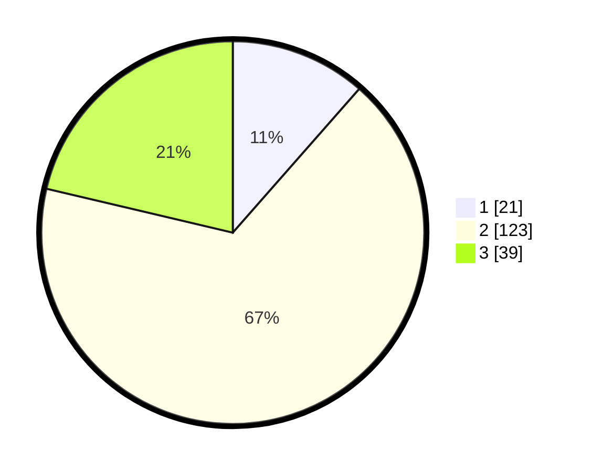

# Hasil

## Grafik

## Tabel

| No. | Nama Paslon    | Suara | Suara (raw) | Persentase |
|:--- |:-------------- | -----:| -----------:| ----------:|
| 1   | ANIES MUHAIMIN | 21    | [21][p-1]   | 11,48      |
| 2   | PRABOWO GIBRAN | 123   | [123][p-2]  | 67,21      |
| 3   | GANJAR MAHFUD  | 39    | [39][p-3]   | 21,31      |

[p-1]: https://github.com/gigit-pemilu/pemilu-2024-51-bali/blob/main/pilpres/hitung-suara/sub/51-bali/sub/71-kota-denpasar/sub/03-denpasar-barat/sub/2002-pemecutan-kelod/sub/077-tps/sub/paslon-1.txt
[p-2]: https://github.com/gigit-pemilu/pemilu-2024-51-bali/blob/main/pilpres/hitung-suara/sub/51-bali/sub/71-kota-denpasar/sub/03-denpasar-barat/sub/2002-pemecutan-kelod/sub/077-tps/sub/paslon-2.txt
[p-3]: https://github.com/gigit-pemilu/pemilu-2024-51-bali/blob/main/pilpres/hitung-suara/sub/51-bali/sub/71-kota-denpasar/sub/03-denpasar-barat/sub/2002-pemecutan-kelod/sub/077-tps/sub/paslon-3.txt

## Foto C Plano

https://sirekap-obj-formc.kpu.go.id/76e4/pemilu/ppwp/51/71/03/20/02/5171032002077-20240214-222305--1cd50e53-6e22-48d8-8bcb-02f0299c7eec.jpg

https://sirekap-obj-formc.kpu.go.id/76e4/pemilu/ppwp/51/71/03/20/02/5171032002077-20240214-222356--dd9ca84a-17a1-4a3b-99c2-6aed70ec24b9.jpg

https://sirekap-obj-formc.kpu.go.id/76e4/pemilu/ppwp/51/71/03/20/02/5171032002077-20240214-222514--d718f39d-69ae-44fa-9fad-1847837fa5a0.jpg

## Metadata

| Key        | Value               |
| ---------- | ------------------- |
| Time Stamp | 2024-02-24 22:31:28 |

