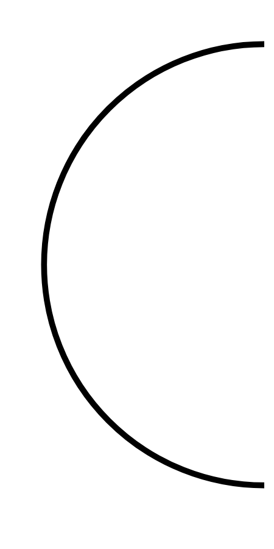

# Hasil

## Grafik

```mermaid
xychart-beta
    title "Perolehan Suara Nasional"
    x-axis []
    y-axis "Suara" 0 --> 0
    bar []
```



## Tabel

| No. | Nama Paslon | Suara | Suara (raw) | Persentase |
|:--- |:----------- | -----:| -----------:| ----------:|


[p-1]: https://github.com/gigit-pemilu/pemilu-2024/blob/main/pilpres/hitung-suara/sub/51-bali/sub/71-kota-denpasar/sub/03-denpasar-barat/sub/2002-pemecutan-kelod/sub/084-tps/sub/paslon-1.txt
[p-2]: https://github.com/gigit-pemilu/pemilu-2024/blob/main/pilpres/hitung-suara/sub/51-bali/sub/71-kota-denpasar/sub/03-denpasar-barat/sub/2002-pemecutan-kelod/sub/084-tps/sub/paslon-2.txt
[p-3]: https://github.com/gigit-pemilu/pemilu-2024/blob/main/pilpres/hitung-suara/sub/51-bali/sub/71-kota-denpasar/sub/03-denpasar-barat/sub/2002-pemecutan-kelod/sub/084-tps/sub/paslon-3.txt

## Foto C Plano

https://sirekap-obj-formc.kpu.go.id/c9f0/pemilu/ppwp/51/71/03/20/02/5171032002084-20240220-085434--e0120e64-68aa-4835-8e17-817f23a54e09.jpg

https://sirekap-obj-formc.kpu.go.id/c9f0/pemilu/ppwp/51/71/03/20/02/5171032002084-20240220-090745--aa8e235a-0f49-4197-8e17-e24e5e98d481.jpg

https://sirekap-obj-formc.kpu.go.id/c9f0/pemilu/ppwp/51/71/03/20/02/5171032002084-20240220-093103--6a602354-81f1-4d26-ad56-f49fb4a131d9.jpg


## Metadata

| Key        | Value               |
| ---------- | ------------------- |
| Time Stamp | 2024-02-20 10:00:00 |


## DATA PEMILIH TETAP

Jumlah pemilih dalam DPT: **272**.
 * L: **134**.
 * P: **138**.

## DATA PENGGUNA HAK PILIH

Jumlah pengguna hak pilih dalam DPT: **202**.
 * L: **98**.
 * P: **104**.

Jumlah pengguna hak pilih dalam DPTb: **4**.
 * L: **1**.
 * P: **3**.

Jumlah pengguna hak pilih dalam DPK: **4**.
 * L: **1**.
 * P: **3**.

Jumlah pengguna hak pilih: **210**.
 * L: **100**.
 * P: **110**.

## JUMLAH SUARA SAH DAN TIDAK SAH

JUMLAH SELURUH SUARA SAH: **204**.

JUMLAH SUARA TIDAK SAH: **6**.

JUMLAH SELURUH SUARA SAH DAN SUARA TIDAK SAH: **210**.


