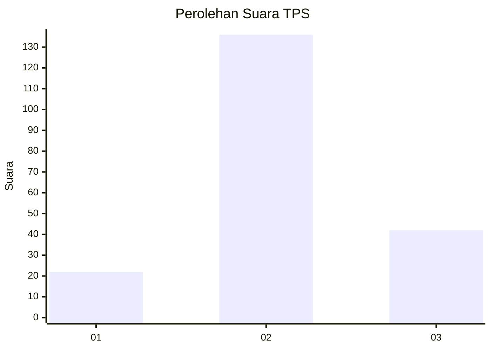
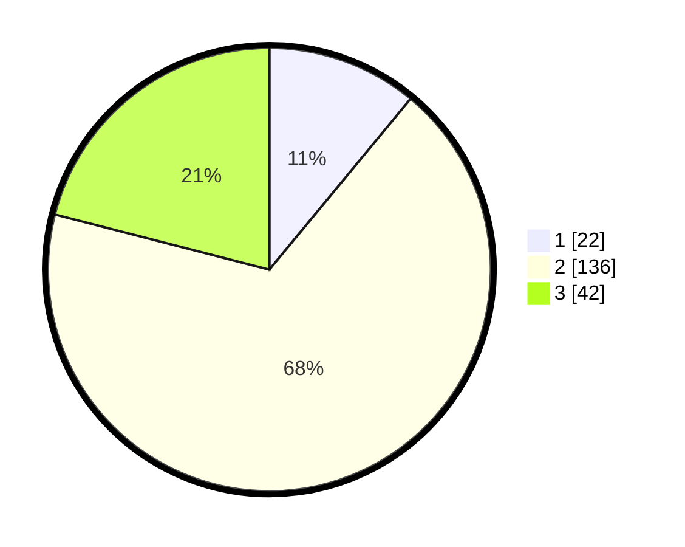

# Hasil

## Grafik

## Tabel

| No. | Nama Paslon    | Suara | Suara (raw) | Persentase |
|:--- |:-------------- | -----:| -----------:| ----------:|
| 1   | ANIES MUHAIMIN | 22    | [22][p-1]   | 11,00      |
| 2   | PRABOWO GIBRAN | 136   | [136][p-2]  | 68,00      |
| 3   | GANJAR MAHFUD  | 42    | [42][p-3]   | 21,00      |

[p-1]: https://github.com/gigit-pemilu/pemilu-2024-51-bali/blob/main/pilpres/hitung-suara/sub/51-bali/sub/71-kota-denpasar/sub/03-denpasar-barat/sub/2002-pemecutan-kelod/sub/090-tps/sub/paslon-1.txt
[p-2]: https://github.com/gigit-pemilu/pemilu-2024-51-bali/blob/main/pilpres/hitung-suara/sub/51-bali/sub/71-kota-denpasar/sub/03-denpasar-barat/sub/2002-pemecutan-kelod/sub/090-tps/sub/paslon-2.txt
[p-3]: https://github.com/gigit-pemilu/pemilu-2024-51-bali/blob/main/pilpres/hitung-suara/sub/51-bali/sub/71-kota-denpasar/sub/03-denpasar-barat/sub/2002-pemecutan-kelod/sub/090-tps/sub/paslon-3.txt

## Foto C Plano

https://sirekap-obj-formc.kpu.go.id/4141/pemilu/ppwp/51/71/03/20/02/5171032002090-20240214-234732--2c10ce66-6ff4-455c-b68e-7264284403e2.jpg

https://sirekap-obj-formc.kpu.go.id/4141/pemilu/ppwp/51/71/03/20/02/5171032002090-20240214-234749--867d3dc2-81d7-48a8-b015-3c8b88961d6d.jpg

https://sirekap-obj-formc.kpu.go.id/4141/pemilu/ppwp/51/71/03/20/02/5171032002090-20240214-234809--e20f7412-2f4a-4fcf-858d-521638d944df.jpg

## Metadata

| Key        | Value               |
| ---------- | ------------------- |
| Time Stamp | 2024-02-24 22:31:28 |

## DATA PEMILIH TETAP

Jumlah pemilih dalam DPT: **265**.
 * L: **120**.
 * P: **145**.

## DATA PENGGUNA HAK PILIH

Jumlah pengguna hak pilih dalam DPT: **180**.
 * L: **84**.
 * P: **96**.

Jumlah pengguna hak pilih dalam DPTb: **11**.
 * L: **3**.
 * P: **8**.

Jumlah pengguna hak pilih dalam DPK: **9**.
 * L: **4**.
 * P: **5**.

Jumlah pengguna hak pilih: **200**.
 * L: **91**.
 * P: **109**.

## JUMLAH SUARA SAH DAN TIDAK SAH

JUMLAH SELURUH SUARA SAH: **200**.

JUMLAH SUARA TIDAK SAH: **0**.

JUMLAH SELURUH SUARA SAH DAN SUARA TIDAK SAH: **200**.

