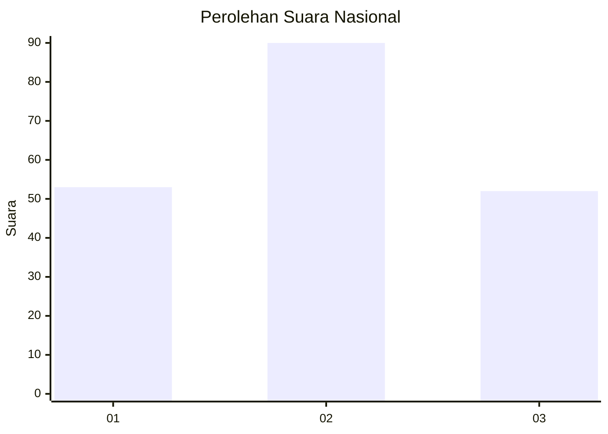
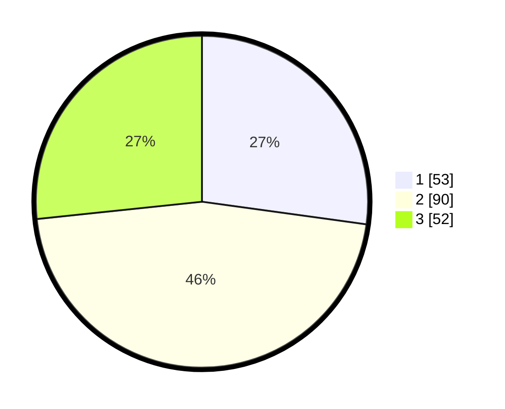

# Hasil

## Grafik

## Tabel

| No. | Nama Paslon    | Suara | Suara (raw) | Persentase |
|:--- |:-------------- | -----:| -----------:| ----------:|
| 1   | ANIES MUHAIMIN | 53    | [53][p-1]   | 27,18      |
| 2   | PRABOWO GIBRAN | 90    | [90][p-2]   | 46,15      |
| 3   | GANJAR MAHFUD  | 52    | [52][p-3]   | 26,67      |

[p-1]: https://github.com/gigit-pemilu/pemilu-2024/blob/main/pilpres/hitung-suara/sub/51-bali/sub/71-kota-denpasar/sub/03-denpasar-barat/sub/2002-pemecutan-kelod/sub/093-tps/sub/paslon-1.txt
[p-2]: https://github.com/gigit-pemilu/pemilu-2024/blob/main/pilpres/hitung-suara/sub/51-bali/sub/71-kota-denpasar/sub/03-denpasar-barat/sub/2002-pemecutan-kelod/sub/093-tps/sub/paslon-2.txt
[p-3]: https://github.com/gigit-pemilu/pemilu-2024/blob/main/pilpres/hitung-suara/sub/51-bali/sub/71-kota-denpasar/sub/03-denpasar-barat/sub/2002-pemecutan-kelod/sub/093-tps/sub/paslon-3.txt

## Foto C Plano

https://sirekap-obj-formc.kpu.go.id/d7f7/pemilu/ppwp/51/71/03/20/02/5171032002093-20240214-200843--58cb3956-9adf-451a-a1da-390991ecb05e.jpg

https://sirekap-obj-formc.kpu.go.id/d7f7/pemilu/ppwp/51/71/03/20/02/5171032002093-20240214-200856--b28063ce-031b-4a4f-98c6-d04f8672321e.jpg

https://sirekap-obj-formc.kpu.go.id/d7f7/pemilu/ppwp/51/71/03/20/02/5171032002093-20240214-200908--52f17c5a-5aaa-413e-8d2d-60f534f5e36d.jpg

## Metadata

| Key        | Value               |
| ---------- | ------------------- |
| Time Stamp | 2024-02-24 22:31:28 |

