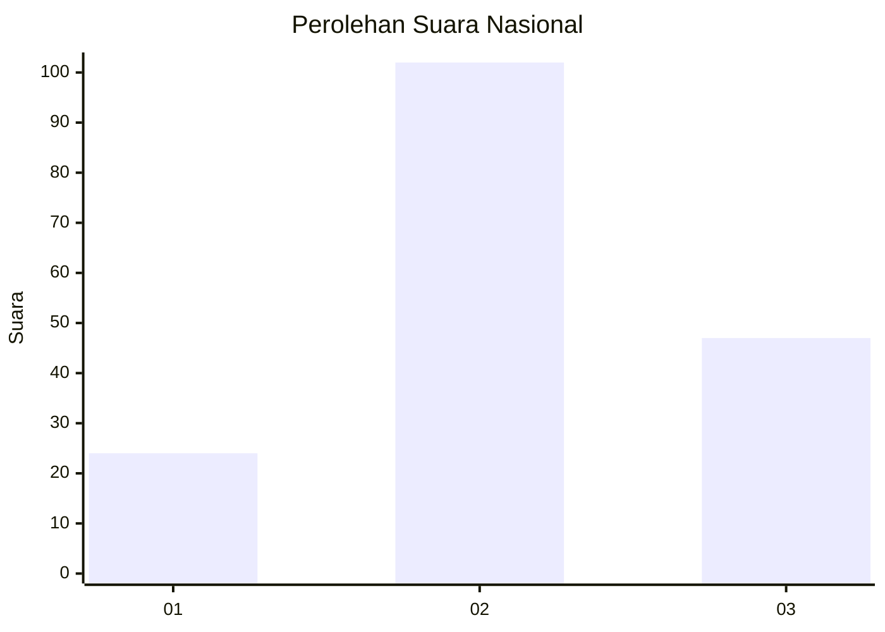
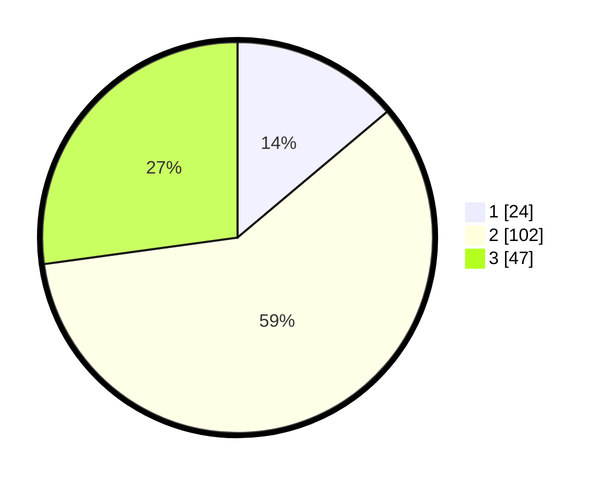

# Hasil

## Grafik

## Tabel

| No. | Nama Paslon    | Suara | Suara (raw) | Persentase |
|:--- |:-------------- | -----:| -----------:| ----------:|
| 1   | ANIES MUHAIMIN | 24    | [24][p-1]   | 13,87      |
| 2   | PRABOWO GIBRAN | 102   | [102][p-2]  | 58,96      |
| 3   | GANJAR MAHFUD  | 47    | [47][p-3]   | 27,17      |

[p-1]: https://github.com/gigit-pemilu/pemilu-2024/blob/main/pilpres/hitung-suara/sub/51-bali/sub/71-kota-denpasar/sub/03-denpasar-barat/sub/2002-pemecutan-kelod/sub/095-tps/sub/paslon-1.txt
[p-2]: https://github.com/gigit-pemilu/pemilu-2024/blob/main/pilpres/hitung-suara/sub/51-bali/sub/71-kota-denpasar/sub/03-denpasar-barat/sub/2002-pemecutan-kelod/sub/095-tps/sub/paslon-2.txt
[p-3]: https://github.com/gigit-pemilu/pemilu-2024/blob/main/pilpres/hitung-suara/sub/51-bali/sub/71-kota-denpasar/sub/03-denpasar-barat/sub/2002-pemecutan-kelod/sub/095-tps/sub/paslon-3.txt

## Foto C Plano

https://sirekap-obj-formc.kpu.go.id/3729/pemilu/ppwp/51/71/03/20/02/5171032002095-20240214-234222--72e0d980-ff7d-47a4-9a0d-776df4242396.jpg

https://sirekap-obj-formc.kpu.go.id/3729/pemilu/ppwp/51/71/03/20/02/5171032002095-20240214-234743--1f043eb0-603b-4d1f-8710-e12d6969d88c.jpg

https://sirekap-obj-formc.kpu.go.id/3729/pemilu/ppwp/51/71/03/20/02/5171032002095-20240214-235157--24385735-b396-44ef-acbc-2df3cb64cbda.jpg

## Metadata

| Key        | Value               |
| ---------- | ------------------- |
| Time Stamp | 2024-02-24 22:31:28 |

