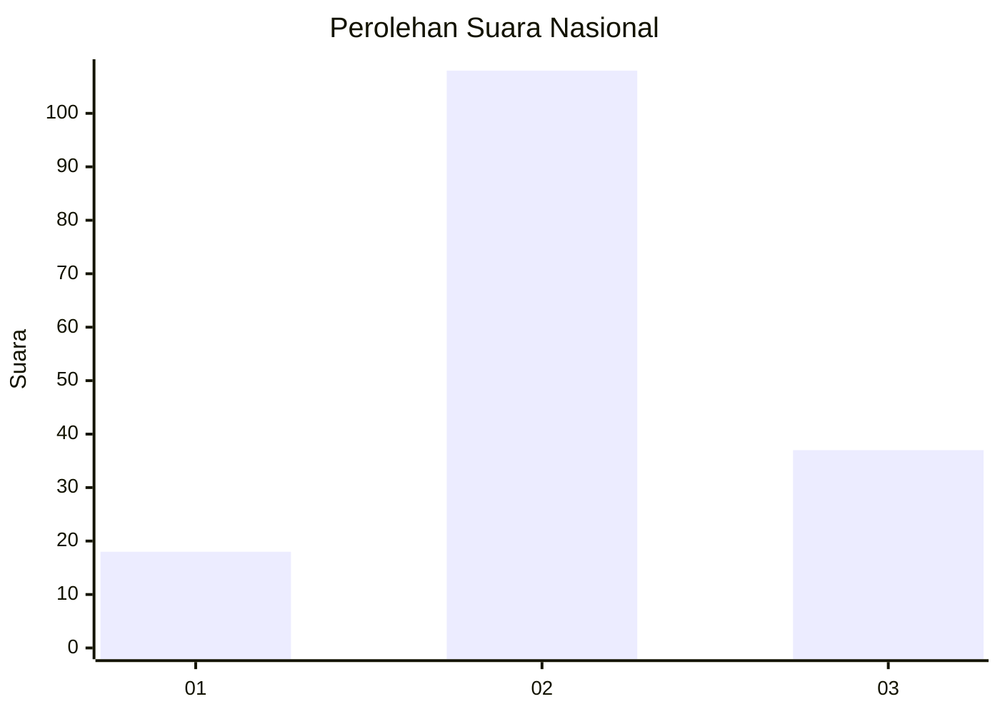
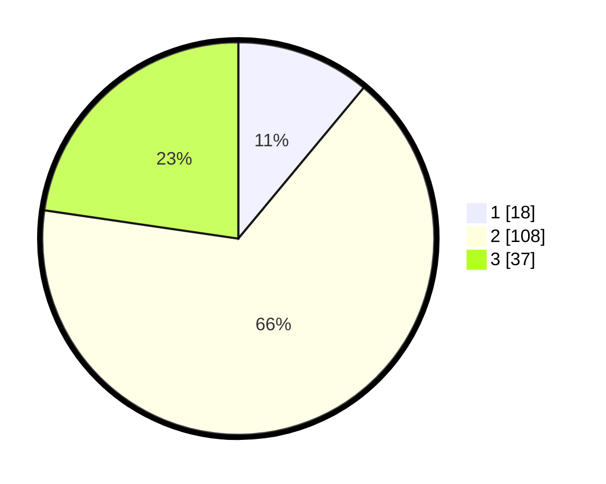

# Hasil

## Grafik

## Tabel

| No. | Nama Paslon    | Suara | Suara (raw) | Persentase |
|:--- |:-------------- | -----:| -----------:| ----------:|
| 1   | ANIES MUHAIMIN | 18    | [18][p-1]   | 11,04      |
| 2   | PRABOWO GIBRAN | 108   | [108][p-2]  | 66,26      |
| 3   | GANJAR MAHFUD  | 37    | [37][p-3]   | 22,70      |

[p-1]: https://github.com/gigit-pemilu/pemilu-2024/blob/main/pilpres/hitung-suara/sub/51-bali/sub/71-kota-denpasar/sub/03-denpasar-barat/sub/2003-dauh-puri-kauh/sub/025-tps/sub/paslon-1.txt
[p-2]: https://github.com/gigit-pemilu/pemilu-2024/blob/main/pilpres/hitung-suara/sub/51-bali/sub/71-kota-denpasar/sub/03-denpasar-barat/sub/2003-dauh-puri-kauh/sub/025-tps/sub/paslon-2.txt
[p-3]: https://github.com/gigit-pemilu/pemilu-2024/blob/main/pilpres/hitung-suara/sub/51-bali/sub/71-kota-denpasar/sub/03-denpasar-barat/sub/2003-dauh-puri-kauh/sub/025-tps/sub/paslon-3.txt

## Foto C Plano

https://sirekap-obj-formc.kpu.go.id/7a83/pemilu/ppwp/51/71/03/20/03/5171032003025-20240214-141847--28030e9a-ed91-4267-8476-c67558ba9ea3.jpg

https://sirekap-obj-formc.kpu.go.id/7a83/pemilu/ppwp/51/71/03/20/03/5171032003025-20240214-141801--b5e670a3-5908-4753-bc7b-c092e487e128.jpg

https://sirekap-obj-formc.kpu.go.id/7a83/pemilu/ppwp/51/71/03/20/03/5171032003025-20240214-141201--30fc2fda-f078-4054-8097-69d3b6299a72.jpg

## Metadata

| Key        | Value               |
| ---------- | ------------------- |
| Time Stamp | 2024-02-24 22:31:28 |

