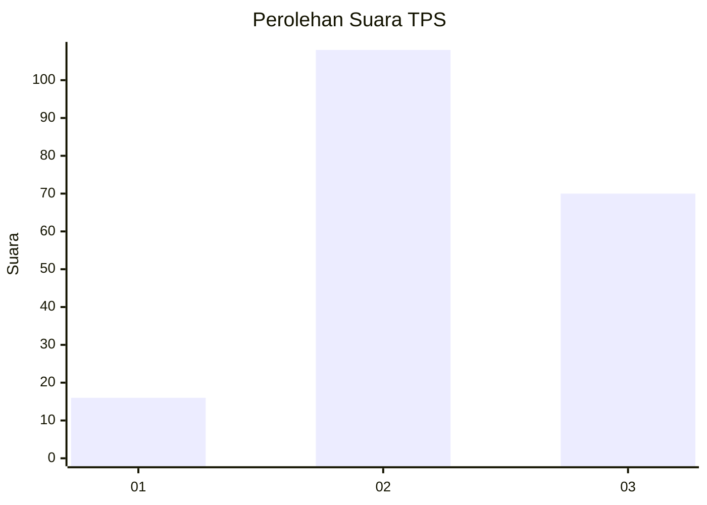
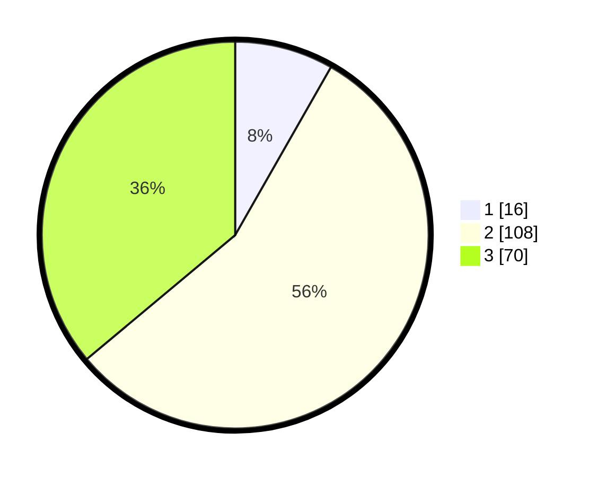

# Hasil

## Grafik

## Tabel

| No. | Nama Paslon    | Suara | Suara (raw) | Persentase |
|:--- |:-------------- | -----:| -----------:| ----------:|
| 1   | ANIES MUHAIMIN | 16    | [16][p-1]   | 8,25       |
| 2   | PRABOWO GIBRAN | 108   | [108][p-2]  | 55,67      |
| 3   | GANJAR MAHFUD  | 70    | [70][p-3]   | 36,08      |

[p-1]: https://github.com/gigit-pemilu/pemilu-2024-51-bali/blob/main/pilpres/hitung-suara/sub/51-bali/sub/71-kota-denpasar/sub/03-denpasar-barat/sub/2003-dauh-puri-kauh/sub/036-tps/sub/paslon-1.txt
[p-2]: https://github.com/gigit-pemilu/pemilu-2024-51-bali/blob/main/pilpres/hitung-suara/sub/51-bali/sub/71-kota-denpasar/sub/03-denpasar-barat/sub/2003-dauh-puri-kauh/sub/036-tps/sub/paslon-2.txt
[p-3]: https://github.com/gigit-pemilu/pemilu-2024-51-bali/blob/main/pilpres/hitung-suara/sub/51-bali/sub/71-kota-denpasar/sub/03-denpasar-barat/sub/2003-dauh-puri-kauh/sub/036-tps/sub/paslon-3.txt

## Foto C Plano

https://sirekap-obj-formc.kpu.go.id/1716/pemilu/ppwp/51/71/03/20/03/5171032003036-20240214-141609--70b39f95-ec82-470c-99d1-8de5c814f5c3.jpg

https://sirekap-obj-formc.kpu.go.id/1716/pemilu/ppwp/51/71/03/20/03/5171032003036-20240214-141812--801331fc-1e79-4659-a300-0d3620d84773.jpg

## Metadata

| Key        | Value               |
| ---------- | ------------------- |
| Time Stamp | 2024-02-24 22:31:28 |

