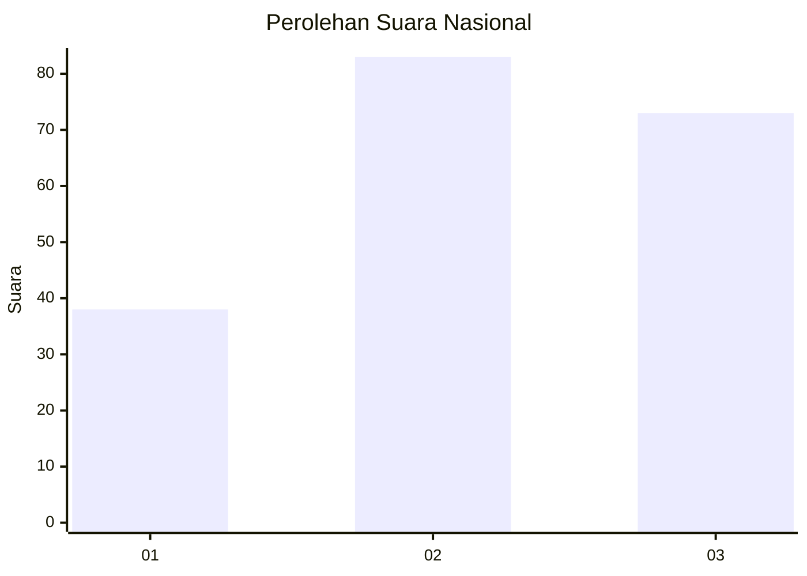
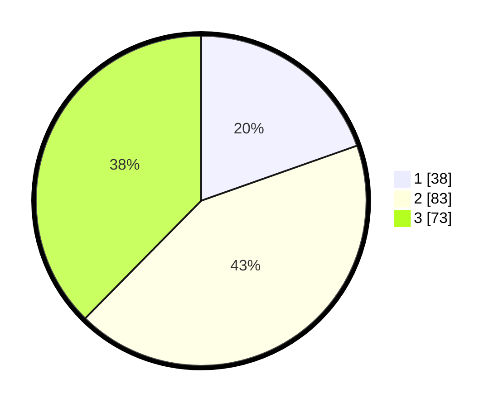

# Hasil

## Grafik

## Tabel

| No. | Nama Paslon    | Suara | Suara (raw) | Persentase |
|:--- |:-------------- | -----:| -----------:| ----------:|
| 1   | ANIES MUHAIMIN | 38    | [38][p-1]   | 19,59      |
| 2   | PRABOWO GIBRAN | 83    | [83][p-2]   | 42,78      |
| 3   | GANJAR MAHFUD  | 73    | [73][p-3]   | 37,63      |

[p-1]: https://github.com/gigit-pemilu/pemilu-2024/blob/main/pilpres/hitung-suara/sub/51-bali/sub/71-kota-denpasar/sub/03-denpasar-barat/sub/2004-dauh-puri-kelod/sub/004-tps/sub/paslon-1.txt
[p-2]: https://github.com/gigit-pemilu/pemilu-2024/blob/main/pilpres/hitung-suara/sub/51-bali/sub/71-kota-denpasar/sub/03-denpasar-barat/sub/2004-dauh-puri-kelod/sub/004-tps/sub/paslon-2.txt
[p-3]: https://github.com/gigit-pemilu/pemilu-2024/blob/main/pilpres/hitung-suara/sub/51-bali/sub/71-kota-denpasar/sub/03-denpasar-barat/sub/2004-dauh-puri-kelod/sub/004-tps/sub/paslon-3.txt

## Foto C Plano

https://sirekap-obj-formc.kpu.go.id/fd08/pemilu/ppwp/51/71/03/20/04/5171032004004-20240218-134403--efac9636-ef47-4a5d-8586-63ae230781f8.jpg

https://sirekap-obj-formc.kpu.go.id/fd08/pemilu/ppwp/51/71/03/20/04/5171032004004-20240222-164401--2777b453-7ae4-4700-8918-00189e0f4935.jpg

https://sirekap-obj-formc.kpu.go.id/fd08/pemilu/ppwp/51/71/03/20/04/5171032004004-20240222-164412--95f98e4a-3f6f-4805-a824-ee1279eb554b.jpg

## Metadata

| Key        | Value               |
| ---------- | ------------------- |
| Time Stamp | 2024-02-24 22:31:28 |

