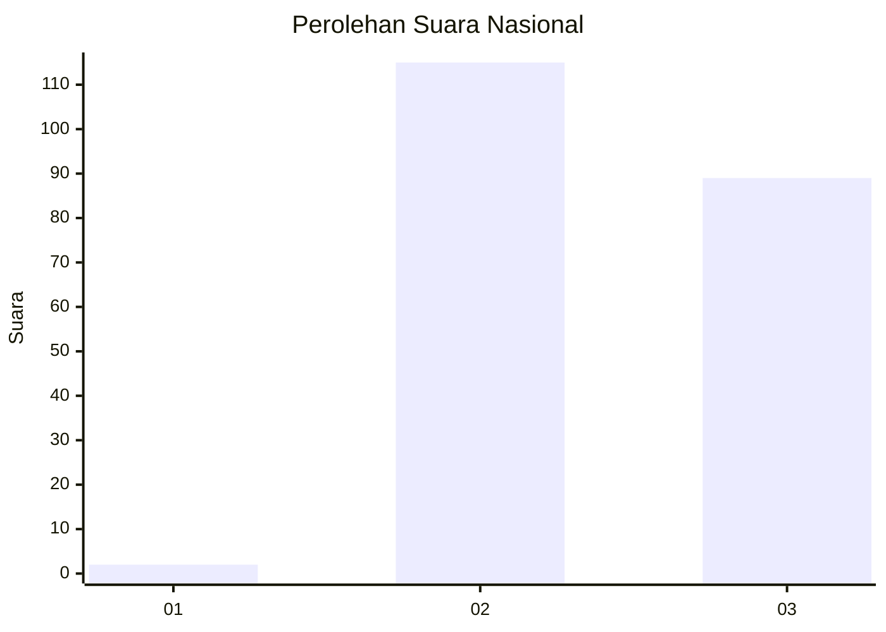
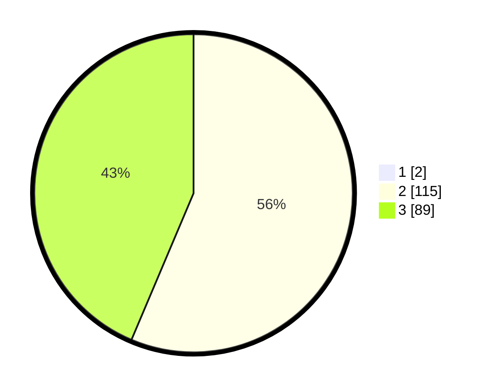

# Hasil

## Grafik

## Tabel

| No. | Nama Paslon    | Suara | Suara (raw) | Persentase |
|:--- |:-------------- | -----:| -----------:| ----------:|
| 1   | ANIES MUHAIMIN | 2     | [2][p-1]    | 0,97       |
| 2   | PRABOWO GIBRAN | 115   | [115][p-2]  | 55,83      |
| 3   | GANJAR MAHFUD  | 89    | [89][p-3]   | 43,20      |

[p-1]: https://github.com/gigit-pemilu/pemilu-2024/blob/main/pilpres/hitung-suara/sub/51-bali/sub/71-kota-denpasar/sub/03-denpasar-barat/sub/2004-dauh-puri-kelod/sub/017-tps/sub/paslon-1.txt
[p-2]: https://github.com/gigit-pemilu/pemilu-2024/blob/main/pilpres/hitung-suara/sub/51-bali/sub/71-kota-denpasar/sub/03-denpasar-barat/sub/2004-dauh-puri-kelod/sub/017-tps/sub/paslon-2.txt
[p-3]: https://github.com/gigit-pemilu/pemilu-2024/blob/main/pilpres/hitung-suara/sub/51-bali/sub/71-kota-denpasar/sub/03-denpasar-barat/sub/2004-dauh-puri-kelod/sub/017-tps/sub/paslon-3.txt

## Foto C Plano

https://sirekap-obj-formc.kpu.go.id/a774/pemilu/ppwp/51/71/03/20/04/5171032004017-20240214-155353--c25f467c-22f2-42f4-a7bd-4d071aee9b91.jpg

https://sirekap-obj-formc.kpu.go.id/a774/pemilu/ppwp/51/71/03/20/04/5171032004017-20240214-155417--595f99ee-cd0c-41cd-bfc0-063a6b949178.jpg

https://sirekap-obj-formc.kpu.go.id/a774/pemilu/ppwp/51/71/03/20/04/5171032004017-20240214-155432--f0f2affb-a0a1-4b2f-95a6-bf39622e5a38.jpg

## Metadata

| Key        | Value               |
| ---------- | ------------------- |
| Time Stamp | 2024-02-24 22:31:28 |

