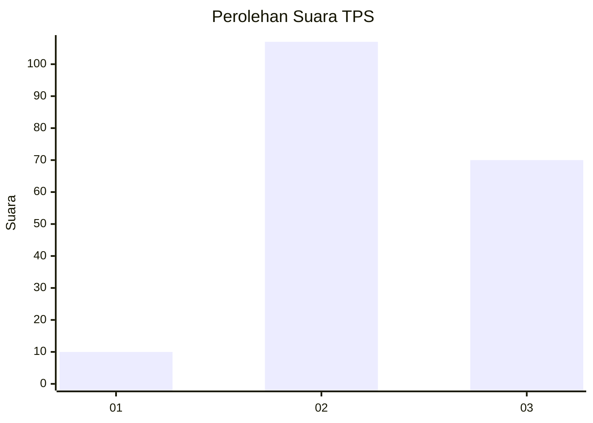
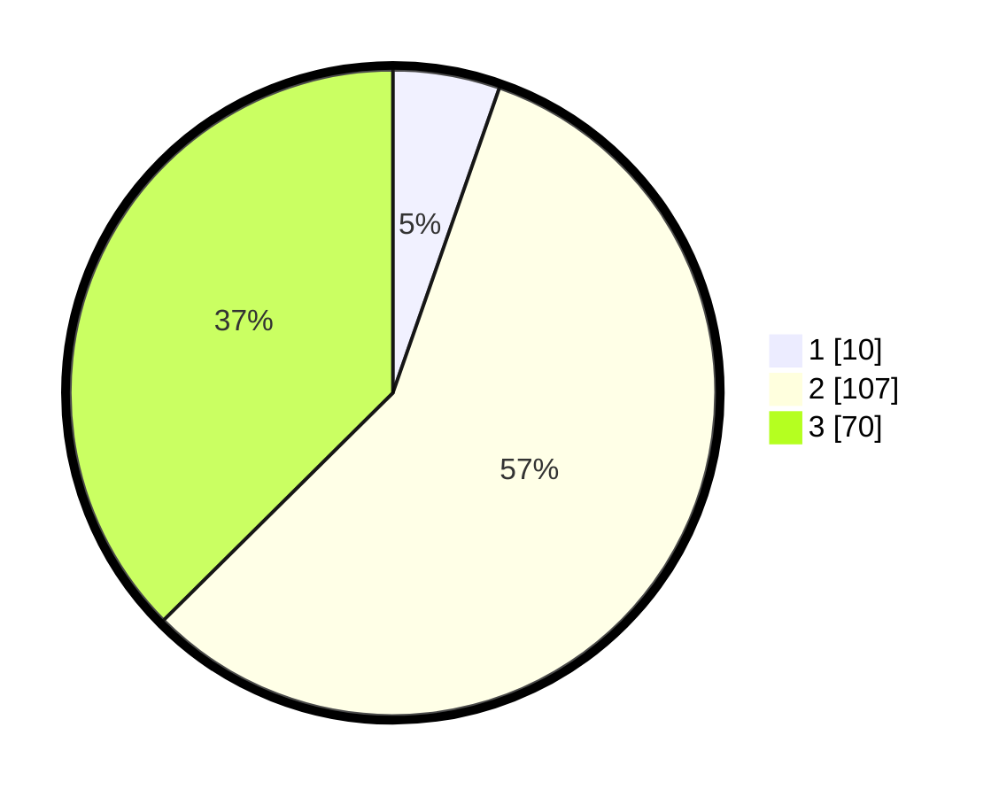

# Hasil

## Grafik

## Tabel

| No. | Nama Paslon    | Suara | Suara (raw) | Persentase |
|:--- |:-------------- | -----:| -----------:| ----------:|
| 1   | ANIES MUHAIMIN | 10    | [10][p-1]   | 5,35       |
| 2   | PRABOWO GIBRAN | 107   | [107][p-2]  | 57,22      |
| 3   | GANJAR MAHFUD  | 70    | [70][p-3]   | 37,43      |

[p-1]: https://github.com/gigit-pemilu/pemilu-2024-51-bali/blob/main/pilpres/hitung-suara/sub/51-bali/sub/71-kota-denpasar/sub/03-denpasar-barat/sub/2004-dauh-puri-kelod/sub/020-tps/sub/paslon-1.txt
[p-2]: https://github.com/gigit-pemilu/pemilu-2024-51-bali/blob/main/pilpres/hitung-suara/sub/51-bali/sub/71-kota-denpasar/sub/03-denpasar-barat/sub/2004-dauh-puri-kelod/sub/020-tps/sub/paslon-2.txt
[p-3]: https://github.com/gigit-pemilu/pemilu-2024-51-bali/blob/main/pilpres/hitung-suara/sub/51-bali/sub/71-kota-denpasar/sub/03-denpasar-barat/sub/2004-dauh-puri-kelod/sub/020-tps/sub/paslon-3.txt

## Foto C Plano

https://sirekap-obj-formc.kpu.go.id/161a/pemilu/ppwp/51/71/03/20/04/5171032004020-20240214-202530--828be706-159a-4ab1-bb59-3d2b02327d56.jpg

https://sirekap-obj-formc.kpu.go.id/161a/pemilu/ppwp/51/71/03/20/04/5171032004020-20240214-202726--1484aeb5-84d8-40f6-9e99-2aa95a5af2da.jpg

https://sirekap-obj-formc.kpu.go.id/161a/pemilu/ppwp/51/71/03/20/04/5171032004020-20240214-202909--107aa080-1e30-42a9-a695-618f8cb09f2a.jpg

## Metadata

| Key        | Value               |
| ---------- | ------------------- |
| Time Stamp | 2024-02-24 22:31:28 |

