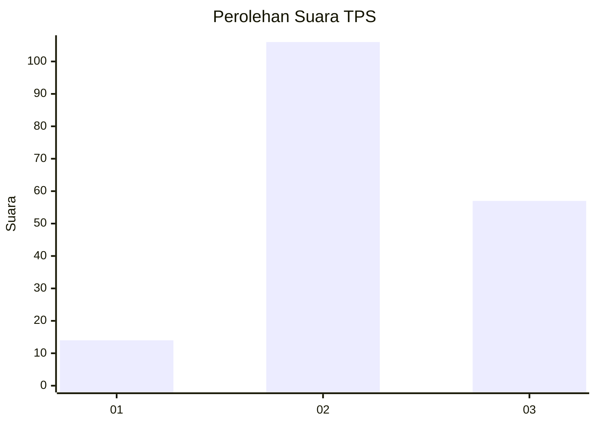
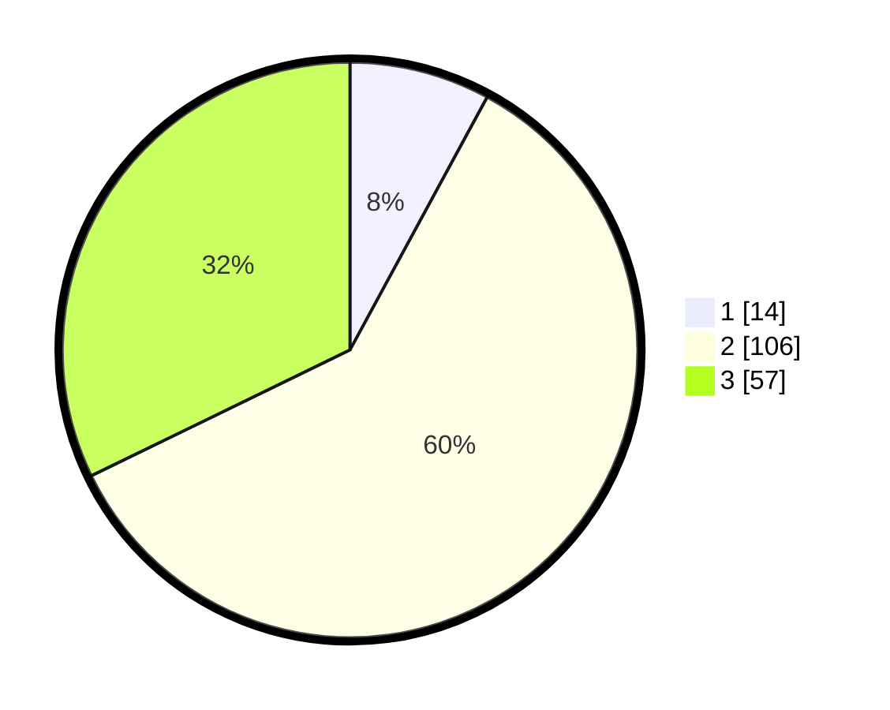

# Hasil

## Grafik

## Tabel

| No. | Nama Paslon    | Suara | Suara (raw) | Persentase |
|:--- |:-------------- | -----:| -----------:| ----------:|
| 1   | ANIES MUHAIMIN | 14    | [14][p-1]   | 7,91       |
| 2   | PRABOWO GIBRAN | 106   | [106][p-2]  | 59,89      |
| 3   | GANJAR MAHFUD  | 57    | [57][p-3]   | 32,20      |

[p-1]: https://github.com/gigit-pemilu/pemilu-2024-51-bali/blob/main/pilpres/hitung-suara/sub/51-bali/sub/71-kota-denpasar/sub/03-denpasar-barat/sub/2004-dauh-puri-kelod/sub/021-tps/sub/paslon-1.txt
[p-2]: https://github.com/gigit-pemilu/pemilu-2024-51-bali/blob/main/pilpres/hitung-suara/sub/51-bali/sub/71-kota-denpasar/sub/03-denpasar-barat/sub/2004-dauh-puri-kelod/sub/021-tps/sub/paslon-2.txt
[p-3]: https://github.com/gigit-pemilu/pemilu-2024-51-bali/blob/main/pilpres/hitung-suara/sub/51-bali/sub/71-kota-denpasar/sub/03-denpasar-barat/sub/2004-dauh-puri-kelod/sub/021-tps/sub/paslon-3.txt

## Foto C Plano

https://sirekap-obj-formc.kpu.go.id/c75a/pemilu/ppwp/51/71/03/20/04/5171032004021-20240214-214940--7371f078-c788-417d-98fa-f519360de9e2.jpg

https://sirekap-obj-formc.kpu.go.id/c75a/pemilu/ppwp/51/71/03/20/04/5171032004021-20240214-215129--782920d2-6ce2-41d3-bf7e-5b9c89cb3bd1.jpg

## Metadata

| Key        | Value               |
| ---------- | ------------------- |
| Time Stamp | 2024-02-26 23:00:00 |

