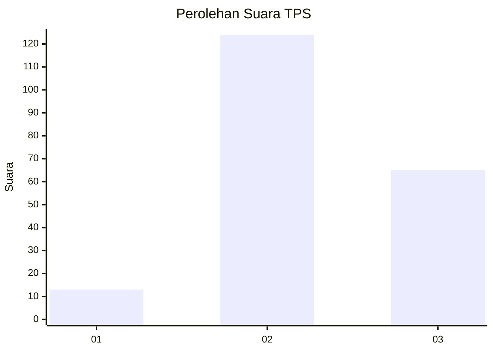
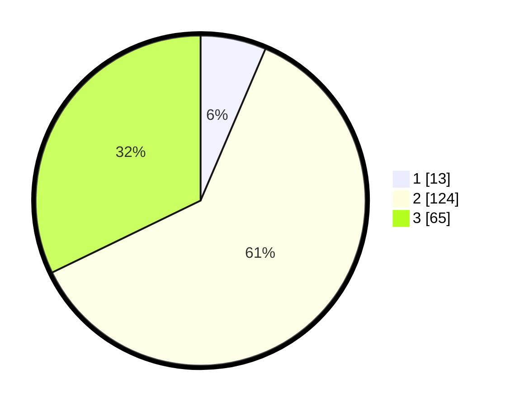

# Hasil

## Grafik

## Tabel

| No. | Nama Paslon    | Suara | Suara (raw) | Persentase |
|:--- |:-------------- | -----:| -----------:| ----------:|
| 1   | ANIES MUHAIMIN | 13    | [13][p-1]   | 6,44       |
| 2   | PRABOWO GIBRAN | 124   | [124][p-2]  | 61,39      |
| 3   | GANJAR MAHFUD  | 65    | [65][p-3]   | 32,18      |

[p-1]: https://github.com/gigit-pemilu/pemilu-2024-51-bali/blob/main/pilpres/hitung-suara/sub/51-bali/sub/71-kota-denpasar/sub/03-denpasar-barat/sub/2004-dauh-puri-kelod/sub/022-tps/sub/paslon-1.txt
[p-2]: https://github.com/gigit-pemilu/pemilu-2024-51-bali/blob/main/pilpres/hitung-suara/sub/51-bali/sub/71-kota-denpasar/sub/03-denpasar-barat/sub/2004-dauh-puri-kelod/sub/022-tps/sub/paslon-2.txt
[p-3]: https://github.com/gigit-pemilu/pemilu-2024-51-bali/blob/main/pilpres/hitung-suara/sub/51-bali/sub/71-kota-denpasar/sub/03-denpasar-barat/sub/2004-dauh-puri-kelod/sub/022-tps/sub/paslon-3.txt

## Foto C Plano

https://sirekap-obj-formc.kpu.go.id/e092/pemilu/ppwp/51/71/03/20/04/5171032004022-20240214-132222--a0034832-0ed5-4e91-baa7-d6b0c6b14f2b.jpg

https://sirekap-obj-formc.kpu.go.id/e092/pemilu/ppwp/51/71/03/20/04/5171032004022-20240214-132123--0c380b33-029e-4524-8872-1070cc48e977.jpg

https://sirekap-obj-formc.kpu.go.id/e092/pemilu/ppwp/51/71/03/20/04/5171032004022-20240214-132016--63da6306-ee4c-4e7d-a393-4a2d49ef0693.jpg

## Metadata

| Key        | Value               |
| ---------- | ------------------- |
| Time Stamp | 2024-02-25 11:00:00 |

