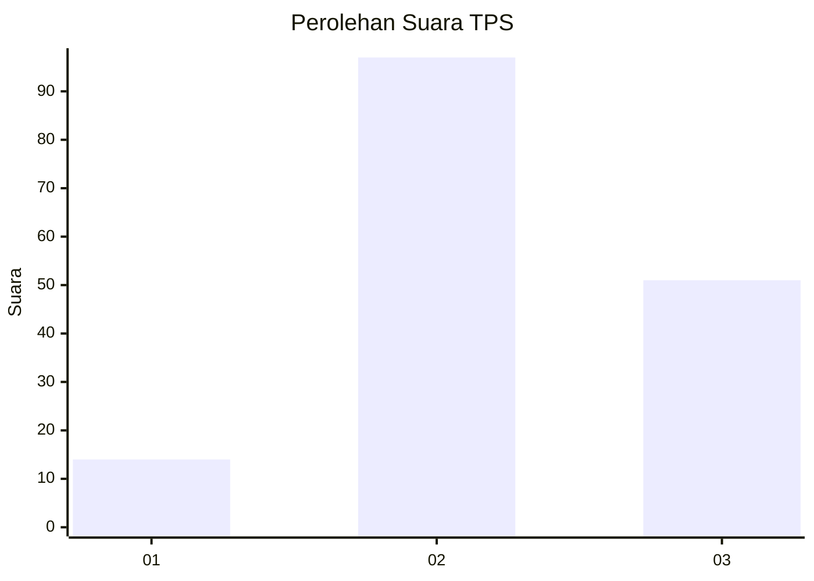
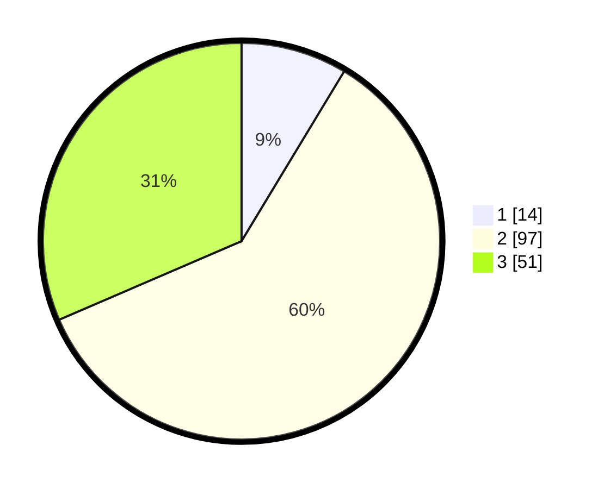

# Hasil

## Grafik

## Tabel

| No. | Nama Paslon    | Suara | Suara (raw) | Persentase |
|:--- |:-------------- | -----:| -----------:| ----------:|
| 1   | ANIES MUHAIMIN | 14    | [14][p-1]   | 8,64       |
| 2   | PRABOWO GIBRAN | 97    | [97][p-2]   | 59,88      |
| 3   | GANJAR MAHFUD  | 51    | [51][p-3]   | 31,48      |

[p-1]: https://github.com/gigit-pemilu/pemilu-2024-51-bali/blob/main/pilpres/hitung-suara/sub/51-bali/sub/71-kota-denpasar/sub/03-denpasar-barat/sub/2004-dauh-puri-kelod/sub/023-tps/sub/paslon-1.txt
[p-2]: https://github.com/gigit-pemilu/pemilu-2024-51-bali/blob/main/pilpres/hitung-suara/sub/51-bali/sub/71-kota-denpasar/sub/03-denpasar-barat/sub/2004-dauh-puri-kelod/sub/023-tps/sub/paslon-2.txt
[p-3]: https://github.com/gigit-pemilu/pemilu-2024-51-bali/blob/main/pilpres/hitung-suara/sub/51-bali/sub/71-kota-denpasar/sub/03-denpasar-barat/sub/2004-dauh-puri-kelod/sub/023-tps/sub/paslon-3.txt

## Foto C Plano

https://sirekap-obj-formc.kpu.go.id/6fa5/pemilu/ppwp/51/71/03/20/04/5171032004023-20240214-204731--28ad8655-aa4b-4f3f-82b9-2d5ceca72691.jpg

https://sirekap-obj-formc.kpu.go.id/6fa5/pemilu/ppwp/51/71/03/20/04/5171032004023-20240214-204729--665e78c0-8eb7-4ab5-b061-6c911dfc9306.jpg

https://sirekap-obj-formc.kpu.go.id/6fa5/pemilu/ppwp/51/71/03/20/04/5171032004023-20240214-204726--39bf126b-4935-43b8-86b6-258cebde3d80.jpg

## Metadata

| Key        | Value               |
| ---------- | ------------------- |
| Time Stamp | 2024-02-24 22:31:28 |

