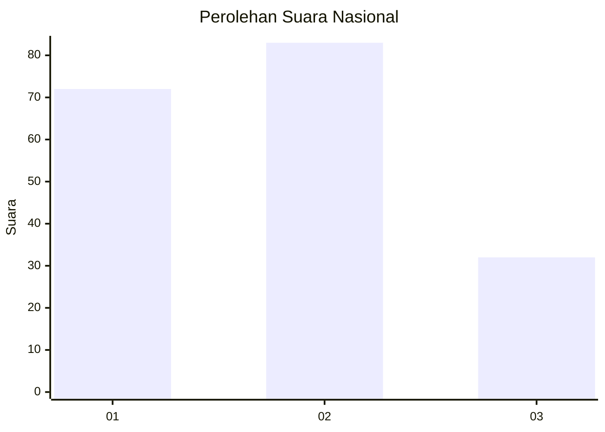
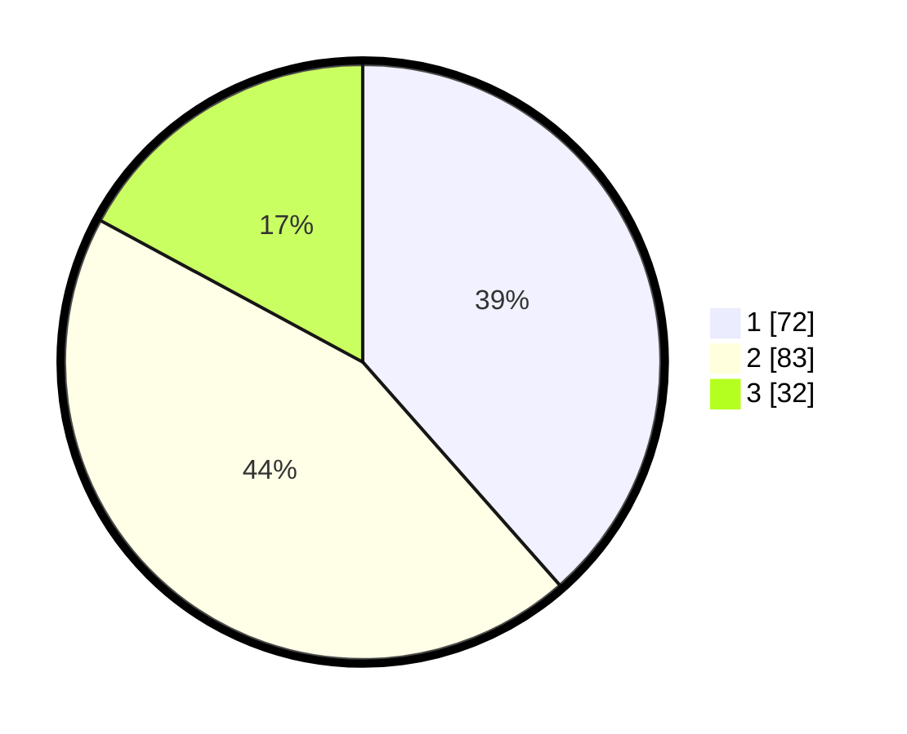

# Hasil

## Grafik

## Tabel

| No. | Nama Paslon    | Suara | Suara (raw) | Persentase |
|:--- |:-------------- | -----:| -----------:| ----------:|
| 1   | ANIES MUHAIMIN | 72    | [72][p-1]   | 38,50      |
| 2   | PRABOWO GIBRAN | 83    | [83][p-2]   | 44,39      |
| 3   | GANJAR MAHFUD  | 32    | [32][p-3]   | 17,11      |

[p-1]: https://github.com/gigit-pemilu/pemilu-2024/blob/main/pilpres/hitung-suara/sub/51-bali/sub/71-kota-denpasar/sub/03-denpasar-barat/sub/2004-dauh-puri-kelod/sub/028-tps/sub/paslon-1.txt
[p-2]: https://github.com/gigit-pemilu/pemilu-2024/blob/main/pilpres/hitung-suara/sub/51-bali/sub/71-kota-denpasar/sub/03-denpasar-barat/sub/2004-dauh-puri-kelod/sub/028-tps/sub/paslon-2.txt
[p-3]: https://github.com/gigit-pemilu/pemilu-2024/blob/main/pilpres/hitung-suara/sub/51-bali/sub/71-kota-denpasar/sub/03-denpasar-barat/sub/2004-dauh-puri-kelod/sub/028-tps/sub/paslon-3.txt

## Foto C Plano

https://sirekap-obj-formc.kpu.go.id/6547/pemilu/ppwp/51/71/03/20/04/5171032004028-20240214-155058--0e80b92a-54ad-4fa9-8dbd-97c4e06527f6.jpg

https://sirekap-obj-formc.kpu.go.id/6547/pemilu/ppwp/51/71/03/20/04/5171032004028-20240214-202821--f9045c7c-7632-4ffe-9ac1-ef8a38a1daf0.jpg

https://sirekap-obj-formc.kpu.go.id/6547/pemilu/ppwp/51/71/03/20/04/5171032004028-20240214-160059--264e9724-4a97-40f4-bdb2-49c76be3db8c.jpg

## Metadata

| Key        | Value               |
| ---------- | ------------------- |
| Time Stamp | 2024-02-24 22:31:28 |

