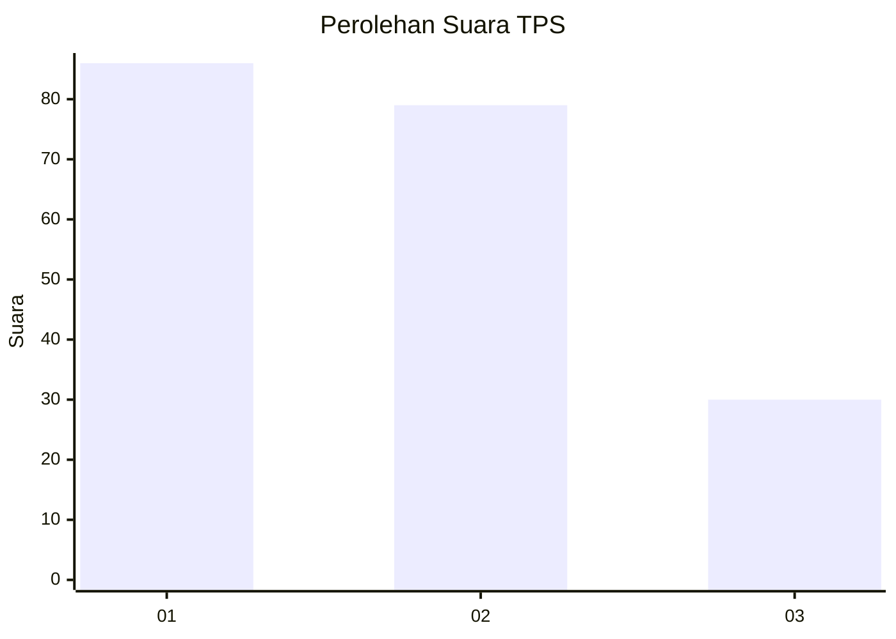
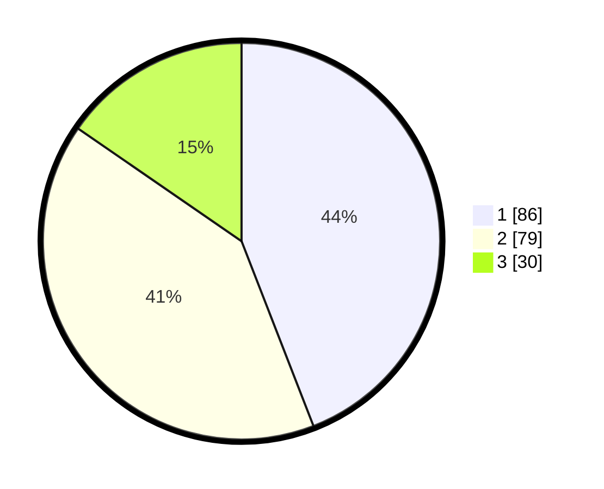

# Hasil

## Grafik

## Tabel

| No. | Nama Paslon    | Suara | Suara (raw) | Persentase |
|:--- |:-------------- | -----:| -----------:| ----------:|
| 1   | ANIES MUHAIMIN | 86    | [86][p-1]   | 44,10      |
| 2   | PRABOWO GIBRAN | 79    | [79][p-2]   | 40,51      |
| 3   | GANJAR MAHFUD  | 30    | [30][p-3]   | 15,38      |

[p-1]: https://github.com/gigit-pemilu/pemilu-2024-51-bali/blob/main/pilpres/hitung-suara/sub/51-bali/sub/71-kota-denpasar/sub/03-denpasar-barat/sub/2004-dauh-puri-kelod/sub/029-tps/sub/paslon-1.txt
[p-2]: https://github.com/gigit-pemilu/pemilu-2024-51-bali/blob/main/pilpres/hitung-suara/sub/51-bali/sub/71-kota-denpasar/sub/03-denpasar-barat/sub/2004-dauh-puri-kelod/sub/029-tps/sub/paslon-2.txt
[p-3]: https://github.com/gigit-pemilu/pemilu-2024-51-bali/blob/main/pilpres/hitung-suara/sub/51-bali/sub/71-kota-denpasar/sub/03-denpasar-barat/sub/2004-dauh-puri-kelod/sub/029-tps/sub/paslon-3.txt

## Foto C Plano

https://sirekap-obj-formc.kpu.go.id/8934/pemilu/ppwp/51/71/03/20/04/5171032004029-20240214-230139--da9550f9-8c2f-4dbd-85a0-679d278a094a.jpg

https://sirekap-obj-formc.kpu.go.id/8934/pemilu/ppwp/51/71/03/20/04/5171032004029-20240214-230235--42c504d0-ef43-4de1-b7c1-8e1c06cc05a6.jpg

https://sirekap-obj-formc.kpu.go.id/8934/pemilu/ppwp/51/71/03/20/04/5171032004029-20240214-230245--a1ee1b0b-3061-496f-b178-a3d54a0de0af.jpg

## Metadata

| Key        | Value               |
| ---------- | ------------------- |
| Time Stamp | 2024-02-24 22:31:28 |

