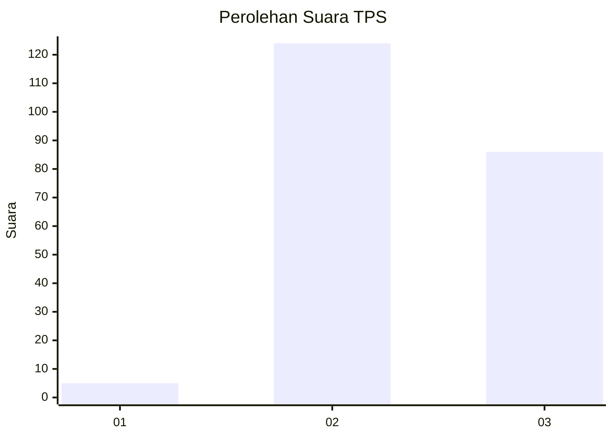
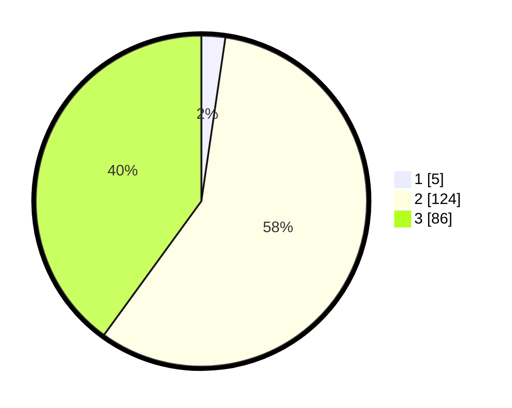

# Hasil

## Grafik

## Tabel

| No. | Nama Paslon    | Suara | Suara (raw) | Persentase |
|:--- |:-------------- | -----:| -----------:| ----------:|
| 1   | ANIES MUHAIMIN | 5     | [5][p-1]    | 2,33       |
| 2   | PRABOWO GIBRAN | 124   | [124][p-2]  | 57,67      |
| 3   | GANJAR MAHFUD  | 86    | [86][p-3]   | 40,00      |

[p-1]: https://github.com/gigit-pemilu/pemilu-2024-51-bali/blob/main/pilpres/hitung-suara/sub/51-bali/sub/71-kota-denpasar/sub/03-denpasar-barat/sub/2006-dauh-puri-kangin/sub/001-tps/sub/paslon-1.txt
[p-2]: https://github.com/gigit-pemilu/pemilu-2024-51-bali/blob/main/pilpres/hitung-suara/sub/51-bali/sub/71-kota-denpasar/sub/03-denpasar-barat/sub/2006-dauh-puri-kangin/sub/001-tps/sub/paslon-2.txt
[p-3]: https://github.com/gigit-pemilu/pemilu-2024-51-bali/blob/main/pilpres/hitung-suara/sub/51-bali/sub/71-kota-denpasar/sub/03-denpasar-barat/sub/2006-dauh-puri-kangin/sub/001-tps/sub/paslon-3.txt

## Foto C Plano

https://sirekap-obj-formc.kpu.go.id/9401/pemilu/ppwp/51/71/03/20/06/5171032006001-20240224-163940--b3cf351c-be10-48fe-b8cb-8a28d3276796.jpg

https://sirekap-obj-formc.kpu.go.id/9401/pemilu/ppwp/51/71/03/20/06/5171032006001-20240224-164012--f5f32fdc-0cf8-4892-9594-ff1b8215622e.jpg

https://sirekap-obj-formc.kpu.go.id/9401/pemilu/ppwp/51/71/03/20/06/5171032006001-20240224-170002--9fb92382-650d-4d9e-a5cd-a4d287a8fd64.jpg

## Metadata

| Key        | Value               |
| ---------- | ------------------- |
| Time Stamp | 2024-02-25 12:00:00 |

