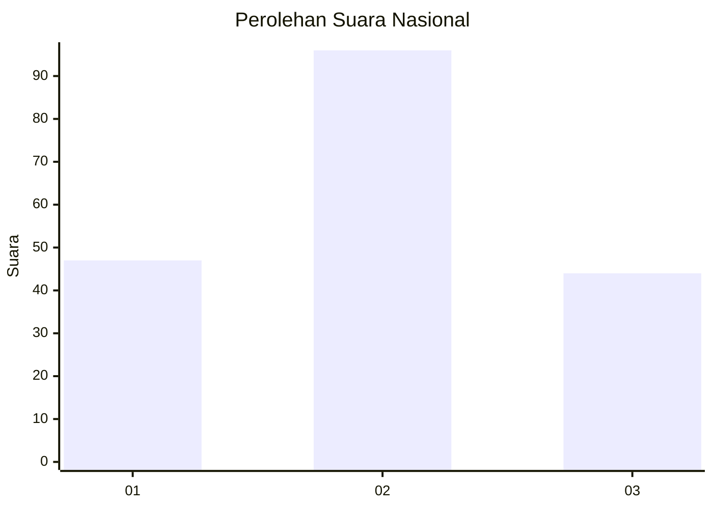
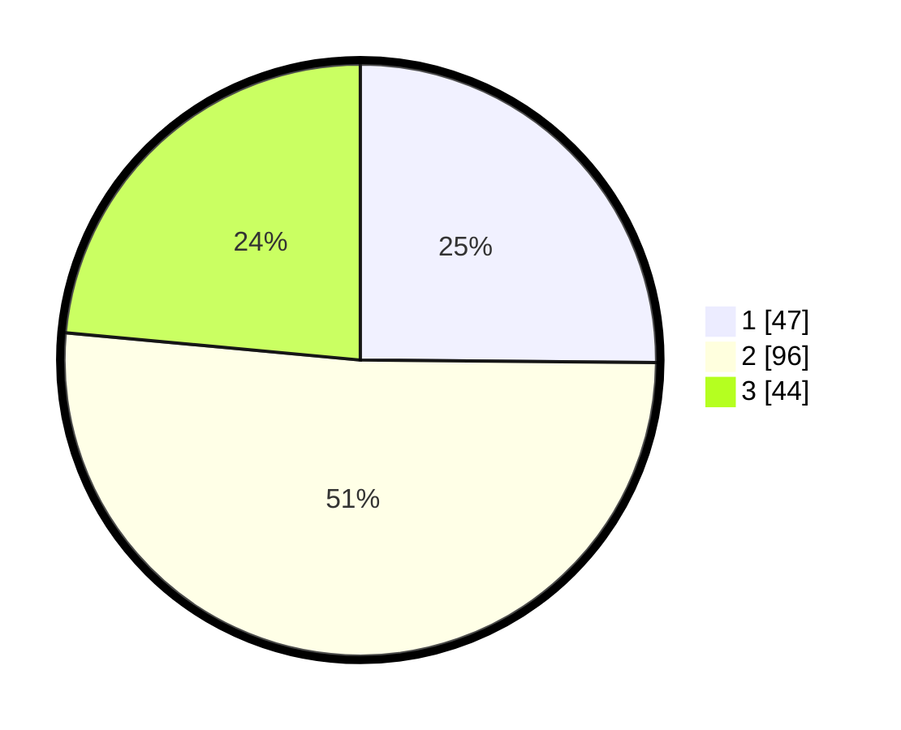

# Hasil

## Grafik

## Tabel

| No. | Nama Paslon    | Suara | Suara (raw) | Persentase |
|:--- |:-------------- | -----:| -----------:| ----------:|
| 1   | ANIES MUHAIMIN | 47    | [47][p-1]   | 25,13      |
| 2   | PRABOWO GIBRAN | 96    | [96][p-2]   | 51,34      |
| 3   | GANJAR MAHFUD  | 44    | [44][p-3]   | 23,53      |

[p-1]: https://github.com/gigit-pemilu/pemilu-2024/blob/main/pilpres/hitung-suara/sub/51-bali/sub/71-kota-denpasar/sub/03-denpasar-barat/sub/2008-tegal-harum/sub/005-tps/sub/paslon-1.txt
[p-2]: https://github.com/gigit-pemilu/pemilu-2024/blob/main/pilpres/hitung-suara/sub/51-bali/sub/71-kota-denpasar/sub/03-denpasar-barat/sub/2008-tegal-harum/sub/005-tps/sub/paslon-2.txt
[p-3]: https://github.com/gigit-pemilu/pemilu-2024/blob/main/pilpres/hitung-suara/sub/51-bali/sub/71-kota-denpasar/sub/03-denpasar-barat/sub/2008-tegal-harum/sub/005-tps/sub/paslon-3.txt

## Foto C Plano

https://sirekap-obj-formc.kpu.go.id/c09c/pemilu/ppwp/51/71/03/20/08/5171032008005-20240215-030125--048227f1-c1a5-4ce2-aad4-bb3916947c58.jpg

https://sirekap-obj-formc.kpu.go.id/c09c/pemilu/ppwp/51/71/03/20/08/5171032008005-20240215-030236--9af69a48-467d-4dfd-8f27-ac0c4a02b71e.jpg

## Metadata

| Key        | Value               |
| ---------- | ------------------- |
| Time Stamp | 2024-02-24 22:31:28 |

