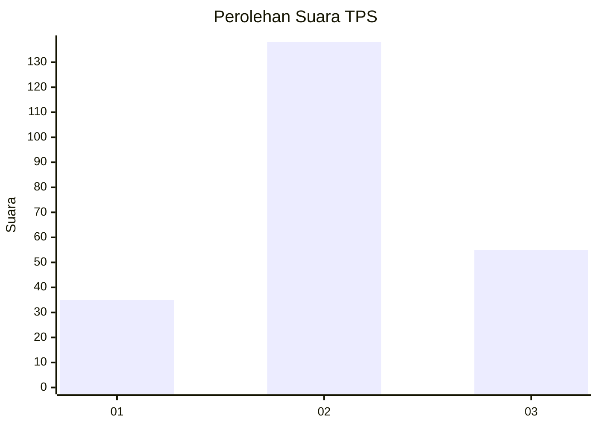
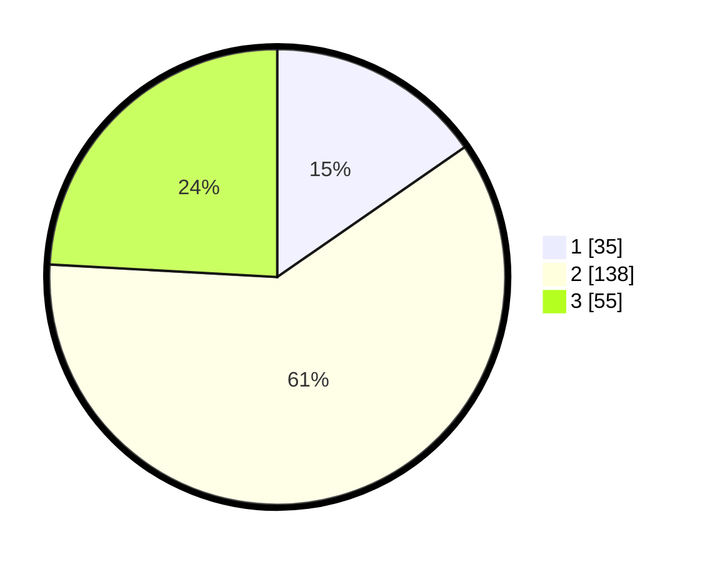

# Hasil

## Grafik

## Tabel

| No. | Nama Paslon    | Suara | Suara (raw) | Persentase |
|:--- |:-------------- | -----:| -----------:| ----------:|
| 1   | ANIES MUHAIMIN | 35    | [35][p-1]   | 15,35      |
| 2   | PRABOWO GIBRAN | 138   | [138][p-2]  | 60,53      |
| 3   | GANJAR MAHFUD  | 55    | [55][p-3]   | 24,12      |

[p-1]: https://github.com/gigit-pemilu/pemilu-2024-51-bali/blob/main/pilpres/hitung-suara/sub/51-bali/sub/71-kota-denpasar/sub/03-denpasar-barat/sub/2008-tegal-harum/sub/007-tps/sub/paslon-1.txt
[p-2]: https://github.com/gigit-pemilu/pemilu-2024-51-bali/blob/main/pilpres/hitung-suara/sub/51-bali/sub/71-kota-denpasar/sub/03-denpasar-barat/sub/2008-tegal-harum/sub/007-tps/sub/paslon-2.txt
[p-3]: https://github.com/gigit-pemilu/pemilu-2024-51-bali/blob/main/pilpres/hitung-suara/sub/51-bali/sub/71-kota-denpasar/sub/03-denpasar-barat/sub/2008-tegal-harum/sub/007-tps/sub/paslon-3.txt

## Foto C Plano

https://sirekap-obj-formc.kpu.go.id/6d79/pemilu/ppwp/51/71/03/20/08/5171032008007-20240214-195130--dd746f5a-61fb-4fcc-92aa-ebff54bf7c1d.jpg

https://sirekap-obj-formc.kpu.go.id/6d79/pemilu/ppwp/51/71/03/20/08/5171032008007-20240214-195308--04b57120-5318-421e-8a38-6f0f9b4c9595.jpg

https://sirekap-obj-formc.kpu.go.id/6d79/pemilu/ppwp/51/71/03/20/08/5171032008007-20240214-195721--52db9d31-a6c6-4a2c-8673-b426bbc6cfd8.jpg

## Metadata

| Key        | Value               |
| ---------- | ------------------- |
| Time Stamp | 2024-02-24 22:31:28 |

