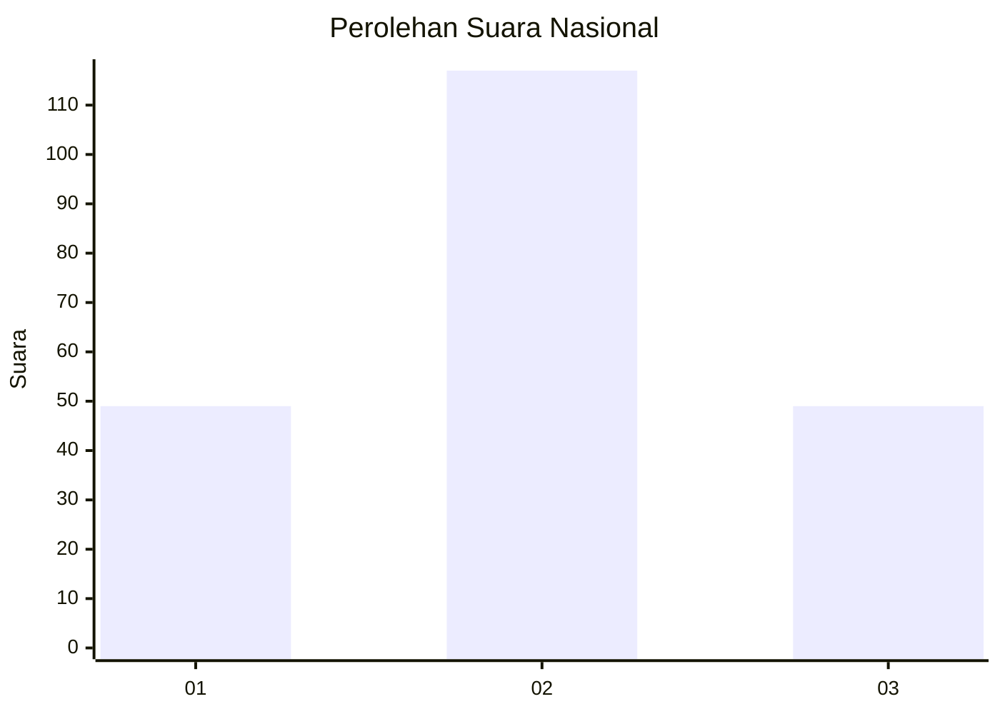
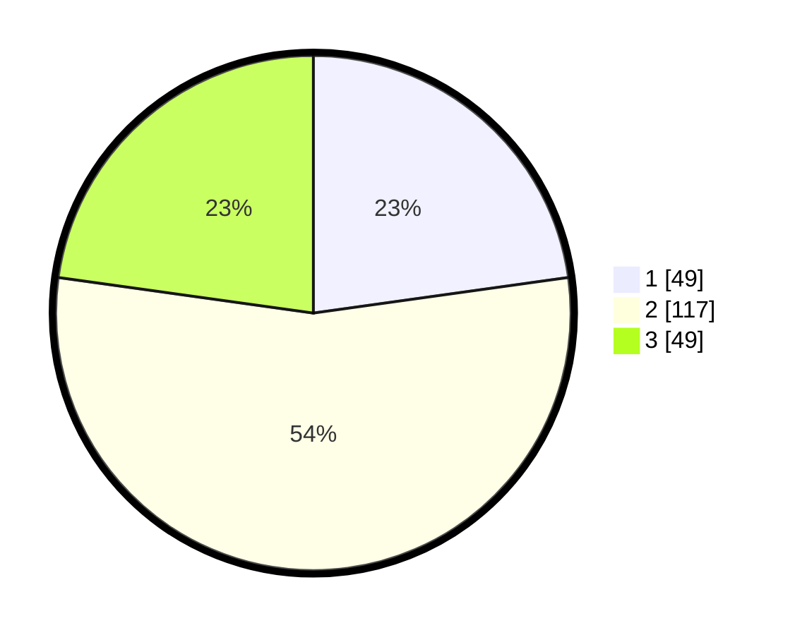

# Hasil

## Grafik

## Tabel

| No. | Nama Paslon    | Suara | Suara (raw) | Persentase |
|:--- |:-------------- | -----:| -----------:| ----------:|
| 1   | ANIES MUHAIMIN | 49    | [49][p-1]   | 22,79      |
| 2   | PRABOWO GIBRAN | 117   | [117][p-2]  | 54,42      |
| 3   | GANJAR MAHFUD  | 49    | [49][p-3]   | 22,79      |

[p-1]: https://github.com/gigit-pemilu/pemilu-2024/blob/main/pilpres/hitung-suara/sub/51-bali/sub/71-kota-denpasar/sub/03-denpasar-barat/sub/2008-tegal-harum/sub/009-tps/sub/paslon-1.txt
[p-2]: https://github.com/gigit-pemilu/pemilu-2024/blob/main/pilpres/hitung-suara/sub/51-bali/sub/71-kota-denpasar/sub/03-denpasar-barat/sub/2008-tegal-harum/sub/009-tps/sub/paslon-2.txt
[p-3]: https://github.com/gigit-pemilu/pemilu-2024/blob/main/pilpres/hitung-suara/sub/51-bali/sub/71-kota-denpasar/sub/03-denpasar-barat/sub/2008-tegal-harum/sub/009-tps/sub/paslon-3.txt

## Foto C Plano

https://sirekap-obj-formc.kpu.go.id/8747/pemilu/ppwp/51/71/03/20/08/5171032008009-20240214-232755--2153cc34-6c55-4388-8853-a7de7c43c33f.jpg

https://sirekap-obj-formc.kpu.go.id/8747/pemilu/ppwp/51/71/03/20/08/5171032008009-20240214-220916--e02838fa-e5fc-4f40-bf2d-ec15e9ba0258.jpg

https://sirekap-obj-formc.kpu.go.id/8747/pemilu/ppwp/51/71/03/20/08/5171032008009-20240214-212013--52085e09-8722-40f0-9323-b333f4e1bb8b.jpg

## Metadata

| Key        | Value               |
| ---------- | ------------------- |
| Time Stamp | 2024-02-24 22:31:28 |

