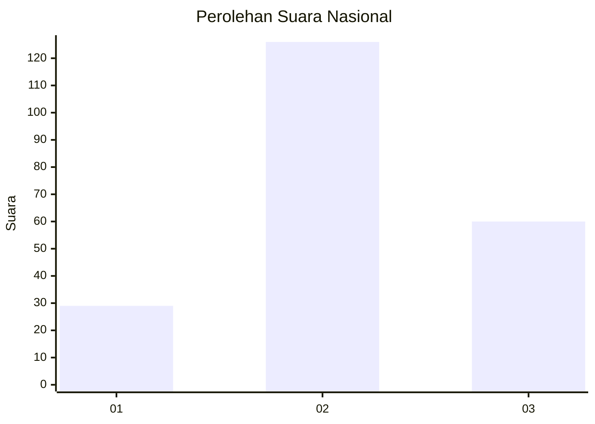
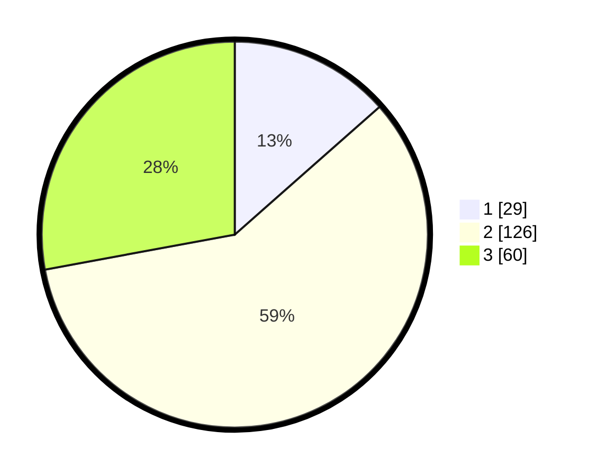

# Hasil

## Grafik

## Tabel

| No. | Nama Paslon    | Suara | Suara (raw) | Persentase |
|:--- |:-------------- | -----:| -----------:| ----------:|
| 1   | ANIES MUHAIMIN | 29    | [29][p-1]   | 13,49      |
| 2   | PRABOWO GIBRAN | 126   | [126][p-2]  | 58,60      |
| 3   | GANJAR MAHFUD  | 60    | [60][p-3]   | 27,91      |

[p-1]: https://github.com/gigit-pemilu/pemilu-2024/blob/main/pilpres/hitung-suara/sub/51-bali/sub/71-kota-denpasar/sub/03-denpasar-barat/sub/2008-tegal-harum/sub/013-tps/sub/paslon-1.txt
[p-2]: https://github.com/gigit-pemilu/pemilu-2024/blob/main/pilpres/hitung-suara/sub/51-bali/sub/71-kota-denpasar/sub/03-denpasar-barat/sub/2008-tegal-harum/sub/013-tps/sub/paslon-2.txt
[p-3]: https://github.com/gigit-pemilu/pemilu-2024/blob/main/pilpres/hitung-suara/sub/51-bali/sub/71-kota-denpasar/sub/03-denpasar-barat/sub/2008-tegal-harum/sub/013-tps/sub/paslon-3.txt

## Foto C Plano

https://sirekap-obj-formc.kpu.go.id/e2cc/pemilu/ppwp/51/71/03/20/08/5171032008013-20240215-005410--c0d4aaef-03f8-4b45-80a7-7a69a62919e6.jpg

https://sirekap-obj-formc.kpu.go.id/e2cc/pemilu/ppwp/51/71/03/20/08/5171032008013-20240215-005637--d99a1e63-daca-4e8c-9155-355ea733d09d.jpg

https://sirekap-obj-formc.kpu.go.id/e2cc/pemilu/ppwp/51/71/03/20/08/5171032008013-20240215-005950--a652fc64-fe59-4464-9e8d-d8ed05d01336.jpg

## Metadata

| Key        | Value               |
| ---------- | ------------------- |
| Time Stamp | 2024-02-24 22:31:28 |

