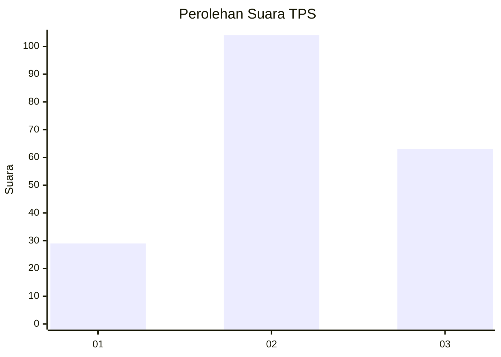
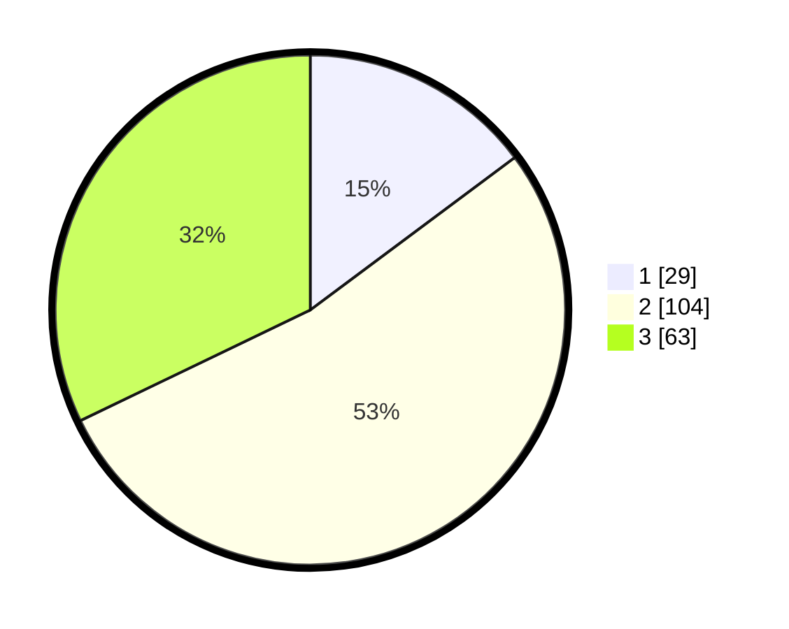

# Hasil

## Grafik

## Tabel

| No. | Nama Paslon    | Suara | Suara (raw) | Persentase |
|:--- |:-------------- | -----:| -----------:| ----------:|
| 1   | ANIES MUHAIMIN | 29    | [29][p-1]   | 14,80      |
| 2   | PRABOWO GIBRAN | 104   | [104][p-2]  | 53,06      |
| 3   | GANJAR MAHFUD  | 63    | [63][p-3]   | 32,14      |

[p-1]: https://github.com/gigit-pemilu/pemilu-2024-51-bali/blob/main/pilpres/hitung-suara/sub/51-bali/sub/71-kota-denpasar/sub/03-denpasar-barat/sub/2008-tegal-harum/sub/015-tps/sub/paslon-1.txt
[p-2]: https://github.com/gigit-pemilu/pemilu-2024-51-bali/blob/main/pilpres/hitung-suara/sub/51-bali/sub/71-kota-denpasar/sub/03-denpasar-barat/sub/2008-tegal-harum/sub/015-tps/sub/paslon-2.txt
[p-3]: https://github.com/gigit-pemilu/pemilu-2024-51-bali/blob/main/pilpres/hitung-suara/sub/51-bali/sub/71-kota-denpasar/sub/03-denpasar-barat/sub/2008-tegal-harum/sub/015-tps/sub/paslon-3.txt

## Foto C Plano

https://sirekap-obj-formc.kpu.go.id/1ce8/pemilu/ppwp/51/71/03/20/08/5171032008015-20240216-133359--d7a92eab-99d9-4b7a-baed-7ba8f20f0e78.jpg

https://sirekap-obj-formc.kpu.go.id/1ce8/pemilu/ppwp/51/71/03/20/08/5171032008015-20240215-124843--8dd3dbf2-c09a-4e77-9fe9-eb7e89f25dfb.jpg

https://sirekap-obj-formc.kpu.go.id/1ce8/pemilu/ppwp/51/71/03/20/08/5171032008015-20240215-124756--29b82f77-cbe9-4219-a73a-3fa1d029d35a.jpg

## Metadata

| Key        | Value               |
| ---------- | ------------------- |
| Time Stamp | 2024-02-16 23:45:47 |

