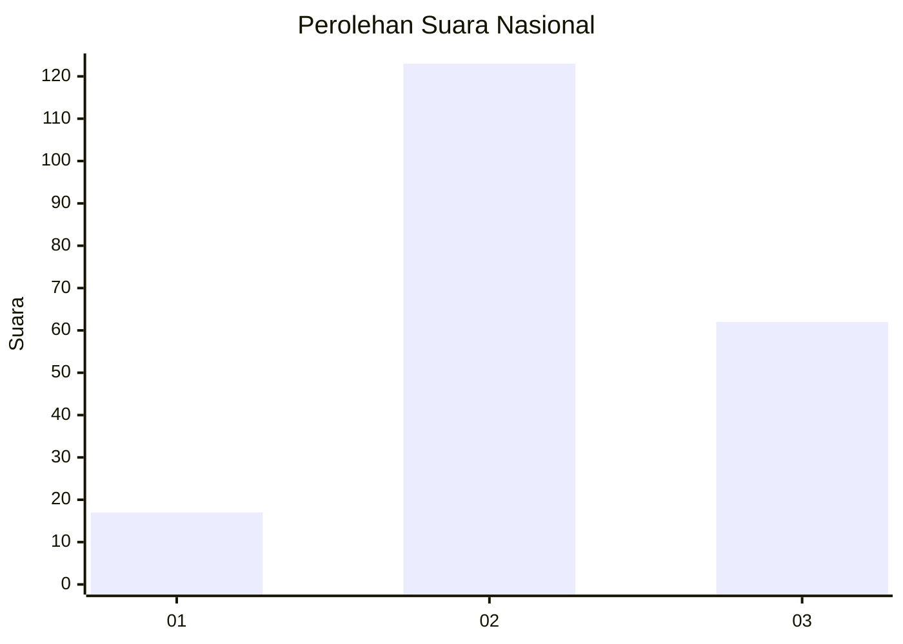
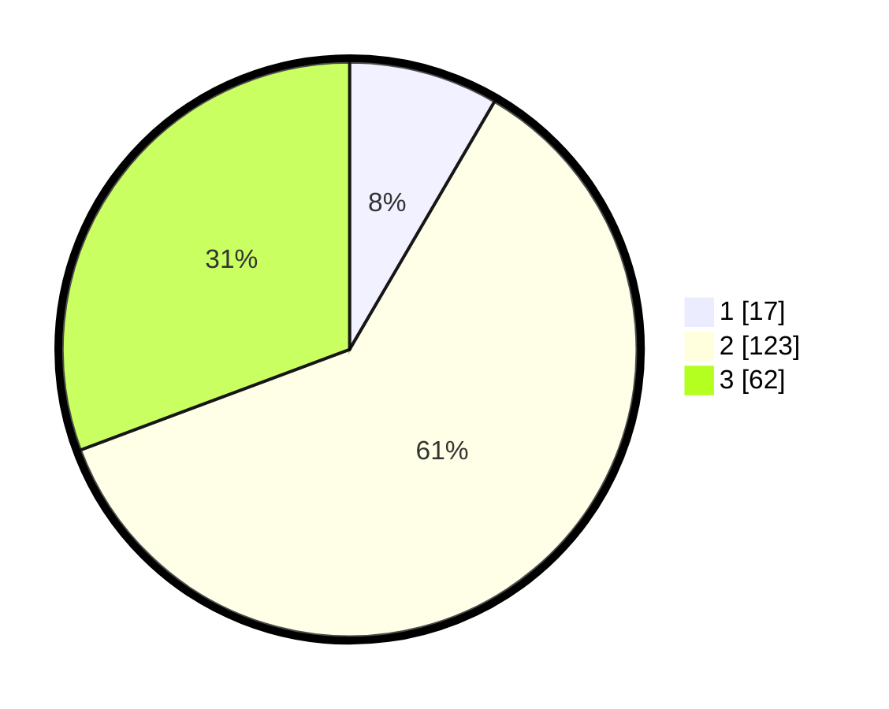

# Hasil

## Grafik

## Tabel

| No. | Nama Paslon    | Suara | Suara (raw) | Persentase |
|:--- |:-------------- | -----:| -----------:| ----------:|
| 1   | ANIES MUHAIMIN | 17    | [17][p-1]   | 8,42       |
| 2   | PRABOWO GIBRAN | 123   | [123][p-2]  | 60,89      |
| 3   | GANJAR MAHFUD  | 62    | [62][p-3]   | 30,69      |

[p-1]: https://github.com/gigit-pemilu/pemilu-2024/blob/main/pilpres/hitung-suara/sub/51-bali/sub/71-kota-denpasar/sub/03-denpasar-barat/sub/2008-tegal-harum/sub/027-tps/sub/paslon-1.txt
[p-2]: https://github.com/gigit-pemilu/pemilu-2024/blob/main/pilpres/hitung-suara/sub/51-bali/sub/71-kota-denpasar/sub/03-denpasar-barat/sub/2008-tegal-harum/sub/027-tps/sub/paslon-2.txt
[p-3]: https://github.com/gigit-pemilu/pemilu-2024/blob/main/pilpres/hitung-suara/sub/51-bali/sub/71-kota-denpasar/sub/03-denpasar-barat/sub/2008-tegal-harum/sub/027-tps/sub/paslon-3.txt

## Foto C Plano

https://sirekap-obj-formc.kpu.go.id/283e/pemilu/ppwp/51/71/03/20/08/5171032008027-20240214-211445--0301f229-8ed0-477e-b6f8-06a4999d1773.jpg

https://sirekap-obj-formc.kpu.go.id/283e/pemilu/ppwp/51/71/03/20/08/5171032008027-20240214-211524--2a4d30c6-336c-4743-8683-8ed8d868e298.jpg

https://sirekap-obj-formc.kpu.go.id/283e/pemilu/ppwp/51/71/03/20/08/5171032008027-20240214-211620--f699e74a-8c37-44c3-a3b6-7acf7e2add97.jpg

## Metadata

| Key        | Value               |
| ---------- | ------------------- |
| Time Stamp | 2024-02-15 12:00:28 |

