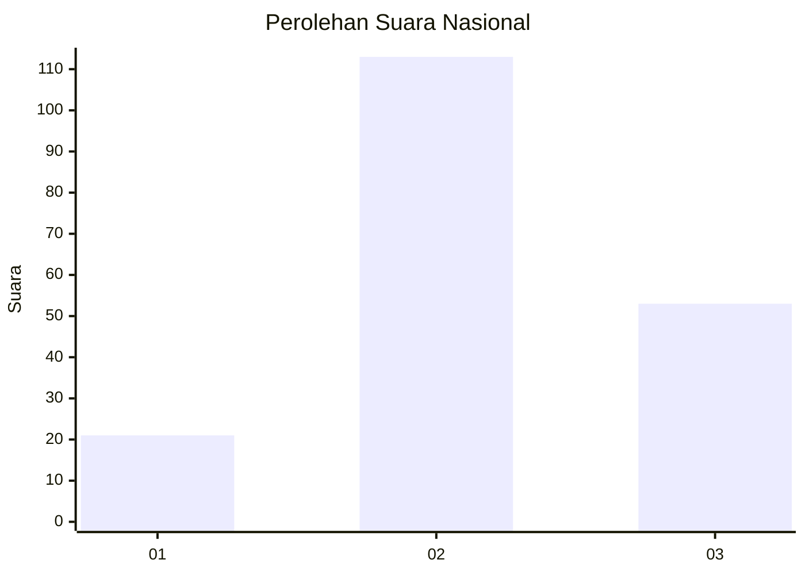
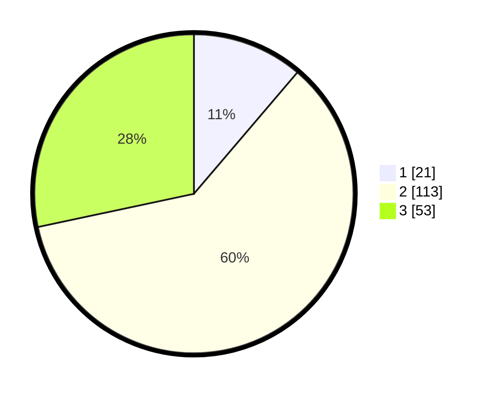

# Hasil

## Grafik

## Tabel

| No. | Nama Paslon    | Suara | Suara (raw) | Persentase |
|:--- |:-------------- | -----:| -----------:| ----------:|
| 1   | ANIES MUHAIMIN | 21    | [21][p-1]   | 11,23      |
| 2   | PRABOWO GIBRAN | 113   | [113][p-2]  | 60,43      |
| 3   | GANJAR MAHFUD  | 53    | [53][p-3]   | 28,34      |

[p-1]: https://github.com/gigit-pemilu/pemilu-2024/blob/main/pilpres/hitung-suara/sub/51-bali/sub/71-kota-denpasar/sub/03-denpasar-barat/sub/2008-tegal-harum/sub/035-tps/sub/paslon-1.txt
[p-2]: https://github.com/gigit-pemilu/pemilu-2024/blob/main/pilpres/hitung-suara/sub/51-bali/sub/71-kota-denpasar/sub/03-denpasar-barat/sub/2008-tegal-harum/sub/035-tps/sub/paslon-2.txt
[p-3]: https://github.com/gigit-pemilu/pemilu-2024/blob/main/pilpres/hitung-suara/sub/51-bali/sub/71-kota-denpasar/sub/03-denpasar-barat/sub/2008-tegal-harum/sub/035-tps/sub/paslon-3.txt

## Foto C Plano

https://sirekap-obj-formc.kpu.go.id/1bfe/pemilu/ppwp/51/71/03/20/08/5171032008035-20240214-232706--bb71d106-5249-4f13-8bda-00f33db1fd38.jpg

https://sirekap-obj-formc.kpu.go.id/1bfe/pemilu/ppwp/51/71/03/20/08/5171032008035-20240214-232729--bbb497df-41ac-411d-baea-ade3f9a98683.jpg

https://sirekap-obj-formc.kpu.go.id/1bfe/pemilu/ppwp/51/71/03/20/08/5171032008035-20240214-232830--2d127cb5-9584-49f5-89bc-42d2f3680fcc.jpg

## Metadata

| Key        | Value               |
| ---------- | ------------------- |
| Time Stamp | 2024-02-24 22:31:28 |

