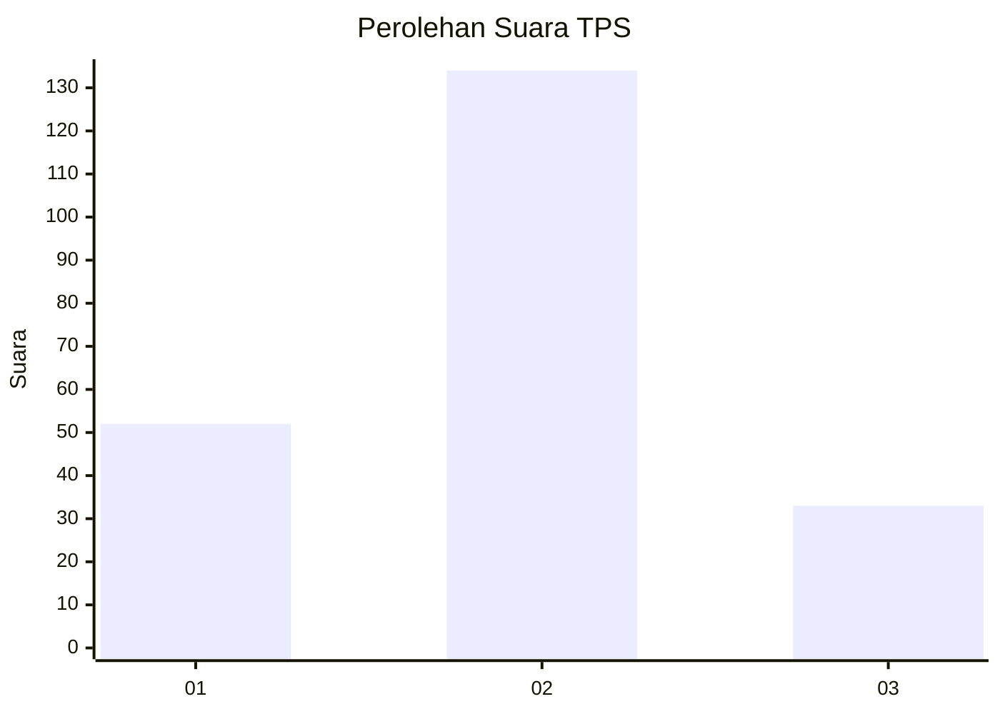
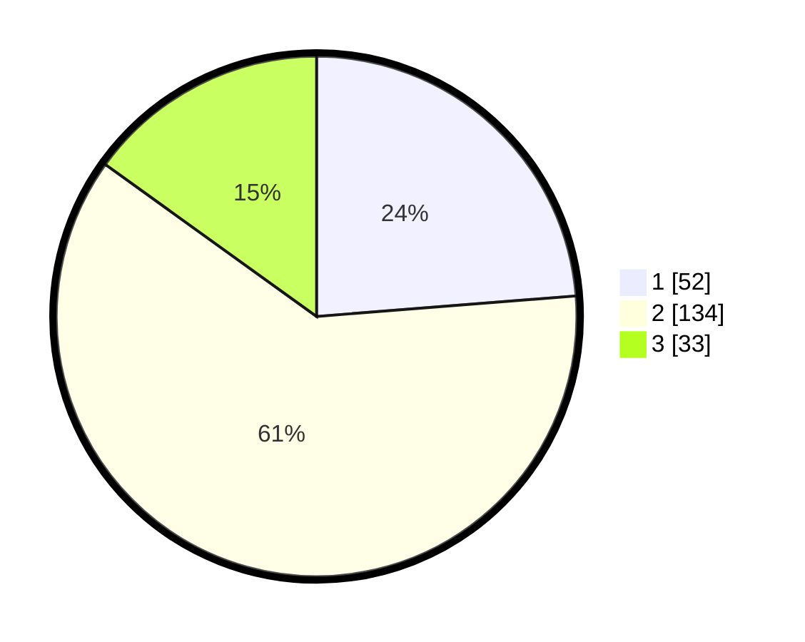

# Hasil

## Grafik

## Tabel

| No. | Nama Paslon    | Suara | Suara (raw) | Persentase |
|:--- |:-------------- | -----:| -----------:| ----------:|
| 1   | ANIES MUHAIMIN | 52    | [52][p-1]   | 23,74      |
| 2   | PRABOWO GIBRAN | 134   | [134][p-2]  | 61,19      |
| 3   | GANJAR MAHFUD  | 33    | [33][p-3]   | 15,07      |

[p-1]: https://github.com/gigit-pemilu/pemilu-2024-51-bali/blob/main/pilpres/hitung-suara/sub/51-bali/sub/71-kota-denpasar/sub/03-denpasar-barat/sub/2009-tegal-kertha/sub/002-tps/sub/paslon-1.txt
[p-2]: https://github.com/gigit-pemilu/pemilu-2024-51-bali/blob/main/pilpres/hitung-suara/sub/51-bali/sub/71-kota-denpasar/sub/03-denpasar-barat/sub/2009-tegal-kertha/sub/002-tps/sub/paslon-2.txt
[p-3]: https://github.com/gigit-pemilu/pemilu-2024-51-bali/blob/main/pilpres/hitung-suara/sub/51-bali/sub/71-kota-denpasar/sub/03-denpasar-barat/sub/2009-tegal-kertha/sub/002-tps/sub/paslon-3.txt

## Foto C Plano

https://sirekap-obj-formc.kpu.go.id/9a9c/pemilu/ppwp/51/71/03/20/09/5171032009002-20240214-212912--bd7abcca-0b0d-4022-a083-c883d5494f13.jpg

https://sirekap-obj-formc.kpu.go.id/9a9c/pemilu/ppwp/51/71/03/20/09/5171032009002-20240214-213651--e6534bf6-ed08-4861-8e11-03440b2a14f2.jpg

https://sirekap-obj-formc.kpu.go.id/9a9c/pemilu/ppwp/51/71/03/20/09/5171032009002-20240214-214431--2c328b6f-95b9-4ba4-8092-f598e264d647.jpg

## Metadata

| Key        | Value               |
| ---------- | ------------------- |
| Time Stamp | 2024-02-15 16:30:25 |

