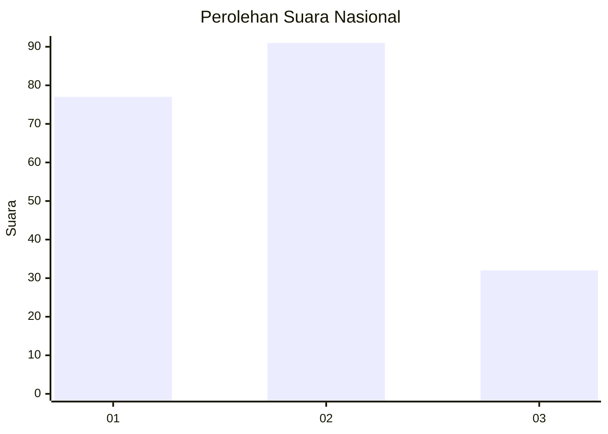
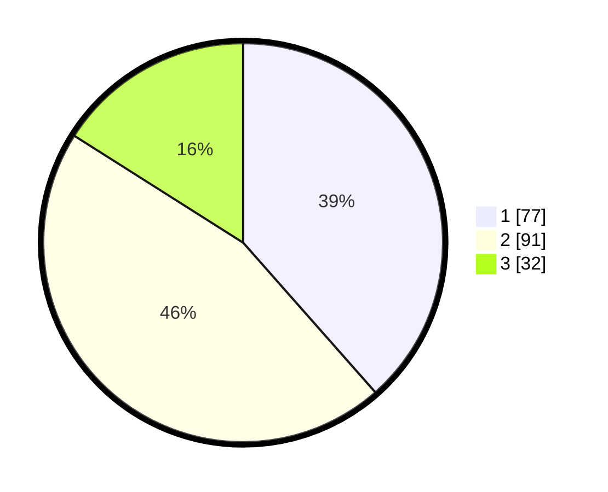

# Hasil

## Grafik

## Tabel

| No. | Nama Paslon    | Suara | Suara (raw) | Persentase |
|:--- |:-------------- | -----:| -----------:| ----------:|
| 1   | ANIES MUHAIMIN | 77    | [77][p-1]   | 38,50      |
| 2   | PRABOWO GIBRAN | 91    | [91][p-2]   | 45,50      |
| 3   | GANJAR MAHFUD  | 32    | [32][p-3]   | 16,00      |

[p-1]: https://github.com/gigit-pemilu/pemilu-2024/blob/main/pilpres/hitung-suara/sub/51-bali/sub/71-kota-denpasar/sub/03-denpasar-barat/sub/2009-tegal-kertha/sub/005-tps/sub/paslon-1.txt
[p-2]: https://github.com/gigit-pemilu/pemilu-2024/blob/main/pilpres/hitung-suara/sub/51-bali/sub/71-kota-denpasar/sub/03-denpasar-barat/sub/2009-tegal-kertha/sub/005-tps/sub/paslon-2.txt
[p-3]: https://github.com/gigit-pemilu/pemilu-2024/blob/main/pilpres/hitung-suara/sub/51-bali/sub/71-kota-denpasar/sub/03-denpasar-barat/sub/2009-tegal-kertha/sub/005-tps/sub/paslon-3.txt

## Foto C Plano

https://sirekap-obj-formc.kpu.go.id/78f8/pemilu/ppwp/51/71/03/20/09/5171032009005-20240214-190735--2f40f6dc-3e0d-4050-9f86-bab19cd0bf1a.jpg

https://sirekap-obj-formc.kpu.go.id/78f8/pemilu/ppwp/51/71/03/20/09/5171032009005-20240214-190552--8d3d2ea1-563b-4590-83ff-fa5336f7f8c8.jpg

https://sirekap-obj-formc.kpu.go.id/78f8/pemilu/ppwp/51/71/03/20/09/5171032009005-20240214-190622--ba5cfb7a-1438-4dbf-b091-de72dd605c55.jpg

## Metadata

| Key        | Value               |
| ---------- | ------------------- |
| Time Stamp | 2024-02-14 21:46:01 |

## DATA PEMILIH TETAP

Jumlah pemilih dalam DPT: **248**.
 * L: **122**.
 * P: **126**.

## DATA PENGGUNA HAK PILIH

Jumlah pengguna hak pilih dalam DPT: **192**.
 * L: **86**.
 * P: **106**.

Jumlah pengguna hak pilih dalam DPTb: **2**.
 * L: **1**.
 * P: **1**.

Jumlah pengguna hak pilih dalam DPK: **8**.
 * L: **3**.
 * P: **5**.

Jumlah pengguna hak pilih: **202**.
 * L: **90**.
 * P: **112**.

## JUMLAH SUARA SAH DAN TIDAK SAH

JUMLAH SELURUH SUARA SAH: **200**.

JUMLAH SUARA TIDAK SAH: **2**.

JUMLAH SELURUH SUARA SAH DAN SUARA TIDAK SAH: **202**.

