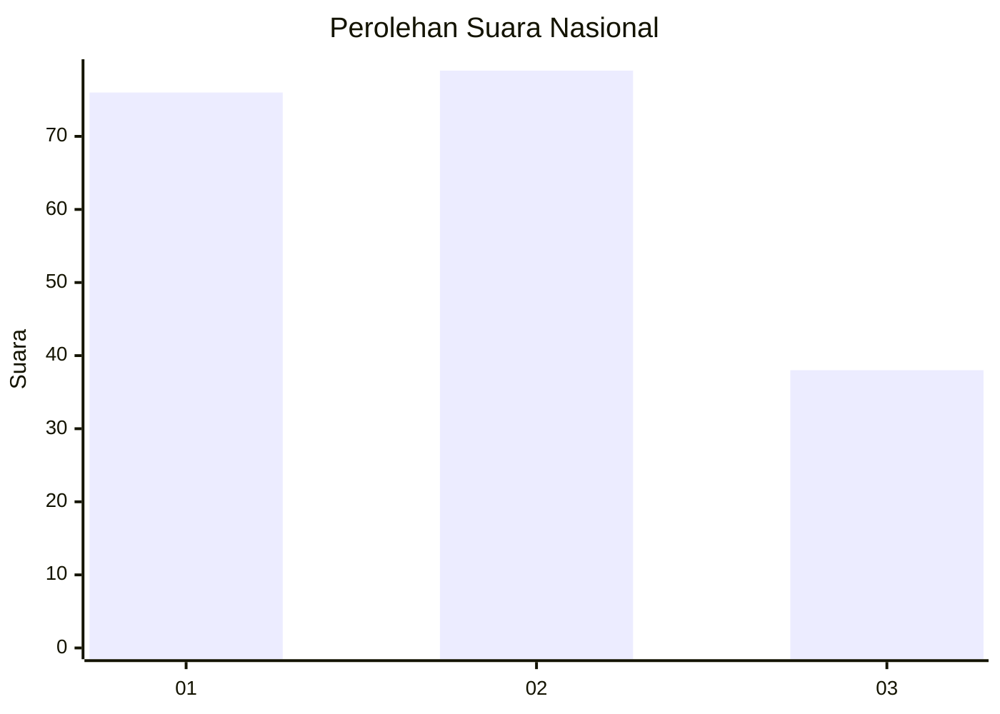
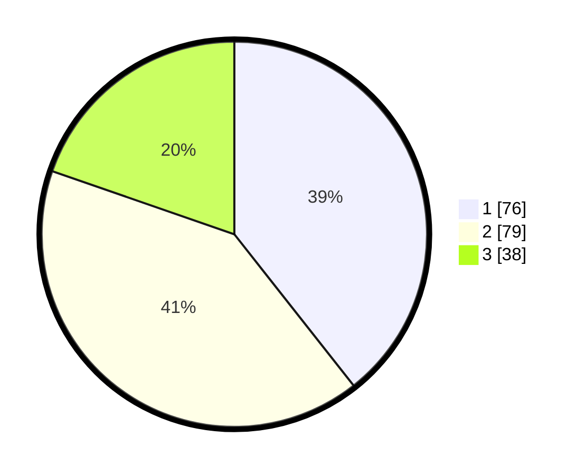

# Hasil

## Grafik

## Tabel

| No. | Nama Paslon    | Suara | Suara (raw) | Persentase |
|:--- |:-------------- | -----:| -----------:| ----------:|
| 1   | ANIES MUHAIMIN | 76    | [76][p-1]   | 39,38      |
| 2   | PRABOWO GIBRAN | 79    | [79][p-2]   | 40,93      |
| 3   | GANJAR MAHFUD  | 38    | [38][p-3]   | 19,69      |

[p-1]: https://github.com/gigit-pemilu/pemilu-2024/blob/main/pilpres/hitung-suara/sub/51-bali/sub/71-kota-denpasar/sub/03-denpasar-barat/sub/2009-tegal-kertha/sub/006-tps/sub/paslon-1.txt
[p-2]: https://github.com/gigit-pemilu/pemilu-2024/blob/main/pilpres/hitung-suara/sub/51-bali/sub/71-kota-denpasar/sub/03-denpasar-barat/sub/2009-tegal-kertha/sub/006-tps/sub/paslon-2.txt
[p-3]: https://github.com/gigit-pemilu/pemilu-2024/blob/main/pilpres/hitung-suara/sub/51-bali/sub/71-kota-denpasar/sub/03-denpasar-barat/sub/2009-tegal-kertha/sub/006-tps/sub/paslon-3.txt

## Foto C Plano

https://sirekap-obj-formc.kpu.go.id/6c4c/pemilu/ppwp/51/71/03/20/09/5171032009006-20240214-205248--2e8c5890-d10b-4b7d-aff3-933dc3a09997.jpg

https://sirekap-obj-formc.kpu.go.id/6c4c/pemilu/ppwp/51/71/03/20/09/5171032009006-20240214-205417--b65944bb-4eb5-4a0b-a283-2fb29ecc5dff.jpg

https://sirekap-obj-formc.kpu.go.id/6c4c/pemilu/ppwp/51/71/03/20/09/5171032009006-20240214-205456--4651c350-c56d-4c3c-904e-e32ef2f48b63.jpg

## Metadata

| Key        | Value               |
| ---------- | ------------------- |
| Time Stamp | 2024-02-15 00:41:44 |

## DATA PEMILIH TETAP

Jumlah pemilih dalam DPT: **247**.
 * L: **112**.
 * P: **135**.

## DATA PENGGUNA HAK PILIH

Jumlah pengguna hak pilih dalam DPT: **185**.
 * L: **86**.
 * P: **99**.

Jumlah pengguna hak pilih dalam DPTb: **7**.
 * L: **4**.
 * P: **3**.

Jumlah pengguna hak pilih dalam DPK: **3**.
 * L: **1**.
 * P: **2**.

Jumlah pengguna hak pilih: **195**.
 * L: **91**.
 * P: **104**.

## JUMLAH SUARA SAH DAN TIDAK SAH

JUMLAH SELURUH SUARA SAH: **193**.

JUMLAH SUARA TIDAK SAH: **2**.

JUMLAH SELURUH SUARA SAH DAN SUARA TIDAK SAH: **195**.

